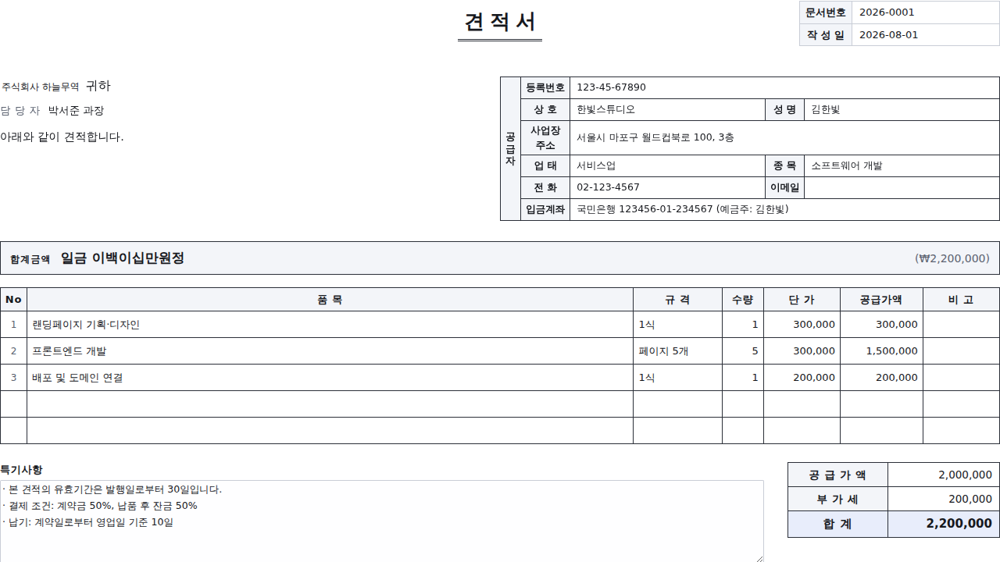

# 클릭 견적서

브라우저에서 바로 만드는 **견적서 · 거래명세서 · 청구서**.
설치 없음, 회원가입 없음, 서버 없음.



## 왜 만들었나

소상공인과 프리랜서는 거래 한 건마다 견적서를 씁니다.
그런데 선택지가 대체로 이렇습니다.

- 한글·엑셀 양식 → 합계 계산을 손으로 하다 틀림, 한글 금액 표기 매번 고생
- 회계 SaaS → 월 구독료, 회원가입, 사업자 정보 등록
- 온라인 무료 생성기 → 거래처 정보와 단가를 남의 서버에 올려야 함

이 도구는 **파일 3개짜리 정적 웹페이지**입니다. 입력한 내용은 브라우저 밖으로 나가지 않습니다.

## 기능

| | |
|---|---|
| 문서 3종 | 견적서 / 거래명세서 / 청구서 — 버튼 하나로 전환 |
| 자동 계산 | 수량 × 단가 → 공급가액 → 부가세 10% → 합계 |
| 한글 금액 | `일금 이백이십만원정` 자동 변환 (조 단위까지) |
| 공급자 정보 | 등록번호·상호·업태·종목·입금계좌 등 표준 양식 |
| 로고 / 도장 | 이미지 넣으면 성명란에 자동 배치 |
| 자동 저장 | 입력 즉시 브라우저에 저장, 새로고침해도 유지 |
| 문서 보관 | 여러 건 저장·불러오기·삭제 |
| 백업 | JSON 내보내기 / 가져오기 |
| PDF | 인쇄 대화상자에서 "PDF로 저장" — A4 한 장, 편집 흔적 없이 |

## 개인정보

- 네트워크 요청이 **한 건도** 없습니다. 애널리틱스, 폰트 CDN, 외부 스크립트 전부 없음
- 데이터는 `localStorage`에만 저장 → 브라우저 데이터를 지우면 함께 사라집니다
- 중요한 문서는 **내보내기**로 JSON 백업을 남겨두세요
- 공용 PC에서 썼다면 **새 문서**를 눌러 내용을 비우고 나오세요

## 실행

```bash
git clone <이 저장소>
cd product-builder-lecter
# index.html 을 브라우저로 열면 끝. 빌드 도구 없음.
```

로컬 서버가 필요하면:

```bash
python3 -m http.server 8000   # http://localhost:8000
```

## 배포

정적 파일뿐이라 어디에 올려도 동작합니다.

```bash
# Firebase Hosting
firebase deploy

# GitHub Pages: Settings → Pages → Branch 를 main / root 로

# Netlify: 폴더를 netlify.com/drop 에 끌어다 놓기
```

## 인쇄 결과가 이상하다면

- 브라우저 인쇄 설정에서 **배경 그래픽**을 켜세요 (표 머리글 음영이 나옵니다)
- **머리글/바닥글**은 끄세요 (URL과 날짜가 문서에 찍힙니다)
- 용지는 **A4**, 배율은 **기본값**
- 권장: Chrome / Edge — `:has()` 와 `field-sizing` 을 써서 빈 칸을 정리합니다.
  구형 브라우저에서는 비워둔 항목의 라벨이 인쇄에 남을 수 있습니다 (계산은 동일)

## 브라우저 지원

Chrome · Edge · Safari · Firefox 최신 버전. 빌드 단계도 의존성도 없습니다.

## 파일 구조

```
index.html   문서 구조 (A4 레이아웃)
style.css    화면용 편집기 스타일 + @media print 인쇄 규칙
main.js      계산 · 한글 금액 변환 · 저장 · 내보내기
```

## 라이선스

MIT
