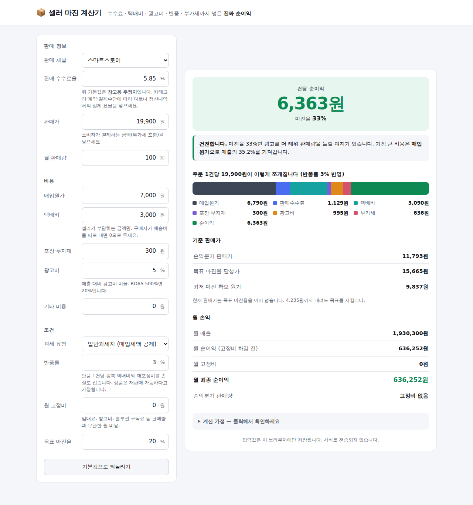

# 소상공인 실무 도구 모음

설치 없음, 회원가입 없음, 서버 없음. 파일을 열면 바로 동작하는 정적 웹 도구입니다.
셋 다 **네트워크 요청을 한 건도 만들지 않습니다** — 입력한 정보가 브라우저 밖으로 나가지 않습니다.

| 도구 | 위치 | 하는 일 |
|---|---|---|
| [클릭 견적서](#클릭-견적서) | `index.html` | 견적서 · 거래명세서 · 청구서를 A4 PDF로 |
| [셀러 마진 계산기](#셀러-마진-계산기) | `margin/` | 수수료·택배비·부가세까지 반영한 진짜 순이익 |

72시간 안에 100만원을 만드는 실행 계획은 [`PLAN-72H.md`](PLAN-72H.md)에 있습니다.

---

## 클릭 견적서

브라우저에서 바로 만드는 **견적서 · 거래명세서 · 청구서**.


## 왜 만들었나

소상공인과 프리랜서는 거래 한 건마다 견적서를 씁니다.
그런데 선택지가 대체로 이렇습니다.

- 한글·엑셀 양식 → 합계 계산을 손으로 하다 틀림, 한글 금액 표기 매번 고생
- 회계 SaaS → 월 구독료, 회원가입, 사업자 정보 등록
- 온라인 무료 생성기 → 거래처 정보와 단가를 남의 서버에 올려야 함

이 도구는 **파일 3개짜리 정적 웹페이지**입니다. 입력한 내용은 브라우저 밖으로 나가지 않습니다.

## 기능

| | |
|---|---|
| 문서 3종 | 견적서 / 거래명세서 / 청구서 — 버튼 하나로 전환 |
| 자동 계산 | 수량 × 단가 → 공급가액 → 부가세 10% → 합계 |
| 한글 금액 | `일금 이백이십만원정` 자동 변환 (조 단위까지) |
| 공급자 정보 | 등록번호·상호·업태·종목·입금계좌 등 표준 양식 |
| 로고 / 도장 | 이미지 넣으면 성명란에 자동 배치 |
| 자동 저장 | 입력 즉시 브라우저에 저장, 새로고침해도 유지 |
| 문서 보관 | 여러 건 저장·불러오기·삭제 |
| 백업 | JSON 내보내기 / 가져오기 |
| PDF | 인쇄 대화상자에서 "PDF로 저장" — A4 한 장, 편집 흔적 없이 |

## 개인정보

- 네트워크 요청이 **한 건도** 없습니다. 애널리틱스, 폰트 CDN, 외부 스크립트 전부 없음
- 데이터는 `localStorage`에만 저장 → 브라우저 데이터를 지우면 함께 사라집니다
- 중요한 문서는 **내보내기**로 JSON 백업을 남겨두세요
- 공용 PC에서 썼다면 **새 문서**를 눌러 내용을 비우고 나오세요

## 실행

```bash
git clone <이 저장소>
cd product-builder-lecter
# index.html 을 브라우저로 열면 끝. 빌드 도구 없음.
```

로컬 서버가 필요하면:

```bash
python3 -m http.server 8000   # http://localhost:8000
```

## 배포

정적 파일뿐이라 어디에 올려도 동작합니다.

```bash
# Firebase Hosting
firebase deploy

# GitHub Pages: Settings → Pages → Branch 를 main / root 로

# Netlify: 폴더를 netlify.com/drop 에 끌어다 놓기
```

## 인쇄 결과가 이상하다면

- 브라우저 인쇄 설정에서 **배경 그래픽**을 켜세요 (표 머리글 음영이 나옵니다)
- **머리글/바닥글**은 끄세요 (URL과 날짜가 문서에 찍힙니다)
- 용지는 **A4**, 배율은 **기본값**
- 권장: Chrome / Edge — `:has()` 와 `field-sizing` 을 써서 빈 칸을 정리합니다.
  구형 브라우저에서는 비워둔 항목의 라벨이 인쇄에 남을 수 있습니다 (계산은 동일)

---

## 셀러 마진 계산기

스마트스토어·쿠팡 셀러가 **한 건 팔면 실제로 얼마가 남는지** 계산합니다.



### 왜 만들었나

셀러가 흔히 하는 계산은 `판매가 − 매입원가 = 마진`입니다. 여기에 빠진 게 많습니다.

- 판매수수료 (채널·카테고리별 4~13%)
- 셀러가 부담하는 택배비 — 저가 상품에서는 이게 최대 비용입니다
- 광고비, 포장·부자재비
- **부가세** — 판매가의 1/11이 원래 내 돈이 아닙니다
- **반품** — 반품 1건은 왕복 택배비를 그대로 태웁니다

이걸 다 넣으면 "마진 40%"였던 상품이 실제로는 적자인 경우가 흔합니다.
이 계산기는 그걸 팔기 전에 보여줍니다.

### 기능

| | |
|---|---|
| 건당 순이익 | 위 비용을 전부 뺀 실제 금액과 마진율 |
| 비용 구조 | 판매가가 어디로 얼마나 빠져나가는지 막대로 |
| 손익분기 판매가 | 본전을 맞추는 최저 가격 |
| 목표 마진율 달성가 | 원하는 마진율을 위한 판매가 역산 |
| 최저 마진 확보 원가 | 지금 가격에서 사입 단가 상한선 |
| 월 손익 | 판매량·고정비를 넣으면 월 순이익과 손익분기 판매량 |
| 채널 프리셋 | 스마트스토어·쿠팡·11번가·G마켓·자체몰 (수정 가능) |

### 계산 방식

`주문 1건 접수`를 기준으로 잡습니다. 그중 반품률만큼은 반품된다고 봅니다.

```
매출     = 판매가 × (1 − 반품률)
매입원가 = 원가 × (1 − 반품률)        반품 상품은 재판매 가능하다고 가정
수수료   = 판매가 × 요율 × (1 − 반품률)   반품 시 환급
택배비   = 택배비 × (1 + 반품률)       반품은 왕복
포장비   = 포장비                     반품 건도 재포장 필요
광고비   = 판매가 × 광고비율           반품돼도 이미 집행됨

부가세   = (매출 − 총비용) ÷ 11        일반과세자만
순이익   = 매출 − 총비용 − 부가세
```

기준 판매가들은 이 모델 위에서 이분탐색으로 역산합니다. 마진율은 판매가에 대해
단조 증가하므로(고정비가 희석되므로) 해가 유일합니다.

수수료율 기본값은 **참고용 추정치**입니다. 카테고리·계약·결제수단에 따라 다르니
정산내역서의 실제 요율을 넣어야 의미가 있습니다. 페이지 안의 "계산 가정"에
무엇을 반영했고 무엇을 뺐는지(종합소득세, 재고 감모 등) 적어두었습니다.

---

## 브라우저 지원

Chrome · Edge · Safari · Firefox 최신 버전. 빌드 단계도 의존성도 없습니다.

## 파일 구조

```
index.html        클릭 견적서 — A4 문서 구조
style.css         화면용 편집기 스타일 + @media print 인쇄 규칙
main.js           계산 · 한글 금액 변환 · 저장 · 내보내기

margin/
  index.html      셀러 마진 계산기 — 입력 폼과 결과 패널
  style.css       반응형 2단 레이아웃 (좁은 화면에서는 결과가 위로)
  main.js         손익 모델 · 이분탐색 역산 · 저장

PLAN-72H.md       72시간 100만원 실행 계획서
blueprint.md      클릭 견적서 설계 문서
```

## 라이선스

MIT
