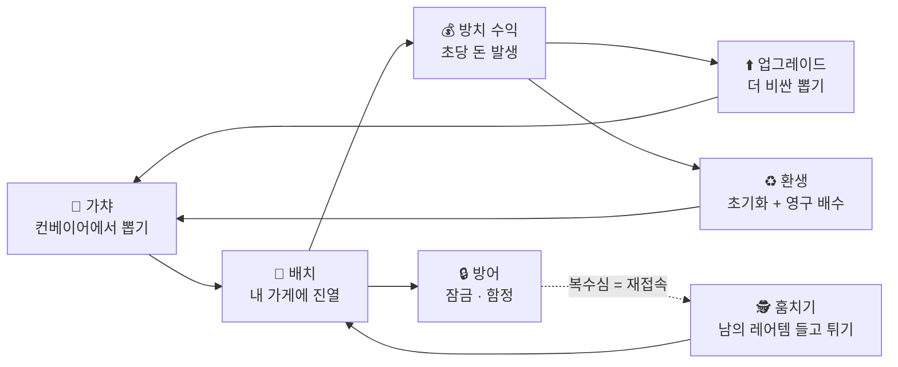

# ⚡ 도파민 드리븐 디벨로핑(DDD) 플랜 — 로블록스 게임 개발

> 유행 게임들이 유저를 붙잡는 도파민 루프 원리를, **개발자 자신에게** 적용하는 개발 방법론.
> 트렌드 근거는 [`trends-2026.md`](./trends-2026.md) 참고.

## 1. 도파민 드리븐 디벨로핑이란

게임이 유저에게 "짧은 루프 → 눈에 보이는 보상 → 다음 루프 유혹"을 주듯이,
개발 과정을 **매 세션이 보상으로 끝나는 루프**로 설계합니다. 동기부여가 끊기는 지점(= 오래 만들었는데 보이는 게 없음)을 구조적으로 제거하는 게 목표입니다.

### DDD 7원칙

1. **모든 세션은 "보이는 것"으로 끝난다** — 세션(1~2시간)이 끝날 때 반드시 스크린샷/클립을 찍을 수 있는 변화가 있어야 함. 없으면 스코프를 잘못 자른 것
2. **아키텍처보다 플레이 먼저** — 첫 24시간 안에 코어 루프 1회전(뽑고→배치하고→돈 오르는 것)을 돌린다. 리팩토링은 재미가 검증된 뒤에
3. **일찍, 자주 퍼블리시** — 7일차에 비공개 출시, 14일차에 공개. "완성되면 출시"는 번아웃 루트
4. **숫자를 보이게 만든다** — Creator Hub 애널리틱스(방문수, D1 리텐션, 세션 길이)가 개발자의 리더보드. 진짜 도파민은 유저 숫자에서 나옴
5. **스코프는 "이번 주말에 끝나는 크기"로 자른다** — 1인 개발 실패 원인 1위는 스코프 과욕. 기능 하나가 주말을 넘기면 반으로 쪼갠다
6. **2주 룰** — 2주 안에 코어 루프가 (친구 기준으로라도) 재미없으면 미련 없이 피벗. 유행 장르는 회전이 빠르므로 매몰비용을 만들지 않는 게 무기
7. **만드는 과정을 클립으로 공유** — 개발 과정 자체를 틱톡/쇼츠/X에 올리기. 외부 반응 = 추가 도파민 + 출시 전 마케팅이 공짜로 됨

## 2. 게임 컨셉 3안

| | 1안. "Steal & Grow" 하이브리드 ◎ 추천 | 2안. 코업 호러 | 3안. 트위스트 옵비 |
|---|---|---|---|
| 한 줄 | 가챠로 뽑고, 키워서 돈 벌고, 서로 훔친다 | 4인 협동 생존 (99 Nights 계열) | Tower of Hell + 비틀기 하나 |
| 트렌드 적합 | 2026년 1등 공식 그 자체 | 상승 장르 | 스테디셀러 |
| 첫 재미까지 | ~1주 | 3~4주 | 2~3일 |
| 리스크 | 카피캣 홍수 → **테마 차별화 필수** | 분위기·AI 난이도, 첫 도파민 늦음 | 천장이 낮음 |
| DDD 적합도 | ★★★ 기능 하나하나가 체크포인트 | ★★ | ★★★ 다만 확장성 낮음 |

**추천: 1안.** 이유: (a) 지금 가장 뜨거운 공식이면서 (b) 가챠→방치수익→훔치기→방어→환생 각 단계가 **독립적으로 추가·검증 가능한 도파민 체크포인트**라 DDD와 완벽하게 맞물립니다. 완전 처음이라 스튜디오 자체가 낯설면 3안으로 2~3일 워밍업 후 1안으로 넘어가는 것도 좋은 루트.

### 테마 차별화 (중요)

- 이탈리안 브레인롯 밈을 그대로 쓰는 건 비추천: 이미 포화 + 남의 밈 IP라 저작권/모더레이션 리스크
- **오리지널 테마로 같은 공식을 굴리는 게 정답.** 후보:
  - 🍢 **K-푸드 분식집** ("Steal a Tteokbokki") — 떡볶이/김밥/붕어빵을 뽑아 진열하고 훔친다. K-콘텐츠 글로벌 수요 + 음식 밈은 언어 장벽이 없음
  - 🐹 동물 카페 — 귀여움은 항상 통함, 단 펫 시뮬 경쟁 심함
  - 👾 자작 밈 캐릭터 세계관 — 잘 되면 IP가 내 것 (Brainrot이 간 길)
- 판정 기준: **썸네일 한 장으로 웃기거나 궁금하게 만들 수 있는가?** (클릭률이 초기 노출을 결정)

## 3. 추천안 코어 루프



## 4. 14일 로드맵 — 세션별 도파민 체크포인트

세션 = 1~2시간. **각 세션의 마지막 열이 그날의 보상**입니다. 체크포인트를 못 찍으면 다음 기능을 벌리지 말고 스코프를 줄이세요. 매 세션 종료 = git 커밋 + 클립 1개.

| Day | 만드는 것 | ✅ 도파민 체크포인트 (세션 끝에 보이는 것) |
|---|---|---|
| 1 | 스튜디오 셋업, 맵 블록아웃(가게 8칸), 돈 leaderstats | 내 이름 옆 숫자가 1초마다 올라간다 |
| 2 | 컨베이어 + 아이템이 흘러가고 클릭하면 구매 | 흘러가는 아이템을 "내가 샀다" |
| 3 | 구매한 아이템이 내 가게 슬롯에 진열 | 내 가게에 물건이 쌓인다 (소유감) |
| 4 | 아이템별 초당 수익 + 머리 위 수익 표시 | 돈이 **스스로** 벌린다 |
| 5 | 레어리티 4등급 + 뽑기 이펙트/사운드 (레전더리 = 번쩍+굉음) | 첫 "레전더리 떴다!!" 순간 |
| 6 | DataStore 저장 + 오프라인 수익 (자리 비운 시간 정산) | 껐다 켜도 그대로 + "돌아온 보상" 팝업 |
| 7 | 🚀 **비공개 퍼블리시**, 친구 3명 초대 테스트 | 진짜 사람이 내 게임에서 논다 |
| 8 | 훔치기 v1: 남의 슬롯에서 뽑아 들고 내 기지까지 달리면 획득 | 첫 도둑질 성공 (그리고 첫 빼앗김의 분노) |
| 9 | 방어: 잠금(일정 시간 무적), 함정 1종 | 뺏고-지키는 긴장감 완성 |
| 10 | 환생(리버스): 전 재산 초기화 ↔ 영구 수익 배수 | 장기 목표 생김, 고인물 루프 가동 |
| 11 | 게임패스 2종(수익 x2, 스틸 알림) + 아이콘/썸네일 제작 | 상점에 내 상품이 걸린다 (첫 Robux 가능성) |
| 12 | 🚀 **공개 퍼블리시** + 틱톡/쇼츠에 15초 클립 3개 | 애널리틱스에 모르는 사람 방문 기록 |
| 13 | 지표 튜닝: D1 리텐션·세션 길이 보고 초반 5분 경험 수정 | 그래프가 어제보다 오른다 |
| 14 | 첫 라이브 이벤트(주말 수익 x2, 한정 아이템 1종) | "이벤트 언제 또 해요?" 첫 댓글 |

> 이후 루프: **주 1회 한정 아이템/이벤트**(유저 FOMO = 개발자 루틴), 지표 보고 튜닝, 잘 크면 업데이트 주기 단축. 2주 룰에 걸리면 → 테마만 바꿔 재도전 (공식은 재사용 가능).

## 5. 첫 30분 퀵스타트 — 오늘의 도파민

Roblox Studio → 새 Baseplate → `ServerScriptService`에 Script 추가 → 아래 붙여넣고 ▶ 실행.
**화면 우측 상단 리더보드에서 내 돈이 1초마다 올라가는 것**이 여러분의 첫 체크포인트입니다.

```lua
-- ServerScriptService/MoneyLoop.server.lua
-- Day 1 체크포인트: 리더보드에 돈이 실시간으로 오른다
local Players = game:GetService("Players")

Players.PlayerAdded:Connect(function(player)
	local stats = Instance.new("Folder")
	stats.Name = "leaderstats" -- 이 이름이어야 기본 리더보드에 표시됨
	stats.Parent = player

	local money = Instance.new("IntValue")
	money.Name = "Money"
	money.Value = 0
	money.Parent = stats

	task.spawn(function()
		while player.Parent do
			money.Value += 1
			task.wait(1)
		end
	end)
end)
```

Day 5 가챠의 뼈대가 될 확률 테이블도 미리 맛보기:

```lua
-- 등급별 확률 테이블 — 나중에 컨베이어 스포너에 연결
local ITEMS = {
	{ name = "떡볶이",   rarity = "Common",    income = 1,   chance = 70 },
	{ name = "김밥",     rarity = "Rare",      income = 5,   chance = 24 },
	{ name = "붕어빵",   rarity = "Epic",      income = 25,  chance = 5  },
	{ name = "황금 떡", rarity = "Legendary", income = 200, chance = 1  },
}

local function rollItem()
	local roll = math.random(1, 100)
	local cumulative = 0
	for _, item in ITEMS do
		cumulative += item.chance
		if roll <= cumulative then
			return item
		end
	end
	return ITEMS[1]
end
```

## 6. 수익화 & 라이브옵스 체크리스트

- [ ] **게임패스** (영구 구매): 수익 x2 / 스틸 당하면 알림 / VIP 전용 아이템 슬롯
- [ ] **개발자 제품** (반복 구매): 즉시 현금 팩, 뽑기 티켓
- [ ] **프리미엄 페이아웃**: 프리미엄 구독 유저의 플레이타임만큼 자동 수익 — 리텐션이 곧 돈
- [ ] **DevEx 환산 감각**: 대략 100,000 Robux ≈ $350 (수수료·환율 변동 있음) — 게임패스 99 R$짜리 1,000개 팔면 개발자 몫 약 70,000 R$
- [ ] **이벤트 캘린더**: 주말 x2, 시즌 한정 아이템 (핼러윈/크리스마스/설날은 미리 준비)
- [ ] **아이콘/썸네일 A/B**: 클릭률이 알고리즘 노출을 좌우 — 2주마다 교체 실험

## 7. 도구 & 워크플로

| 용도 | 도구 |
|---|---|
| 개발 | Roblox Studio (무료) + Luau |
| 버전 관리 | Rojo + VS Code → **이 레포에서 git으로 관리 가능** (스크립트를 파일로 동기화) |
| AI 보조 | Studio 내장 Assistant (코드 생성/설명), Claude에게 Luau 스크립트 요청 |
| 지표 | Creator Hub Analytics (리텐션, 세션 길이, 퍼널) — Day 12부터 매일 확인 |
| 시장 조사 | 트래커 사이트(rotrends 등)에서 상위권 CCU 변화 관찰, 급상승 게임 벤치마킹 |
| 홍보 | 틱톡/쇼츠 (15초 클립: 레전더리 뽑는 순간, 스틸 성공/실패 순간), 디스코드 서버 |

## 8. 함정 리스트 (미리 알고 피하기)

1. **스코프 크리프** — 1인 개발 실패 원인 1위. "이왕이면 펫 시스템도…"가 출시를 죽임. 로드맵에 없는 기능은 출시 후 백로그로
2. **남의 밈 IP** — 브레인롯 캐릭터/상표 복붙은 모더레이션 삭제 + 저작권 리스크. 공식만 빌리고 테마는 오리지널로
3. **빈 서버 문제** — 소셜 훅(훔치기)은 유저가 없으면 무의미. 초기엔 친구·커뮤니티를 시간 정해서 동원, 서버 최대 인원은 작게(8~12명) 설정해 밀도 유지
4. **훔치기 밸런스** — 뺏기는 고통이 너무 크면 신규 유저가 떠남. 초보 보호(첫 N분 무적), 잠금 수단을 반드시 세트로
5. **아동 안전/모더레이션 규정** — 로블록스는 규정 위반에 엄격 (채팅 필터 우회, 도박성 연출 과도하면 제재). 가챠 확률은 과장 없이
6. **"완성되면 출시" 병** — 지표 없는 완성도 작업은 도파민도 데이터도 없음. 7일차 비공개 출시는 타협 불가
