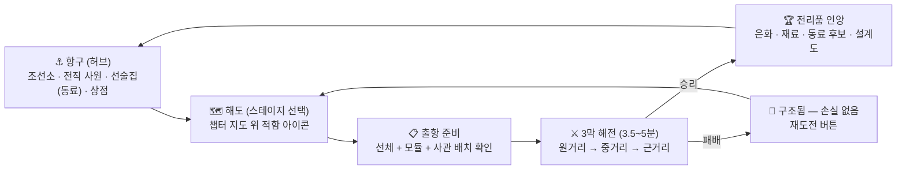
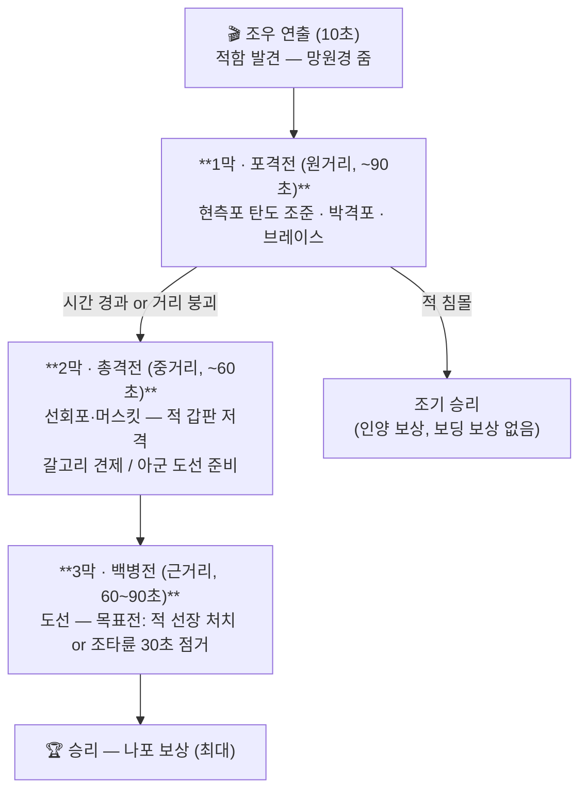
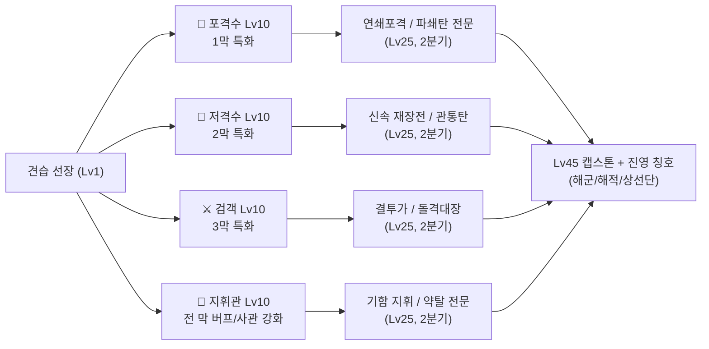

# ⚓ 해상전 프로젝트 — 마스터 기획서 v1 (스테이지형)

> 컨셉 한 줄: **"블랙 플래그의 3막 해전(포격→총격→백병전)을, 항해 없이, 스테이지로."**
> 배는 장비다. 재화로 사고, 꾸미고, 장비하고, 출항 버튼을 누르면 그 배 위에서 1:1 PvE 해전이 시작된다.
>
> 이 문서는 13개 병렬 에이전트의 리서치·설계·적대적 검증(총 185만 토큰)을 통과한 결정만 담는다.
> 상세 근거는 [`reference/`](./reference/) 폴더 참조. 작성: 2026-08-03.

## 0. 왜 오픈월드가 아니라 스테이지형인가

원래 기획(오픈월드 항해)은 적대적 검증 3개 렌즈에서 전부 경고를 받았다:

| 렌즈 | 판정 | 결정타 |
|---|---|---|
| 엔진 | needs-rework | 서버 권위 배 물리·움직이는 갑판·스트리밍 충돌 등 블로커 13개 |
| 1인 생산 | needs-rework | 일정 3~5배 낙관 (실제 1,200~2,250시간), 오픈월드 콘텐츠 물량 |
| 재미 | risky | **모든 해양 게임의 1위 불만 = "항해 자체가 지루하다"**, 첫 5분이 조작 튜토리얼 |

스테이지형 전환은 이 중 대부분을 **구조적으로 소멸**시킨다:

- 항해 지루함 → 항해가 없다. 출항 = 전투 시작
- 움직이는 갑판 물리 → 배를 **앵커 고정**하고 바다·카메라를 움직인다 (§7)
- 오픈월드 스트리밍·좌표 예산·이동 시간 → 해당 없음
- 콘텐츠 물량전 → 스테이지 단위 생산 = 1인 규모에 맞음

시장 근거는 오히려 강해졌다 ([경쟁 리서치](./reference/research-competitors.md)):

1. **네이벌 니치는 요새가 아니라 진공** — 로블록스 최대 순수 해상전 게임이 CCU ~1,000. 장르 대표 Arcane Odyssey는 두 번 붕괴(런칭 4~8만 → 2천, 풀릴리즈 2.4만 → 몇 주 만에 7천). 문제는 획득이 아니라 **리텐션**
2. **바다 배경 자체는 70만 CCU를 담을 수 있다** — 2026년 돌파작 Sailor Piece(피크 74.4만)는 항해 게임이 아니라 **명확한 성장 RPG**. 우리도 "해전 시뮬"이 아니라 "성장 RPG의 전투가 해전"이어야 한다
3. **배-대-배 전투가 제대로 되는 게임이 플랫폼에 없다** — 장르 기함조차 공성무기 데미지 0, 충각 미끄러짐 같은 상태. **"포격이 손맛있게 맞는 것" 자체가 모트**
4. 400k+ 규모의 해양 롤플레이 커뮤니티(계급·제복·함명)가 놀고 있는 잠재 수요

## 1. 게임 구조 — 세션 플로우

- **항구 = 로비**: 모든 성장·수익화·소셜 표면. 다른 플레이어들이 보이는 공용 공간 (내 배가 정박해 있는 게 곧 과시)
- **해도 = 스테이지 맵**: 챕터(해역)별 스테이지 노드. 스테이지 = 적함 1척(+변형). 별 3개 평가(승리/무피해 막 1개 이상/보너스 목표)
- **패배 손실 = 0**: "구조되어 항구로" — 재도전 즉시. 손실 설계 원칙(손실은 절도처럼 느껴지면 안 된다) 그대로
- 세션 구조: 5분 = 스테이지 1판 / 30분 = 챕터 진행+장비 정비 / 2시간 = 선체 티어 승급 작전

## 2. 3막 페이즈 배틀 — 코어 루프

한 판은 거리에 따라 3막으로 진행된다. **각 막의 성과가 다음 막의 시작 조건을 바꾼다** — 이게 전략의 전부다.

### 2-1. 막 간 캐리오버 (조준 부위 = 전략)

| 1막에서 노린 곳 | 2막에 미치는 효과 | 3막에 미치는 효과 |
|---|---|---|
| **돛/마스트** | 2막 조기 진입(적이 도망 못 감), 적 저격 명중률 −20% | — |
| **선체** | — | 적 함 HP 낮게 시작, 적 사기 −1단계 |
| **갑판(대인)** | 적 머스킷 사수 감소 | **적 백병 인원 감소** (최대 −40%) |
| 2막에서 적 사수 제압 | — | 도선 시 아군 피해 없이 시작 |
| 2막에서 갈고리 차단 실패 | — | 적이 **우리 배로** 넘어옴 (수비전) |

- **조기 결판 트레이드오프**: 1막에서 선체만 집중하면 침몰 조기 승리가 가능하지만 보상이 인양(하위)에 그침. **나포(3막 승리)가 최대 보상** — 동료 후보 획득은 나포 전용. "빨리 끝내기 vs 크게 벌기"의 선택
- **수비전 변형**: 관리 못 하면 3막이 우리 갑판에서 벌어진다 — 같은 시스템으로 공수 양면 생성

### 2-2. 무기 상수 (v1 기준값 — [전투 설계](./reference/design-combat.md)에서 이식)

| 무기 | 사용 막 | 재장전 | 피해 | 특성 |
|---|---|---|---|---|
| 현측포 (원탄) | 1막 | 6.0s | 45/발 | 탄도 수동 조준, 부위 판정(돛/선체/갑판) |
| 박격포 | 1막 | 12.0s | 130 | 착탄 원형 텔레그래프, **지면 마커 조준**(리드샷 아님 — 검증 처방) |
| 선회포 | 1·2막 | 2.5s | 90+출혈 | 약점/대인 전용, 차징 1.2s |
| 머스킷 | 2막 | 3.0s | 적 선원 1명 | 조준경 저격, 헤드샷 = 즉시 제압 |
| 갈고리 커터 | 2막 | — | — | 적 갈고리 절단 QTE (실패 = 3막 수비전) |
| 커틀러스/권총 | 3막 | — | 콤보 | 근접 3타 + 회피, 권총 1발(재장전 6s) |
| **브레이스** | 전 막 | — | 피해 −55% | 적 포문 발광 1.0s 텔레그래프 → **0.40s 창** 퍼펙트 −80% (모바일 검증 반영) |

- 상성 구조: 돛 노리기(안전·저보상) ↔ 선체(조기결판·보상↓) ↔ 갑판(3막 투자) — **단일 정답 없음**
- 모바일: 상시 버튼 5개 이하. 1막 = 좌/우현 발사 + 브레이스 + 부위 전환, 3막 = 공격/회피/스킬

### 2-3. 긴장 설계 (안달 엔진 이식)

- 적 일제사격 1.0초 전 포문 발광 + 화약 점화음 → **브레이스 타이밍** = 전 막을 관통하는 스킬 축
- 막 전환 연출 10초: 카메라가 두 배 사이를 훑으며 거리 붕괴 — "다음 막이 온다"는 기대 도파민
- 나포 성공 시 서버 전체 방송("💀 XX 선장이 프리깃 '이단심문관'을 나포!") — 전광판 훅 재사용

## 3. 배 = 장비 시스템

**선체 = 최상위 장비 슬롯.** 절대 소멸하지 않는 자산. 성능은 획득 전용, 외형은 판매 가능 ([선박 설계](./reference/design-ships.md)의 티어를 스테이지형 스탯으로 재해석):

| | T1 슬루프 | T2 스쿠너 | T3 브리간틴 | T4 프리깃 | T5 갈레온/레이지/전열함 |
|---|---|---|---|---|---|
| 세그먼트 체력 | 3×420 | 3×640 | 3×900 | 3×1,320 | 3×1,700 / 3×1,380 / 3×2,050 |
| 현측포 (1막 화력) | 3 | 4 | 6 | 8 | 11 / 8 / 13 |
| 저격 슬롯 (2막) | 1 | 1 | 2 | 2 | 2 / 3 / 2 |
| 백병 인원 (3막) | 4 | 6 | 8 | 10 | 12 / 9 / 14 |
| 사관 스테이션 | 2 | 3 | 4 | 5 | 6 / 5 / 6 |
| 획득 | 시작 지급 | 은화 8k + 업적 2/4 | 34k + 업적 3/5 | 120k + 업적 3/4 | 320k + 기함 인가장 |

- **T5는 상위호환이 아니라 3종 사이드그레이드** (화력형/속공형/요새형) — 수평 엔드게임, 기존 자산 가치 보존
- **모듈 14종 × 4티어**: 장갑판·포신·화약고·돛(2막 진입 타이밍)·충각… 은화+재료로만 구매
- **치장 = 수익화 표면**: 선체 도색, 돛 문양, 선수상, 포격 연기색, 함명판, 정박지 장식 — 항구에서 남에게 보이는 것 전부
- 침몰 없음: 패배 = 구조. 배는 "수리 중" 연출만 (수리비 무료 — 검증 처방: 실패에 통행료를 매기지 않는다)

## 4. 영웅 전직 (막 특화 = 정체성)

**"어느 막의 주인공인가"**가 전직의 정체성이다. 3축 분리(함선=화력 / 선장=기량 / 명성=진영) 유지 ([성장 설계](./reference/design-progression.md)):

- **1차 전직 Lv10 = 첫 세션 안** (~50분 도달 레벨 커브) — "재미있는 직업까지 그라인드" 금지
- 승급 조건 = **위업(Deeds) 복수 경로**: "N판 승리 OR 무피해 막 N회 OR 나포 N회" — 단일 관문 금지
- **숫자는 무료, 정체성은 획득**: 기량 포인트 재배분 무제한 무료. 전직 계열 변경은 티어당 1회 무료 + 이후 콘텐츠 드랍 증표. 로벅스로 전직 판매 금지
- **전직 연출 = 클립 베이트**: 항구 사원에서 의식 → 입력 정지 → 전용 컷신 → 서버 전체 방송 + 계열 코트/모자/칭호 영구 변화. 방송은 전직·나포·전설선 3종으로 제한(희소성 유지)

## 5. 동료(사관) 시스템

**동료는 데이터+연출이지 물리 NPC가 아니다** (AO 선원이 파도에 쓸려가던 실패의 구조적 회피). 갑판 위 모습은 배에 웰드된 장식.

- **6 스테이션**: 포술장(1막 재장전 −%), 저격수장(2막 슬롯+1), 갑판장(3막 아군 강화), 목수(막간 세그먼트 수리), 항해장(브레이스 창 +0.05s), 요리사(스테이지 시작 버프)
- **역할 적합 보너스**: 사관마다 선호 스테이션, 맞으면 +20% — 배치가 로드아웃 퍼즐이 됨
- **기여 총합 상한 15%** (서버 클램프) — 동료는 배수가 아니라 조합. 파워크립 원천 봉쇄
- **획득은 earn-only**: 나포 시 영입 제안, 항구 선술집 평판 영입, 스토리 사관. **로벅스 뽑기 없음** → 2026 확률 공개 규제 자체를 우회 + "반(反)가챠" 마케팅 포인트. 무료 트랙 랜덤성은 확률 공개+천장 표시(우리 원칙)
- 중복 사관 = 승급 재료(5→1 베테랑 승급, 초상화 변화). 영구 사망 없음 — 부상 시 항구에서 회복
- 등급: 일반/숙련/베테랑/전설(이름+개인 퀘스트+전용 함선 능력 1개)
- **친구가 오면**: 사관 스테이션을 실제 플레이어가 점유(2~3인 코업 스테이지) — 친구는 사회적으로 우월하되 기계적으로 필수가 아님. v1 이후

## 6. 수익화 ([수익화 설계](./reference/design-monetization.md) + 리서치 준수)

원칙 3줄: **힘은 팔지 않는다 / 확률은 공개하고 천장을 보여준다 / 안전·보호를 상품화하지 않는다**

| 단 | 가격 (R$) | 상품 예 |
|---|---|---|
| 문턱 | 3~19 | 돛 염색 1색, 깃발 1종 |
| 일상 | 49~99 | 선체 도색 패턴, 선원 제복, 포연 색 |
| 중간 | 199~499 | 선수상, 함명판(프리셋), 정박지 장식 세트, **함대 공용 문양** |
| 프리스티지 | 1,499~2,999 | 플래그십 풀 코디(선체+돛+선수상+VFX+제복) — 고래 세그먼트 필수 (137명의 2,999 구매 = 4,122명의 99 구매) |
| 반복 | $4.99 구독 | 서포터: 항구 칭호 + 월간 치장 상자(확률 공개) + 정박지 프리미엄 |
| 편의 | 99~299 | 선체 보관 슬롯, 사관 로드아웃 프리셋, 의상 슬롯 (Deepwoken 검증 SKU) |

- 판매 금지: 전투 스탯 전부, 화물칸, 상위 전직, 최강 사관, 도난/그리핑 보호
- 시즌패스는 1년차 금지(검증 처방) → **볼트-앤-리턴 로테이션 상점**(주간 절반 신규/절반 복각, 복각 예고제 = 반FOMO)
- **현실 숫자를 문서에 박는다**: 코스메틱 mid-core는 CCU당 월 ~$1.0~1.5(개발자 실수령). 손익분기 = 솔로 ~5,000 CCU, 2,000 CCU 미만은 취미. **이 게임은 12~24개월 자산이다 — 그동안 현금흐름은 하이퍼캐주얼 트랙(뽁뽁이 계열)이 담당** (2트랙 전략)

## 7. 기술 아키텍처 — 스테이지형이 바꾸는 것

| 문제 | 오픈월드에서 | 스테이지형에서 |
|---|---|---|
| 배 물리 | 블로커 1순위 | **배 = 앵커된 세트.** 이동 없음 |
| 흔들림 | 갑판 움직이면 캐릭터 미끄러짐 | **갑판 고정, 바다·수평선·카메라가 움직인다** (영화 세트 트릭). 멀미 옵션으로 강도 조절 |
| 막 전환(거리 붕괴) | 실제 항해 | 카메라 연출 + 바다 스크롤 + 적함을 코드가 재배치 (플레이어는 자기 갑판에 서 있음) |
| 포탄 | 60발 캡, 레이캐스트 | 동일 (FastCast 스타일), 1:1이라 총량 절반 이하 |
| 스테이지 인스턴스 | — | 서버 1개(8~12인)에 항구 허브 + 원거리 분산 아레나 4~6개. 예약서버 불필요(v1) |
| 스트리밍 | 블로커 | 정적 씬만 존재 — 문제 자체가 없음 |
| 안티치트 | 선체 로컬 좌표 검증 | 훨씬 단순: 판정 전부 서버, 클라는 입력·연출만 |

**남는 리스크 (Week 0 스파이크 4개, 각 PASS 기준 포함):**

1. **세트 트릭 검증** — 고정 갑판 + 움직이는 바다/카메라가 "배 위" 느낌을 주는가 (테스터 5인 중 4인 "배에 탄 것 같다" = PASS / FAIL 시: 흔들림 강도만 낮추고 진행 — 치명 리스크 아님)
2. **포격 손맛 (모바일)** — 탄도 조준+부위 판정+명중 이펙트가 폰에서 재미있는가 (5인 중 4인 "한 판 더" = PASS / FAIL 시 조준 보정 강화)
3. **3막 백병전 최소본** — 8인 근접이 저가폰에서 30fps 유지 + 판정 억울함 없음 (FAIL 시: 백병전을 목표 QTE+연출 중심으로 강등)
4. **저가 안드로이드 풀씬** — 배 2척(각 ~300 인스턴스)+선원 장식+VFX에서 p50 30fps (FAIL 시 인스턴스 예산 삭감표 발동)

## 8. 로드맵 — 고정 시간예산 · 가변 스코프

검증 처방 그대로: 날짜를 미루지 않는다, **스코프를 자른다**.

| 단계 | 시간예산 | 내용 | 출구 게이트 |
|---|---|---|---|
| **W0 스파이크** | 20~30h | §7의 4개 스파이크 | 4개 전부 판정 완료 |
| **v0.1 «포격전»** | 80~120h | **1막만 있는 게임** — 항구(미니)+해도 5스테이지+T1/T2+조준·브레이스·별 평가. **실제 공개 출시** | 썸네일 CTR·첫 60초 이탈·세션 길이·p50 fps 측정 |
| **v0.5 «3막»** | +120~160h | 2·3막+캐리오버+T3+전직 1차(4계열)+사관 3스테이션 | D1 ≥ 25%, 첫 나포 완료율 ≥ 60% |
| **v1.0 «함대»** | +150~200h | 챕터 3개+T4+전직 2차+사관 6스테이션+치장 상점+운영 툴킷 | D7 ≥ 8%, CCU 추세 |
| 이후 | 라이브 | T5 3종, 전설선 스테이지(주간 레이드), 코업, 진영 | 지표 게이트별 |

- **v0.1을 공개 출시하는 이유** (검증 처방): 최대 리스크는 기술이 아니라 "아무도 클릭하지 않는다" — 5개월 뒤가 아니라 8주차에 시장 검증. 1막만으로도 게임이 성립하는 게 스테이지형의 최대 이점
- **트립와이어**: 어느 단계든 예산 1.5배 초과 시 그 자리에서 기능 절단 + 게이트 실시 / 누적 200h 내 공개 출시 없으면 범위 재협상 강제
- **운영 툴킷 = v1.0 선행조건**: 원격 킬스위치, DataStore 계정 롤백, 관리자 커맨드, 경제 이상 알람
- 라이브 운영 주 6시간을 고정비로 계상 — 개발 가용시간은 그걸 뺀 값으로 계획

### NOT in v1 (거절 목록)

오픈월드 항해 / 실시간 PvP(아레나 PvP는 v1.5 후보) / 걸어다니는 선내 인테리어 / 함대(다중 함선 동시 운용) / 길드전 / 자유 조선(BABFT식 빌딩) / 무역 경제 / 낚시·채집 — 각각 발동 조건(D7·CCU 기준)을 넘겨야 백로그 진입

## 9. 킬 크라이테리아 (정직하게)

1. W0 스파이크 2번(포격 손맛) FAIL 반복 → **이 게임의 심장이 없는 것.** 컨셉 재검토
2. v0.1 공개 후 4주: 세션 중앙값 < 8분 AND D1 < 15% → 훅 재설계 1회 시도 후 미개선 시 중단
3. v0.5 후 D7 < 5% → 콘텐츠 추가로 해결하려 하지 말 것(리서치: AO는 콘텐츠가 아니라 리텐션 구조로 죽었다). 루프 자체를 재설계하거나 종료

## 출처 (핵심)

전체 출처는 [`reference/`](./reference/) 각 문서에. 대표: [Arcane Odyssey 포럼(플레이어 수 붕괴)](https://forum.arcaneodyssey.dev/t/player-count/112874) · [RoWatcher — Sailor Piece](https://rowatcher.com/games/9186719164/2x-luck-sailor-piece) · [Blox Fruits 위키(보트/해상 이벤트)](https://blox-fruits.fandom.com/wiki/Sea_Events) · [PC Gamer — 블랙플래그 디렉터 인터뷰](https://www.pcgamer.com/interview-assassins-creed-iv-black-flag-game-director-ashraf-ismail/) · Roblox DevForum 다수(엔진 제약) · [Roblox 유료 랜덤 아이템 정책(2026 확률 공개)](https://create.roblox.com/docs)
