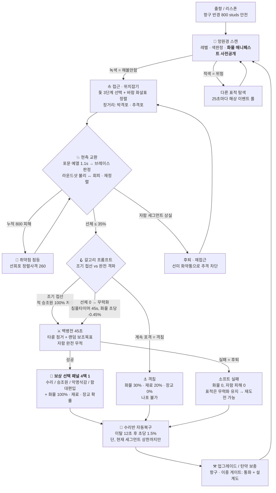
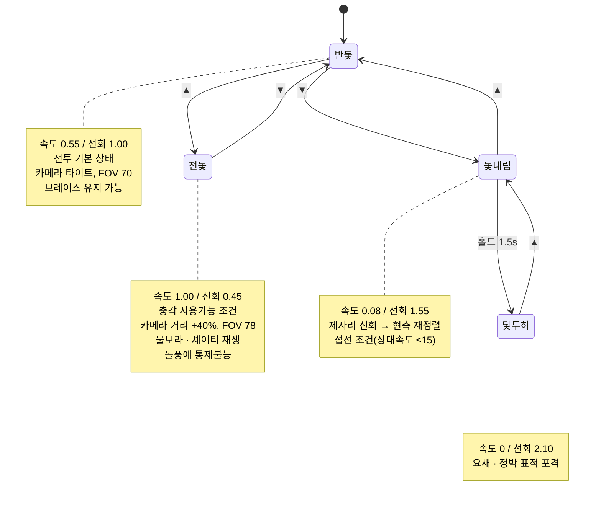
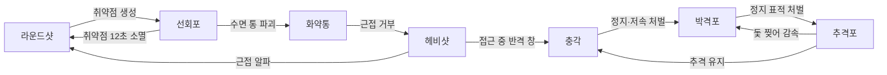
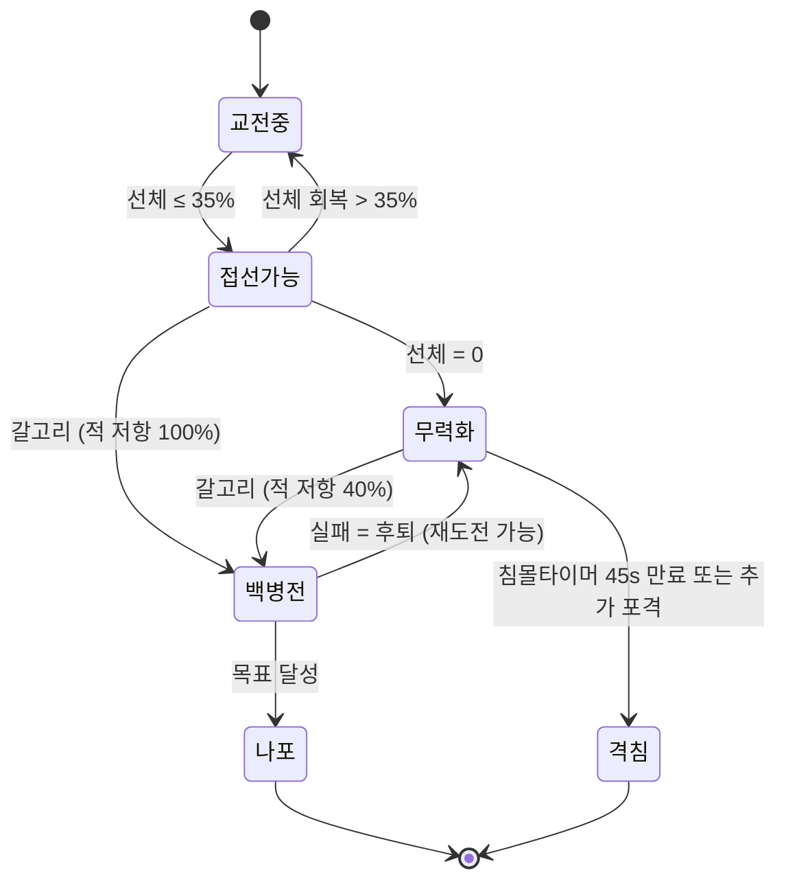
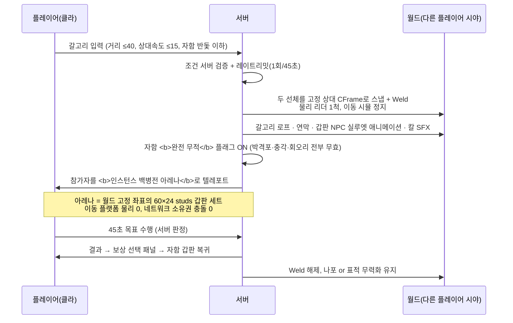
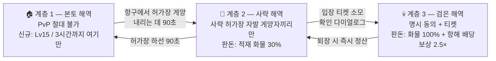

## 해상전 코어 루프 — 전투 시스템

> **이 섹션의 합격 기준**: 진행도(레벨·업그레이드·전직)를 전부 0으로 꺼놓고도 **단일 교전 1회가 재밌어야 한다.** Black Flag가 5분 만에 재밌는 이유는 콘텐츠 양이 아니라 "항상 이미 배에 타 있고, 항상 이미 무장해 있고, 90~180초 안에 완결되는 극적 아크가 손 뻗으면 있다"는 구조 때문이다. 아래 모든 수치는 그 구조를 만들기 위한 초기 튜닝값이며, 출처 리서치의 Resynced 수치는 방향성 참고로만 썼다(하드코딩 금지).

---

### 1. 핵심 루프

#### 1.1 전체 루프 다이어그램



#### 1.2 타이밍 예산 (합격선)

| 구간 | 목표 시간 | 실패 판정 |
|---|---|---|
| 스폰 → 첫 표적 스캔 | ≤ 20초 | 표적을 찾으러 헤매면 실패 |
| 스폰 → 첫 포탄 발사 | ≤ 25초 | 30초 넘으면 "항해가 지루하다"(장르 1위 불만) 재발 |
| 교전 개시 → 무력화 (동급) | 90 ~ 180초 | 240초 초과 시 HP 스펀지 |
| 백병전 전체 | 30 ~ 60초 (타이머 45초) | 60초 초과 시 반복 피로 |
| 보상 선택 → 다음 표적 조우 | ≤ 40초 | 이동 공백은 20~40초마다 이벤트로 메움 |
| **1 아크 총합** | **3 ~ 5분** | 5분 세션이 완결 아크 1개를 못 담으면 설계 실패 |

---

### 2. 항해 조작 — 돛 3단계 상태머신

무기 이전에 **조타가 주 동사**다. 아날로그 스로틀 대신 3단계 이산 상태를 쓴다. 이유: (a) 상태 전환이 "선택"으로 느껴진다, (b) 카메라·오디오·애니메이션 프리셋을 3개만 저작하면 된다, (c) 모바일에서 버튼 2개(▲▼)로 끝난다, (d) 속도↔선회 트레이드오프가 흐릿한 그라데이션이 아니라 읽히는 결정이 된다.



**속도·선회 공식**

```
현재최대속도 = 함급기본속도 × 돛계수 × 바람계수 × 삭구건전도 × (1 - 브레이스감속 0.35)
  돛계수:  전돛 1.00 / 반돛 0.55 / 돛내림 0.08 / 닻 0.00
  바람계수: 1.15 (순풍, 상대각 0~45°) / 1.00 (횡풍 45~135°) / 0.80 (역풍 135~180°)
  삭구건전도 = 1 - Σ(파괴 마스트 패널티)   포마스트 0.20 / 메인 0.30 / 미즌 0.15

선회속도(deg/s) = 함급기본선회 × 돛선회계수 × (1 - 미즌파괴 × 0.25)
  돛선회계수: 전돛 0.45 / 반돛 1.00 / 돛내림 1.55 / 닻 2.10
```

| 함급 | 길이 | 기본속도 | 기본선회 | 선체 HP | 승조원 | 현측 포문 |
|---|---|---|---|---|---|---|
| 커터 | 40 studs | 105 | 26°/s | 600 | 6 | 3 |
| 스쿠너 | 60 | 95 | 22°/s | 1,200 | 10 | 5 |
| **브릭 (플레이어 기준함)** | 100 | 80 | 18°/s | **3,000 (1,000×3)** | 18 | 8 |
| 프리깃 | 150 | 68 | 13°/s | 4,500 | 28 | 12 |
| 전열함 | 220 | 55 | 9°/s | 9,000 | 44 | 18 |

**바람은 물리가 아니라 READOUT이다.** 2013년 원작의 바람 효과는 커뮤니티 검증상 거의 무의미했고, Resynced가 뒤늦게 강화했다. 우리는 소박한 계수(1.15/1.00/0.80)만 넣고, 투자는 **100ms 안에 읽히는 미니맵 바람 화살표(녹→황→적)** 에 집중한다. 바람은 90초 주기로 22°씩 회전하므로, 시작할 때 순풍이던 추격이 중반에 역풍이 된다 — 이게 "위치잡기"라는 게임플레이를 만든다. 바람을 완전히 무시하는 플레이어도 20%만 느릴 뿐 재미는 유지된다(세금이 아니라 숙련 표현).

---

### 3. 무기 체계

#### 3.1 무기 표 (브릭 티어 기준, 업그레이드 0단계)

| 무기 | 발당 피해 | 1볼리 | 재장전 | 사각 | 유효사거리 | 탄약 | 전술 역할 | 카운터 |
|---|---|---|---|---|---|---|---|---|
| **현측 라운드샷** | 45 | ×8 = **360** | 4.5s | 좌/우현 각 140° (선체축 20~160°) | 120~420 (최적 260) | ∞ | 유일한 무한 무기. 수동 리드 조준. 취약점 생성기 | 브레이스(-65%), 거리 벌리기, 선수/선미 실루엣 노출, 급선회 |
| **헤비샷** | 110 | ×8 = **880** (0~60studs 100%, 60~120 선형 40%) | **9s** (같은 포열 공유 → 이 동안 라운드샷 불가) | 좌/우현 동일 | 0~120 | **4 볼리** | 무조준 알파 스트라이크 / 피니셔. 조준 스킬을 조타 스킬로 이전 | 근접 거부(화약통·충각), 발사 순간 급선회로 사각 이탈, 접근 중 반격 현측 |
| **추격포** | 30 | ×2 = **60** (삭구 명중 시 **×2**) | 2.0s | 선수 ±25° / 선미 ±25° | 200~700 | ∞ | 추격·도주 전용. 도망자 돛 찢어 감속 | 급선회로 사각 이탈(=상대에게 측면 노출), 저 DPS라 결정력 없음 |
| **박격포 (곡사)** | 220 (스플래시 반경 22) | ×1 | 7.0s | **전방위** | **최소 250** ~ 900 | **8발** | 사각 밖 유일한 답. 호위함 선제 제거, 정박 표적 | 오렌지 착탄원 회피(전돛 직진), 비행 3.5초 예측 필요, 250 이내 사용 불가 |
| **선회포 (정렬사격)** | **260 (취약점 전용)** / 비취약점 15 | ×1 | 3.0s | 전방위(사수 시야) | ≤ 500 | ∞ (취약점 필요) | 스킬 배율기. 숙련자 킬타임 −30~35% | 취약점이 없으면 무용, 취약점 12초 후 소멸, 홀드-정렬 1.1초 동안 조타 불가 |
| **화약통** | 400 직격 / 220 반경 45 | ×1 | 6.0s | **선미 후방** | 투하(수면 잔존 20s, 무장 1.2s) | **4발** | 후방 사각의 동사. "쫓기는 상태"를 공격 행위로 전환 | 선회포로 수면 통 파괴, 넓게 우회, 4발 한정 |
| **충각** | `5.5 × 접근상대속도 × 질량비` (상한 900), 자기피해 25% | 접촉 | — | 선수 ±15° | 접촉 | ∞ | 조타 실력 자체가 입력. 전돛을 전투 중에도 유효하게 만듦 | 급선회 회피 → 실패 시 자함 측면을 상대 현측에 헌납, 대형함 상대 자기피해 역전 |

```
충각데미지 = clamp(5.5 × 접근상대속도(studs/s) × 질량비, 0, 900)
  질량비 = clamp(자함질량 / 표적질량, 0.5, 2.0)
  자기피해 = 충각데미지 × 0.25 × (1 / 질량비)
  요구조건: 전돛 AND 자함속도 ≥ 최대속도의 70% AND 충돌각 선수 ±15°
```

#### 3.2 가위바위보 — 삼축 매트릭스

RPS는 데미지 타입 삼각형이 아니다. **거리대 × 사각 × 탄약희소성** 3축에서 각 무기가 서로 다른 칸을 점유하고, 어느 것도 다른 것을 하드 카운터하지 않는다.

| 무기 | 거리대 | 사각 | 희소성 | 조준 부담 |
|---|---|---|---|---|
| 라운드샷 | 중 (120~420) | 좌/우현 | 무한 | 높음(리드+낙차) |
| 헤비샷 | 초근접 (0~120) | 좌/우현 | 희소 4 | **없음**(조타로 이전) |
| 추격포 | 중장 (200~700) | 선수/선미 | 무한 | 낮음(고속 평사) |
| 박격포 | 장 (250~900) | 전방위 | 희소 8 | 높음(3.5초 리드) |
| 선회포 | 전 (≤500) | 전방위 | 무한 but 조건부 | 중(정렬 타이밍) |
| 화약통 | 후방 | 선미 | 희소 4 | 없음(설치형) |
| 충각 | 접촉 | 선수 | 무한 | 조타 100% |

**핵심 설계 규칙 3개**
1. **무한은 하나뿐.** 라운드샷만 무한이고, 그것이 유일하게 수동 조준을 요구한다. 전투가 절대 소프트락되지 않으면서 숙련 상한이 열려 있다.
2. **현측 포열 공유.** 라운드샷과 헤비샷은 같은 8문을 쓴다. 헤비샷을 쏘면 9초간 현측이 침묵한다 — 헤비샷 지배를 구조적으로 막는 단일 규칙.
3. **모든 사각에 동사가 있다.** 선수=추격포/충각, 좌우현=라운드샷/헤비샷, 선미=화약통, 사각 밖=박격포. "위치가 나쁘다"가 절대 무행동 시간이 되지 않는다.

#### 3.3 카운터 웹



#### 3.4 아군 무기를 살아있게 만드는 적 아키타입 (필수 — 없으면 전부 "항상 현측"으로 붕괴)

| 아키타입 | 무력화되는 무기 | 강제되는 무기 | 기믹 |
|---|---|---|---|
| **밀항 커터 무리** (3~4척) | 라운드샷(작고 빨라 빗나감) | 충각, 헤비샷 | 105 속도로 근접 선회, 개별 600 HP |
| **장갑 프리깃** | 라운드샷(정면·현측 장갑 **0.35×**) | 선회포 취약점, 선미 각 | 선미만 1.0× — 사각 변경 강제 |
| **박격포 갤리엇** | 근접 무기(자기 최소사거리 250) | 접근 후 라운드샷/충각 | 정지 3초 이상 = 곡사 확정 명중. 계속 움직여야 함 |
| **추격 슬루프 팩** | 현측(계속 선미에 붙음) | 화약통, 선미 추격포 | 후방 사각 플레이 강제 |
| **화공선** | 헤비샷·충각(자폭 반경 60) | 박격포, 장거리 라운드샷 | 접근 금지형 표적 |
| **(레이드) 유령 전열함** | 페이즈별로 각기 다른 하나 | 전 무기 로테이션 | 3페이즈, 취약점만 유효 구간 존재 |

---

### 4. 데미지 모델

#### 4.1 3트랙 구조

| 트랙 | 최대치(브릭) | 명중 부위 | 효과 | 회복 |
|---|---|---|---|---|
| **선체 (Hull)** | 1,000 × 3 세그먼트 | 수면선 밴드 | 0 → **무력화(격침 아님)**. 세그먼트 상실 시 최대속도 누적 −8% | 세그먼트 내부: 이탈 12초 후 초당 1.5%. 세그먼트 경계 = 항구 수리 또는 접선 보상만 |
| **삭구 (Rigging)** | 마스트 3 × 400 | 삭구 밴드 (고각) | 포 −20% / 메인 −30% / 미즌 −15% 최대속도, 미즌 파괴 시 선회 −25% | 이탈 25초 후 초당 2%, 파괴된 마스트는 항구에서만 |
| **승조원 (Crew)** | 18명 | 갑판 밴드 (중각) | 재장전·수리속도 저하, 백병전 저항력 | 접선 보상 / 항구 / 표류자 구조 |

```
실재장전 = 기본재장전 × 포술반계수 × 업그레이드계수
  포술반계수 = 1.0 + 0.6 × (1 - 포술반현재/포술반정원)      → 최대 1.60
수리속도 = 기본 × (수리반현재 / 수리반정원)
```

**침수·기울기는 공짜로 얻는다** (엔진 기회 활용): 커스텀 부력을 4~8개 샘플점의 VectorForce로 구현하므로,

```
부력점 i = (질량 × 196.2 / N) × 침수율_i × (1 - 침수도_i)
  침수도_i = 해당 구획 누적 선체피해 / 구획최대치   (취약점 존재 시 초당 +0.02)
```

구획 하나가 피해를 입으면 그쪽 부력이 줄어 배가 **실제로 기울고 가라앉는다.** 새 시스템 0개, 체감 완성도 최대. 데미지 숫자는 화면에 절대 띄우지 않는다 — 파편, 기울기, 연기 밀도, 속도 저하가 데미지 UI다. 표시되는 유일한 수치는 3칸 세그먼트 바.

#### 4.2 조준 밴드 (모바일 핵심)

적함 조준 시 **3개의 굵은 수평 밴드**가 겹쳐 표시된다. 상하 드래그로 밴드를 고르고, 밴드 안에서 산포가 결정된다. 별도 UI 없이 "돛을 노려 감속시킨다 / 선체를 노려 침몰시킨다 / 갑판을 노려 승조원을 줄인다"가 성립.

| 밴드 | 히트 트랙 | 배율 | 전술 의도 |
|---|---|---|---|
| 상 — 삭구 | Rigging 1.0×, Hull 0.15× | — | 도망자 감속, 접선 준비 |
| 중 — 갑판 | Crew (볼리당 1~3명), Hull 0.55× | — | 백병전 사전 청소, 재장전 지연 |
| 하 — 수면선 | Hull 1.0× | — | 격침·무력화 최단 경로 |

정조준 보너스: 조준 유지 1.4초 후 "Steady" — 산포 −50%, 수면 조준링이 적→황→녹으로 수축.

#### 4.3 취약점 루프

```
취약점 생성: 누적 라운드샷 피해 800당 1개 (동시 최대 2개), 최근 명중 부위에 발생
지속: 12초 (수리반이 임시 판자로 봉합)
선회포 명중: 260 피해 + 트랙별 추가효과
  선체 취약점 → 침수도 +0.15 (기울기 즉시 체감)
  마스트 취약점 → 해당 마스트 즉시 파괴
  갑판 취약점 → 승조원 4명 사망
```

수치 검산: 260 / 800 = **+32.5% 실효 DPS**. 숙련 플레이어가 스탯 차이 0으로 30~35% 빨리 죽인다 — 실력 격차가 큰 로블록스 오디언스에 정확히 맞는 폭이다. 최종 업그레이드 티어는 "취약점 자동 사격"으로 이 미니게임을 **자동화**해준다(숙련을 편의로 환전 — 원작의 영리한 보상 구조).

#### 4.4 브레이스 (최우선 구현 항목)

전투를 HP 경주에서 듀얼로 바꾸는 단 하나의 메커닉. 로블록스 나발 게임 중 아무도 안 쓴다.

```
적 포문 발광(오렌지 Emissive) 1.1초 → 발사
브레이스: 홀드 입력
  피해 −65%,  승조원 사망 0,  삭구 피해 −50%
  퍼펙트 브레이스: 발사 전 0.25초 창 안에 홀드 시작 → 피해 −85% + "완벽 방어" 연출 + 승조원 함성
유지 비용: 최대속도 −35%, 선회 −50%, 발사 불가  → 쿨다운 없이도 남용 불가
```

구현 비용은 거의 0이다(Emissive 머티리얼 스왑 + 서버 검증 플래그). 서버 권위: 브레이스 상태는 서버가 타임스탬프로 판정하고, 클라이언트는 연출만 한다.

#### 4.5 접선 임계값과 격침 분기



| 결말 | 화물 | 재료 | 장교 확률 | 함대 편입 | 소요 |
|---|---|---|---|---|---|
| **조기 접선** (선체 ≤35%) | **100%** | 100% | 기본 | 가능 | 백병전 하드 |
| **무력화 후 접선** | 100% − (경과초 × 0.45%) | 100% | 기본 | 가능 | 백병전 표준 |
| **격침** | **30%** | 20% | **0%** | 불가 | 즉시 |

이 3분기가 루프의 엔진이다. **0 HP = 사망이 아니라 결정**이고, 침몰 타이머가 그 결정에 초시계를 붙인다. 망원경이 화물 매니페스트를 **전투 전에** 보여주므로, 플레이어는 이미 그 화물을 자기 것이라 느끼고 있다 — 랜덤 드랍이 아니라 지켜야 할 목표가 된다. 이건 구현 비용 대비 효용이 문서 전체에서 가장 높은 항목이다.

**자함이 무력화될 때 (손실 상한 원칙)**

| 상황 | 손실 | 보험 |
|---|---|---|
| PvE 격침 | 적재 화물 **15%** + 세그먼트 전부 손상(항구 수리 필요) | 무료 3회/일, 화물 50% 환급 |
| PvP(사략 해역) 격침 | 적재 화물 **30%** | 동일 |
| PvP(검은 해역) 격침 | 적재 화물 100% + 항해 배당 | 없음(옵트인 대가) |
| **모든 경우** | **선체·업그레이드·장교·코스메틱 손실 0%** | — |

---

### 5. 백병전 (Boarding) — 감정적 페이오프

Arcane Odyssey는 이걸 시도조차 안 했고, GPO는 이동 갑판에서 플레이어를 날려버린다. 로블록스에서 **가장 명확한 차별화 지점**이다.

#### 5.1 엔진 제약 정면 대응 — 물리 난투를 만들지 않는다

리서치의 하드 제약: (a) 캐릭터는 이동 플랫폼의 속도를 상속하지 않는다(확인된 엔진 버그), (b) 캐릭터를 갑판에 weld하면 배를 끌고 다니거나 침몰시킨다, (c) 네트워크 소유자가 다른 두 리지드바디의 충돌 처리는 공식적으로 "가장 큰 문제"로 지목돼 있다. → **흔들리는 갑판 위 물리 난투는 만들지 않는다.**



**아레나 방식이 해결하는 것**: 이동 플랫폼 속도 상속 문제, 두 갑판 간 점프, 교차 소유권 충돌, 승조원 NPC가 파도에 휩쓸려 사라지는 AO의 버그 계열 — **전부 한 번에**. 다른 플레이어에게는 두 배가 갈고리로 묶여 연기를 뿜고 검격 소리가 나는 것으로 보인다(연출로 충분하다).

⚠️ **익스플로잇 가드**: 무적 상태를 체인으로 이어 불사가 되는 것을 막기 위해 접선 시작 쿨다운 45초, 동일 표적 재접선 금지, 무적은 아레나 진입~퇴장 구간으로 서버가 시간 상한(60초)을 강제한다.

#### 5.2 목표 설계 — "적 N명 처치"는 쓰지 않는다

원작은 5/10/15/20 킬 카운트였고, 완전한 근접전투 시스템을 갖췄음에도 "매번 똑같다"는 스팀 스레드가 존재한다. 더 얇은 로블록스 버전은 더 빨리 식는다.

| 항목 | 설계 |
|---|---|
| **주 목표** | **타륜 점거** — 선미 타륜 존(반경 6 studs)에 서서 점령 게이지 8초 채움. 적 승조원이 존 안에 있으면 게이지 정지(감소는 안 함). 함급이 커지면 존이 멀고 저항이 두꺼워져 자연스럽게 길어진다 |
| **보조 목표** | 랜덤 1개, 6종 로테이션. **동사가 전부 다르다** |
| **타이머** | 45초 (표시: 화면 상단 침몰 밧줄이 타는 연출) |
| **저항 승조원** | 처치는 수단이지 목표가 아니다. 무력화 후 접선 시 저항력 40%, 조기 접선 시 100% |
| **보너스** | 주 목표만 = 표준 보상 / 보조까지 = 화물 +15%, 장교 확률 ×2 |

**보조 목표 6종 (전부 다른 동사)**

| # | 목표 | 동사 | 소요 |
|---|---|---|---|
| 1 | 화약고 폭파 | 하부 해치 → 도화선 점화 → 8초 안에 탈출 (타이머) | 12s |
| 2 | 깃발 내리기 | 메인마스트 등반 상호작용 (수직 이동) | 8s |
| 3 | 적 선장 처치 | 단일 강적 (전투) | 10s |
| 4 | 화물 자물쇠 해제 | 3초 상호작용 × 2개소 (분업 — 코업 유도) | 9s |
| 5 | 포로 3명 구출 | 탐색 + 호송 (탐색) | 12s |
| 6 | 신호 종 타격 | 3박자 리듬 입력 (타이밍) | 6s |

#### 5.3 모바일 조작

| 입력 | 매핑 |
|---|---|
| 좌 가상 스틱 | 이동 |
| 대형 버튼 A | 근접 공격 — **8 studs 내 최근접 적 자동 스냅**(판정은 서버) |
| 버튼 B (홀드) | 방어 — 피해 −70%, 이동 −40% |
| 버튼 C | 상호작용 (점거 / 해제 / 등반 / 타격) — 컨텍스트 자동 전환 |
| 버튼 D | 플린트락 1발, 재장전 4초 (원거리 해답) |

버튼 4개. 백병전 조작은 항해 조작과 완전히 분리된 별개 컨트롤 셋이므로 인지 부하도 분리된다.

#### 5.4 실패 처리 — 절도로 느껴지지 않게

45초 초과 또는 참가자 전원 다운 → **후퇴**. 자함으로 복귀, 화물 0, **자함 피해 0**, 표적은 무력화 상태 유지 → 즉시 재도전 가능(단 쿨다운 45초, 그 사이 침몰 타이머는 계속 흐른다). 손실은 "시간과 화물의 일부"뿐이고 영구 자산은 절대 없다.

#### 5.5 보상 선택 패널 (자동 지급 금지)

승리의 순간에 3~4개 선택지를 주는 것은 UI 패널 하나로 만들 수 있는 가장 값싼 깊이다. 같은 콘텐츠가 매번 다른 이야기를 만들고, 플레이어가 자기 항해를 저작하게 된다.

| 선택지 | 효과 | 언제 고르는가 |
|---|---|---|
| **수리** | 선체 세그먼트 1칸 **완전 복구** + 현재 세그먼트 만충 | 다음 표적이 크거나 세그먼트를 잃었을 때 |
| **승조원 보충** | 승조원 정원까지 +40% | 재장전이 느려졌다고 느낄 때 |
| **악명 삭감** | 악명 −25% | PvP 표적화·NPC 해군 추격을 끊고 싶을 때 |
| **함대 편입 (나포)** | 이 배를 항구 함대에 등록 → 패시브 무역 루트 (berth 슬롯 소모) | 좋은 함급을 만났을 때 |
| (공통 자동) | 화물 매니페스트 전량, 재료(목재/천/철), 탄약 보충, 장교 카드 확률 | — |

장교 카드 확률은 **접선 = 무과금 획득 경로**로만 굴린다. 로블록스 2026 유료 랜덤 아이템 정책의 확률 공시 의무는 Robux 유래 통화가 개입할 때만 적용되므로, 승조원/장교 RNG를 전부 무료 획득 트랙에 두면 규제 범위를 아예 벗어나면서 "안티 가챠" 포지셔닝을 얻는다. (Robux로 파는 것은 결정론적 지정 구매만.)

---

### 6. PvE 콘텐츠

#### 6.1 해상 이벤트 롤 — 항해를 세금이 아니라 콘텐츠로

장르 1위 불만은 "항해 자체가 지루하다"다. Blox Fruits는 밀도 높은 해상 이벤트로 우연히 이걸 풀었다. 우리는 의도적으로 한다.

**롤 규칙**: 25초마다 판정. 플레이어 함선 반경 700 studs 안에 활성 이벤트가 없을 때만 스폰. **보장 하한**: 어떤 항해도 5분 안에 최소 1회 "화물 획득 가능 표적"을 만난다 (Dark Sea 교훈 — 빈 물은 낭비된 시간으로 읽힌다).

| 가중치 | 이벤트 | 소요 | 보상 |
|---|---|---|---|
| 30 | 표류 화물 · 난파 잔해 | 10s | 재료 소량 (즉시) |
| 22 | 소형 순찰 커터 2척 | 60~90s | 화물 소, 재료 |
| 14 | 무호위 상선 1척 (화물 만재) | 60s | 화물 중 |
| 10 | 표류자 구조 | 45s | 승조원 +2, 장교 4% |
| 8 | 호송대 (상선 2 + 호위 1) | 3~5분 | 화물 대 |
| 6 | 돌풍 · 국지 회오리 | 40s | 통과 보너스 |
| 5 | 고래떼 (연출 전용) | 20s | 견시 XP, 스크린샷 |
| 3 | 바다괴물 촉수 (미니 조우) | 3~5분 | 희귀 재료 |
| 2 | 유령 안개 (전설선 단서) | — | 레이드 좌표 |

#### 6.2 정규 PvE 콘텐츠

| 콘텐츠 | 세션 길이 | 난이도 게이트 | 구성 | 강제되는 무기 | 보상 |
|---|---|---|---|---|---|
| **순찰 호송대** | 3~5분 | 없음 (상시) | 상선 2 + 호위 스쿠너 1 | 라운드샷, 박격포(호위 선제 제거) | 화물, 재료, 접선 1~3회 |
| **보물 함대** | 8~12분 | 없음, 단 **90초 전 서버 전체 예고** | 갤리언 1(화물 5배) + 프리깃 호위 3 | 전 무기 로테이션 | 대량 화물, 설계도 확률 25% |
| **요새 · 봉쇄선** | 10~15분 | 브릭 티어 + 박격포 2단계 | 요새 포대 3 + 정박 프리깃 2 | **박격포 필수**, 닻투하 포격 | 지역 개방 → 함대 무역 루트 확장 |
| **폭풍 / 회오리** | 40~90초 통과 | 없음 (환경) | 로그 웨이브, 돌풍, 낙뢰 AoE | **반돛 전환 / 파도 정면 조준** | 통과 보너스 + 렌더거리 감소 = 은폐 도구 |
| **바다 괴물 (크라켄)** | 5~8분 | 프리깃 티어 | 촉수 6개(각 취약점) + 본체 | 선회포, 헤비샷 | 희귀 재료, 코스메틱 |
| **유령선 / 전설선** | 15~20분 | **4인 레이드**, 최종 업그레이드 티어 | 3페이즈, 페이즈별 무기 무효화 | 전 무기 + 팀 역할 분담 | 설계도, 전설 코스메틱, 서버 방송 |
| **표류자 구조** | 60~90초 | 없음 | 침몰 잔해 + 상어 | 조타(구조 기동) | 승조원, 장교 확률 |

**폭풍의 우아함**: 해저드의 카운터가 곧 코어 메커닉이다 — 돌풍은 반돛으로, 로그 웨이브는 선수를 정면으로 향해서 넘는다. 즉 **날씨가 항해를 가르친다.** v1은 폭풍 1종 + 로그 웨이브 1종으로 충분하다. 폭풍 안에서는 네임플레이트·렌더 거리가 줄어들어 추격 회피 도구로도 쓰인다.

**절대 하지 않는 것**: 절차생성 무한 해역. Dark Sea는 플랫폼에서 가장 야심찬 오픈 시 존이었고 가장 많이 욕먹는 기능이 됐다. 우리 해역은 8,000 × 8,000 studs 수제작 군도 + 위 이벤트 테이블로 밀도를 만든다.

---

### 7. PvP 방침 (결정)

**결론: 3계층 옵트인 구조. 기본값은 PvP OFF. 영구 자산은 어떤 계층에서도 절대 잃지 않는다.**

로블록스 오디언스는 비자발적 PvP + 유의미한 손실을 용납하지 않는다. Arcane Odyssey의 현상금 사냥(사망 + 처형 패널티 + 감옥, 그리고 클랜 가입이 PvP를 영구·불가역으로 강제 활성화)은 가장 많이 인용되는 이탈 원인이다. 우리는 이걸 명시적으로 반대 설계한다.



#### 7.1 계층별 규칙

| | 계층 1 본토 해역 | 계층 2 사략 해역 | 계층 3 검은 해역 |
|---|---|---|---|
| PvP | **불가** | 허가장 게양자 상호 간만 | 존 내 전원 |
| 진입 | 기본값 | 항구에서 게양(하선 90초 소요 — 전투 중 도주 방지) | 명시 동의 다이얼로그 + 티켓 |
| 파워 브래킷 | — | 함급 ±1티어 **AND** 악명 대역 일치. 브래킷 밖 상호 데미지 **0** (서버 판정) | 브래킷 없음 |
| 판돈 | 없음 | 적재 화물 **30%** | 적재 화물 100% + 항해 배당 |
| 영구 자산 | 안전 | **안전** (선체·업그레이드·장교·코스메틱 손실 0) | **안전** |
| 보험 | — | 무료 3회/일, 손실분 50% 환급 | 없음(옵트인 대가) |
| 보상 배율 | 1.0× | 1.4× | **2.5×** + 전용 코스메틱 |

#### 7.2 그리핑 방지 (전부 무료 — 안전은 절대 팔지 않는다)

| 장치 | 규칙 |
|---|---|
| **항구 절대 안전** | 항구 반경 800 studs: 무적 + 발사 불가 |
| **출항 보호** | 800~1,600 studs 구간 45초 무적. **발사하면 즉시 해제** — 방패 뒤 저격 불가 |
| **리스폰 보호** | 리스폰 후 60초 무적 + 무장 잠금 |
| **반복 사냥 무의미화** | 동일 가해자에게 20분 내 재격침 시 **손실 0** |
| **악명 시스템** | 브래킷 하위 격침 시 악명 급상승 → NPC 해군 순양함대 추격 + 전 서버 현상금 표적 공개. 악명 3단계는 본토 해역 입항 불가 + 수리비 3배 |
| **복수 계약 (Zeigarnik)** | 나를 격침한 상대가 접속 중이면 "복수 계약" 자동 발급 — 상대 대략 위치 힌트 + 승리 시 **잃은 것의 150% 회수**. 손실을 시스템으로 전환 |
| **에스코트 없는 신규** | Lv15 이전 계정은 사략 허가장 UI 자체가 잠김 |

**절대 안 하는 것**: 클랜·길드·팩션 가입이 PvP를 강제 활성화하는 구조(AO 최악의 결정). 우리 함대·선단 시스템은 PvP 상태와 완전히 독립이다.

**판돈이 "화물"인 이유**: 화물은 그 항해에서 방금 얻은 것이고, 망원경으로 미리 보고 감정적으로 소유한 것이며, 다시 얻는 데 3~5분이 든다. 즉 긴장은 충분하되 손실 깊이는 얕다 — "빼앗겼다"가 아니라 "다음엔 잡는다"가 된다.

---

### 8. 긴장 설계 — 착탄까지의 10초

도파민은 획득이 아니라 **"올 것 같은" 순간**에 최대다. 현측 교환은 그 구간이 초 단위로 반복되는 구조이므로, 전투 전체를 기대 도파민 엔진으로 튜닝할 수 있다.

#### 8.1 6초 시퀀스 (교환 1회)

| T | 사건 | 카메라 | 오디오 | 화면 |
|---|---|---|---|---|
| −2.5s | 사거리 진입 | FOV 70 유지, 카메라 −2 studs 전진 | 승조원 웅성거림 시작, 셰이티 볼륨 −60% | 수면 조준링 등장(적색) |
| −1.4s | 정조준(Steady) 시작 | 미세 줌 인 (FOV 68) | 램로드 SFX, 포술장 "장전 완료!" | 조준링 수축 적→황→녹, 산포 −50% |
| −1.1s | **적 포문 발광** | — | 적함 방향 저역 럼블 (스테레오 위치 명확) | 적 포문 오렌지 Emissive + 화면 테두리 방향 인디케이터 |
| −0.25s | **퍼펙트 브레이스 창** | — | 짧은 하이핏 틱 | 브레이스 버튼 링 점등 |
| 0.0s | 양측 발사 | FOV 70→78 킥, 카메라 −3 studs 후퇴, 흔들림 0.18s(토글 가능) | 포성 + 압력파, 주변음 0.3s 덕킹 | 포연이 시야 40% 차단 |
| **+0.2 ~ +1.4s** | **비행 공백 — 도파민 피크** | 카메라가 살짝 탄도 방향으로 리드 | 셰이티·바람 감쇠, 승조원 "맞아라!" 외침, 착탄 0.2초 전 하이패스 | 포연 사이로 적함만 보임 |
| +1.4s | 착탄 or 니어미스 | 명중 시 짧은 줌 펄스 | 명중: 목재 파열 + 승조원 비명 / 빗맞: 물기둥 쉬익 | 명중: 파편 + 기울기 변화 / 빗맞: 물기둥 32 studs + 선체 롤 |

**핵심은 +0.2 ~ +1.4초의 공백이다.** 결과가 확정됐지만 아직 안 보이는 1.2초. 여기에 포연으로 시야를 가리고, 승조원 목소리를 넣고, 착탄 직전 주변음을 깎으면 매 볼리가 작은 복권 긁는 순간이 된다. 데미지 숫자를 띄우면 이 구간이 즉사한다 — **숫자는 절대 표시하지 않는다.**

#### 8.2 "한 발만 더" 장치

| 트리거 | 연출 |
|---|---|
| 적함 세그먼트 잔량 ≤ 20% | 화면 테두리 붉은 비네트 + 심박 SFX 60→90bpm, 적함 눈에 보이게 기울기 시작 |
| 취약점 점등 | 붉은 십자 마커 + 카메라 자동 미세 줌(타임스케일 조작 없음 — 로블록스 제약), 선회포 버튼 맥동 |
| 접선 프롬프트 | 갈고리 아이콘 상공 부유 + 침몰 밧줄 타이머 UI 발화 시작 |
| 세그먼트 상실(자함) | 전 화면 0.2초 붉은 플래시 + 목재 파열 + 세그먼트 마커 갈라짐 |
| 퍼펙트 브레이스 | 화면 짧은 청백 림라이트 + 승조원 함성 + 연속 카운터 표시 |
| 니어미스 (5 studs 이내) | 물기둥이 카메라 렌즈를 적심 + 선체 롤 3° |

#### 8.3 예고와 방송 (기대 도파민)

| 이벤트 | 예고 | 방송 |
|---|---|---|
| 보물 함대 출현 | **90초 전** 서버 전체 예고 + 미니맵 카운트다운 | 나포 성공 시 서버 방송 |
| 폭풍 접근 | 60초 전 수평선 흑운 + 기압 SFX | 없음 |
| 전설선 조우 | 유령 안개 → 좌표 단서 → 대치 | 격침 시 **전용 대사 + 서버 전체 플래시** |
| 퍼펙트 브레이스 10연속 | — | 개인 칭호 획득 방송 |

**방송 예산: 세션당 3회 이하.** 방송은 희소할 때만 특별하다. 전직 승급 방송(다른 섹션 소관)과 예산을 공유한다.

#### 8.4 돛 상태 = 6채널 동시 피드백

돛 상태 enum 하나가 카메라 거리/FOV/흔들림, 물보라 파티클 밀도, 바람 SFX 볼륨, 셰이티 재생 여부, 승조원 갑판 애니메이션, 로프 흔들림을 동시에 바꾼다. 로블록스에서 구현 비용 대비 즙(juice)이 가장 높은 항목이며, 카메라 흔들림·스웨이는 **1일차부터 접근성 토글**로 제공한다(Ubisoft가 비싸게 배운 교훈).

---

### 9. 세션 구조

#### 9.1 5분 세션 — 신규 유저의 판결 구간

```
0:00  스폰 (항구 앞, 이미 배에 타 있고 이미 무장돼 있음 — 로딩·로드아웃·큐 없음)
0:12  🔭 망원경 스캔 → 녹색 상선 1척 + 화물 매니페스트 표시 ("설탕 12통, 목재 8")
0:25  첫 라운드샷 발사   ← 합격선
0:25~1:40  현측 교환 3회, 브레이스 2회, 취약점 1회 선회포
1:50  선체 ≤35% → 갈고리 프롬프트 (조기 접선 선택)
1:50~2:30  백병전: 타륜 점거 + 보조목표 "깃발 내리기"
2:35  🎁 보상 선택 패널 → "수리" 선택
2:45  화물·재료 획득, 이탈 12초 후 수리반 자동 복구 시작
3:10  25초 이벤트 롤 → 표류자 구조 (승조원 +2)
4:00  두 번째 표적 스캔 → 교전 개시
5:00  이탈
```
**획득한 것**: 완결된 극적 아크 1개, 보상 선택 1회, 화물·재료, 승조원 2명. **항구에 한 번도 돌아가지 않았다** — 세그먼트 바닥 자동 복구가 왕복 세금을 없앤다.

#### 9.2 30분 세션 — 표준 (로블록스 평균 세션 33분에 맞춤)

| 시간 | 내용 |
|---|---|
| 0~8분 | 교전 3회 (커터 무리 1, 상선 2), 접선 2회, 승조원·탄약 보충 |
| 8~14분 | **순찰 호송대** 1건 — 박격포로 호위 선제 제거, 접선 2회 |
| 14~17분 | 폭풍 통과 1회 (반돛 전환 학습), 추격 회피에 폭풍 은폐 활용 |
| 17~26분 | **보물 함대** 예고 → 서버 내 다른 플레이어와 협동/경쟁, 나포 성공 |
| 26~30분 | 항구 입항 — 업그레이드 1~2개 구매(선체 장갑 우선), 함대 편입 1척, 장교 1명 배치 |

**획득**: 교전 8~12회, 업그레이드 1~2단, 장교 1명, 함대 1척 → 다음 로그인 이유(패시브 무역 루트 회수).

#### 9.3 2시간 세션 — 코어 유저

| 블록 | 내용 | 목적 |
|---|---|---|
| 0~25분 | 워밍업 교전 + 계약 2~3건 소화 | 통화·재료 축적 |
| 25~45분 | **요새 함락** (3인) — 박격포 중심, 닻투하 정박 포격 | 지역 개방 → 함대 무역 루트 확장 (전투 성과가 경제를 확장하는 연결점) |
| 45~60분 | 개방된 지역 탐색 — 난파선에서 **설계도** 획득 | 이중 게이트의 비구매 게이트 통과 |
| 60~85분 | 최종 티어 업그레이드 구매 + 승조원 스테이션 재배치 | 빌드 최적화 |
| 85~110분 | **전설선 레이드** (4인) — 3페이즈, 무기 로테이션 강제 | 서버 방송, 전설 코스메틱 |
| 110~120분 | 사략 허가장 게양 → 계층 2 PvP 2~3전 (옵트인) | 사회적 엔드게임 |

#### 9.4 세션 길이별 설계 원칙

- **5분에 완결 아크가 없으면 게임이 죽는다.** 요새(10~15분)·레이드(15~20분)는 v1의 진입 요구사항이 아니라 상단 콘텐츠다.
- **모든 콘텐츠는 중단 가능해야 한다.** 호송대·보물함대는 도중 이탈 시 이미 얻은 화물을 유지한다. 요새는 포대 단위로 진행 저장.
- **AFK 불가, 대신 무행동 시간도 불가.** Sailor Piece는 AFK 가능해서 그라인드가 무가치하게 느껴진다는 불만을 받았고, AO는 AFK를 처벌하면서 보상은 안 줘서 최악의 조합이 됐다. 우리는 25초 이벤트 롤로 무행동 시간을 없애되, 조작 없이는 아무것도 얻지 못하게 한다.

---

### 10. 엔진 제약 → 전투 설계 우회 (명시적 매핑)

| 엔진 제약 (리서치 확인) | 전투 설계에서 어떻게 피하는가 |
|---|---|
| Terrain water 파동은 렌더 전용, `GetWaveHeight` API 없음 | 커스텀 스킨드메시/EditableMesh 오션 + 해석적 `GetHeight(x,z,t)`, `workspace:GetServerTimeNow()`로 동기 → **파고가 서버·전 클라이언트 동일, 리플리케이션 0바이트.** 로그 웨이브는 "파고 임계값 + 선수각" 판정으로 구현 |
| Terrain water는 볼류메트릭 → 대형 해양 메모리 폭발, 선체 내부에서 Humanoid 수영 상태 강제 | 메시 오션이므로 "침수 여부"가 우리 술어. **건조한 걸을 수 있는 포갑판**이 공짜 — 경쟁자가 못 하는 가시적 기능 |
| 물리 포탄 불가 (`Touched`는 AssemblyLinearVelocity 100 studs/s 초과 시 불안정, CFrame 이동 시 미발화) | **FastCast식 스텝 레이캐스트 + PartCache 비주얼.** 탄속 300 studs/s, 중력 196.2 → 45° 사거리 ≈ v²/g = **459 studs**. 최대 교전거리 900 < 스트리밍 반경 1,024 → **전투가 스트리밍 경계를 절대 넘지 않음** |
| 클라 소유 언앵커드 파트 = 공식 문서화된 익스플로잇 표면 (Inf/NaN 속도, 텔레포트, 가짜 Touched) | 포탄·화약통·화물 상자·부유 전리품 **전부 비물리**. 화약통은 Anchored 파트 + 서버 반경 판정. 게임플레이 크리티컬한 언앵커드 파트 0개 |
| 서버 레이캐스트는 지연으로 빗나가고, 클라 레이캐스트는 스푸핑 가능 | 클라가 origin+direction+timestamp 전송 → 서버가 **함선별 롤링 CFrame 히스토리 버퍼**로 되감아 재레이캐스트. 함선은 크고 느리므로 200ms 되감기 오차 ≈ 20 studs vs 150 studs 표적 → **관대한 톨러런스로도 정직하고 치트 불가.** 플레이어·마스트 등 작은 표적만 엄격 검증 |
| 10척 이상 멀티 어셈블리 차량 = 문서화된 러버밴딩 임계값 | 물리 시뮬 함선 **≤14척** (플레이어 8 + 근거리 NPC 6). 720 studs 밖 NPC는 물리 없는 **kinematic 프록시**(실루엣 메시 + 항적 + 저정밀 CFrame 보간). 규모는 NPC 함대 연출로 위조 |
| 캐릭터가 이동 플랫폼 속도 상속 안 함 (확인된 버그), weld는 배를 끌거나 침몰시킴 | 백병전은 **월드 고정 인스턴스 아레나** → 이동 플랫폼 물리 완전 제거. 항해 중 갑판 이동은 커스텀 데크 컨트롤러(Character Controller Library `GroundController` 후크) + **모든 캐릭터 파트 `Massless = true`**(승조원이 부력·핸들링에 영향 0) + 함선과 승조원 캐릭터 **동일 네트워크 소유자** 규칙 |
| 교차 네트워크 소유자 리지드바디 충돌 = 공식적으로 "가장 큰 문제" | **충각과 접선은 물리 충돌이 아니라 상태 전이.** 충각은 선수 레이캐스트로 예측 → 스크립트 임펄스 + 데미지. 접선은 두 선체를 고정 상대 CFrame로 스냅 + Weld → 단일 어셈블리화 |
| 부력을 엔진에 맡기면 플레이어 점프로 피치·요가 요동 | 4~8개 의도된 샘플점 VectorForce로 자체 구현. 부수효과로 **구획 침수 → 실제 기울기**를 공짜로 얻음 |
| 단정밀도 Vector3 → 원점에서 멀면 지터 | 플레이필드 **8,000 × 8,000 studs, 원점 중심** (최대 16k). 브릭 80 studs/s로 대각 횡단 ≈ 140초 — 이동 시간 설계가 절대 거리보다 중요 |
| StreamingEnabled + 이동 함선 = 버그 농장 (Weld/SeatWeld 미스트리밍, nil 부모화, 스테일 Position) | 모든 함선 `ModelStreamingMode = Atomic`, 각 승조원 `Player.ReplicationFocus = 함선 루트`(추가 focus는 금지 — 9개 focus = 10인분 서버 비용), 서버 로직만 함선 Position 조회 |
| MeshPart `PreciseConvexDecomposition`은 가장 비싸고 메모리 폭식 | 시각 선체 = 단일 메시, `CanCollide = false`, Box/Hull 피델리티. 충돌은 **불가시 박스 파트 수동 저작**(갑판 평면, 현장 벽, 계단 램프, 해치 차단) → 빠르고 캐릭터 컨트롤러에 예측 가능한 평면 제공 |
| 모바일 인스턴스 상한 ~5,000 / 드로우콜 1,000 / 트라이앵글 1M | 플레이어 함선 **280 인스턴스**, NPC 함선 160(저디테일). 8×280 + 6×160 = **3,200** → 섬·VFX·플레이어에 여유. 함급 3~4종만 만들고 메시 재사용(드로우콜은 유니크 메시 단위) |
| 포연·파편 파티클이 모바일 프레임 파괴 | PartCache 풀: 포탄 비주얼 64, 물기둥 32, 파편 48. 500 studs 밖은 포연 발생률 1/4. 흔들림·스웨이·블러는 1일차 토글 |

**Server Authority (`Workspace.AuthorityMode = Server`) 채택 여부 — 검증 필요**

2026년 7월 정식 출시. PvP 나발 게임에 예측+롤백 기반 치트 저항 함선 이동을 준다는 점에서 진짜 경쟁 우위지만, StreamingEnabled·UseFixedSimulation·Deferred 시그널·Input Action System을 강제하고, `BindToSimulation` 안에서 yield 금지, 커스텀 상태는 앞선 64개 attribute(이름 ≤50자, 문자열 값 ≤50자)로 제한된다. 1인 개발 규모에서 이 제약은 무겁고, 2026년 열린 버그 리포트에 "물리 기반 캐릭터 컨트롤러(ControllerManager)와 예측이 잘 안 맞는다"가 포함돼 있다 — 우리 데크 컨트롤러가 정확히 그것이다.

- **결정 게이트**: 프로젝트 1주차에 **5일 스파이크** — `AuthorityMode = Server` 하에서 (a) 커스텀 오션 부력 함선 12척, (b) 이동 갑판 데크 컨트롤러, (c) 레이캐스트 포격 되감기 판정을 프로토타입. 모바일 3대(저·중·고사양)에서 프레임타임 ≤16.67ms, 함선 스냅/텔레포트 0회, 데크 위 캐릭터 드리프트 ≤2 studs/10초를 통과하면 채택, 실패하면 **분할 권위**로 간다.
- **분할 권위 대안(폴백)**: 함선 운동학은 조타수 클라이언트 소유 + 예측(체감 우선), **데미지·취약점·브레이스·박격포 착탄·전리품·나포는 100% 서버 판정**. 어느 쪽을 택해도 이 섹션의 전투 설계는 그대로 동작한다 — 의도적으로 권위 모델과 분리해 설계했다.

---

### 11. 검증 필요 항목 (튜닝 리스크와 판정 테스트)

| 항목 | 불확실성 | 판정 테스트 |
|---|---|---|
| 킬타임 90~180초 | 브릭 3,000 HP / 라운드샷 360 볼리 / 4.5s 재장전은 명중률 65% 가정. 실제 모바일 명중률이 45%면 킬타임 250초로 늘어짐 | 플레이테스트 20판에서 **명중률 중위값** 측정. 45% 미만이면 발당 45→55 인상 또는 산포 축소 (HP 하향보다 우선 — HP를 낮추면 세그먼트 3칸 구조가 흐려짐) |
| 헤비샷 지배 여부 | "포열 공유 9초 침묵" 페널티가 충분한지 불명 | 봇 대전 100판에서 헤비샷 사용률 측정. 볼리 중 40% 초과면 탄약 4→3, 사거리 감쇠 시작점 60→45 |
| 취약점 +32.5% 폭 | 리서치가 제시한 30~40%대 목표에 맞췄지만 로블록스 오디언스 실력 분산이 더 클 수 있음 | 상위 10% vs 중위 플레이어 킬타임 비율 측정. 1.6배 초과면 선회포 260→210 |
| 백병전 45초가 지루해지는 시점 | 원작은 완전한 근접전투를 갖췄음에도 반복 불만이 나왔다 | 접선 30회 이상 유저의 **접선 선택률** 추적. 격침 선택이 40% 넘으면 백병전이 화물 20% 프리미엄보다 재미없다는 신호 → 보조목표 6종→9종 확장 및 아레나 레이아웃 3종 로테이션 |
| 브레이스 −65%가 교착을 만드는지 | 양측이 계속 브레이스하면 전투가 늘어질 수 있음 | 브레이스 유지 시간 비율 측정. 교전 시간의 45% 초과면 유지 비용 강화(속도 −35% → −50%) |
| PvP 계층 2 참여율 | 옵트인 PvP가 아무도 안 하는 죽은 콘텐츠가 될 위험 | 출시 2주 후 허가장 게양률. 8% 미만이면 사략 해역 보상 배율 1.4→1.8 및 사략 전용 코스메틱 추가(강제 활성화는 절대 금지) |
| 25초 이벤트 롤 밀도 | 너무 잦으면 소음, 드물면 지루함 | "다음 표적까지 걸린 시간" 히스토그램. 90퍼센타일이 60초 초과면 가중치 상향, 중위값 15초 미만이면 하향 |
| 물리 시뮬 함선 14척 상한 | 2026 ImprovedPhysicsReplication에 우리가 쓸 constraint 스택(LinearVelocity + AlignOrientation + PlaneConstraint) 대상 신규 버그 리포트 존재 | 24인 서버에 함선 14척 + 봇 부하로 30분 스트레스. 스냅/텔레포트가 서버당 시간당 3회 초과면 상한 14→10, 근거리 NPC 6→4 |