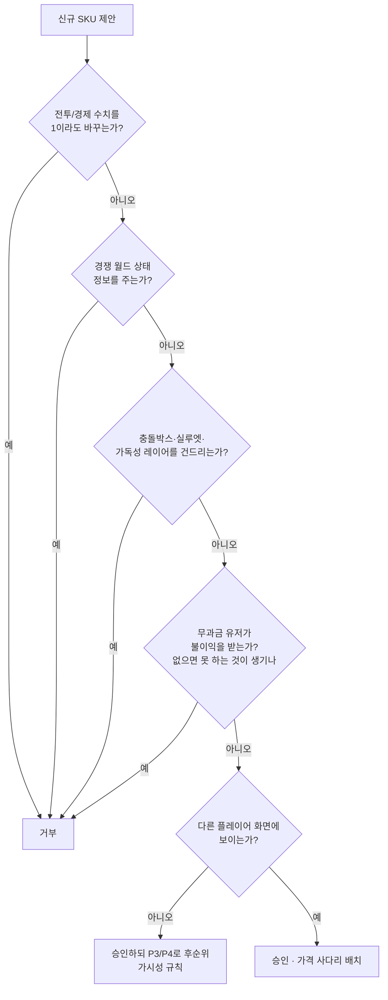

## 수익화 & 라이브옵스 컨셉

> 전제 수치: DevEx $0.0035/R$ × 크리에이터 70% = **순 $0.00245/R$**. 즉 유저가 쓴 돈의 **약 20~24%만 우리 손에 남는다.** 모든 매출 목표는 여기에 4~5배를 곱해서 "얼마가 상점을 통과해야 하는가"로 환산해야 한다. 2026-06-08 신규 게임 실효 배분 26.6%→37.8% 인상(≈1.4배)은 **업사이드로만** 계산한다 — **검증 필요**(create.roblox.com/docs DevEx 페이지의 현재 환산율 및 6월 공지 원문 확인).
> 환율 가정: **1 USD = 1,400원**.

---

### 1. 수익화 원칙 3줄

1. **우리는 정체성·표현·편의를 판다. 힘·정보·안전은 팔지 않는다.** 선체 스킨, 돛 문양, 선원 제복, 함포 VFX, 칭호, 슬롯, 발견한 항구 간 빠른 이동까지가 상한선이다.
2. **유료 랜덤 상품 0개.** Robux로 구매하는 모든 것은 "내가 고른 그것"이 즉시 온다. 랜덤은 무과금 획득 경로에만 존재하며(유령선 도안 드롭 등) 그조차 **확률 공개 + 화면 상시 천장 카운터**를 붙인다. → 2026 로블록스 Paid Random Items 공시 규제 대상에서 원천적으로 벗어나고, PolicyService 지역 차단 리스크도 0.
3. **절대 판매 금지선 (문서 고정, 변경 시 팀 전원 서면 합의 필요):** 선체 HP·장갑, 함포 데미지·재장전, 속도·선회, **화물칸 용량**, 은폐/히트박스에 영향 주는 스킨, 도난/그리핑 면역, 프라이빗 서버를 유일한 회피 수단으로 판매, 경쟁 월드 상태 정보(보물 함대 위치·유령선 스폰 알림), 시즌 패스 티어 스킵, 최상위 전직 티어, 최강 선원.

> **화물칸 확장을 요청 목록에서 빼는 이유:** 해상 교역이 경제 루프의 핵심인 게임에서 화물칸은 저장 공간이 아니라 **시간당 수익률 = 파워**다. 리서치 하드 제약과 정면 충돌한다. 대신 **드라이독 슬롯**(배를 여러 척 보관), **의상장 슬롯**(치장 보관), **장교 편성 프리셋 슬롯**을 판다 — 셋 다 시간당 수익률을 1원도 올리지 않는다.

#### 판매 승인 게이트 (신규 SKU 제안 시 이 트리를 통과해야 상점에 올라감)



#### 치장 무해성 규칙 4개 (엔지니어가 그대로 구현할 사양)

| # | 규칙 | 구현 |
|---|---|---|
| R1 | **실루엣 동일** | 스킨은 충돌 박스·선체 길이·마스트 높이를 변경 불가(±0%). 스킨은 머티리얼/데칼/메시 슬롯 교체만, 콜리전 박스는 함급별 공용 불변 |
| R2 | **가독성 최우선** | 포문 오렌지 발광(브레이스 텔레그래프), 약점 적십자 마커, 침몰 타이머, 나포 갈고리 아이콘은 **항상 스킨 레이어 위**에 강제 렌더. 스킨이 이 색상을 오버라이드하는 것을 코드로 차단 |
| R3 | **은폐 금지** | 돛/선체 알베도 밝기 하한 0.25, 투명도 사용 금지, 채도 변경만 허용. 안개·야간에 스킨 때문에 안 보이는 배는 존재할 수 없음 |
| R4 | **소음 동일** | 함포 VFX 스킨은 발사 SFX 길이·볼륨·피치를 변경 불가. 소리로 상대 무장을 오판하게 만드는 이점 제거 |

---

### 2. 상품 카탈로그

**가격 사다리:** 3 → 49 → 99 → 199~499 → 1,499~2,999 R$ + 재화팩 + 구독 1종. 시장이 이미 검증한 5단 구조를 그대로 쓰고 **내용물만 힘에서 정체성으로 바꾼다.**

**재화 구조:** 로테이션 상점은 **항해 크레딧**으로만 구매(크레딧 가격 = 표기 R$ × 2). 영구 카탈로그(프레스티지·슬롯·편의)는 **Robux 직접 구매**. 시즌 패스 무료 트랙이 시즌당 **300 크레딧**을 주므로 무과금도 시즌마다 로테이션 상점에서 1점은 산다(= "안 써도 됨" 알리바이).

#### 2-A. 진입 티어 — 지갑 문턱 제거 (P0)

| SKU | 가격 | 분류 | 이점 없음 근거 |
|---|---|---|---|
| 돛 염료 1색 (단품) | **3 R$** | 치장 | 돛 색상만 변경, R3 밝기 하한 적용 |
| 선체 목재 색조 1종 | **9 R$** | 치장 | 머티리얼 데칼 교체, 실루엣 불변 |
| 삼각 페넌트 1종 | **19 R$** | 치장 | 마스트 최상단 장식, 콜리전 없음 |
| 갑판 랜턴 색 1종 | **25 R$** | 치장 | 야간 광원 색만 변경, 광량 고정 |
| 문양(엠블럼) 1종 | **49 R$** | 치장 | 돛 중앙 데칼, 텍스트 불가 |

> 목적은 매출이 아니라 **첫 결제 유발**이다. 3 R$ 결제 1건의 순매출은 $0.0074 — 사실상 0원이지만, 첫 결제를 넘긴 계정의 두 번째 결제 문턱은 영구히 낮아진다. **최저가 SKU를 49 R$ 위에 두면 이 계단을 건너뛰는 것이다.**

#### 2-B. 선체 / 돛 / 깃발 — 가시성 1순위 (P1, 아트 예산 최우선)

| SKU | 가격 | 분류 | 이점 없음 근거 |
|---|---|---|---|
| 돛 세트 (3장 일괄 문양+색) | 99 R$ | 치장 | 데칼 세트, 항력·속도 파라미터 미참조 |
| 함대 깃발 (선단 공용 디자인) | 149 R$ | 치장 | 소속 표시용, 조준·식별 편의는 양방향으로 동일 |
| 선수상(피겨헤드) 1종 | 199 R$ | 치장 | 램 데미지 계수는 함급 고정값, 선수상 미참조 |
| 테마 선체 스킨 (예: 심해 유물선) | 399 R$ | 치장 | R1 실루엣 동일, 함급 스탯 상속 |
| 테마 선체 스킨 (전설급, 애니메이션 포함) | 499 R$ | 치장 | 위와 동일 + 정점 애니메이션은 시각 전용 |

#### 2-C. VFX / 선원 / 이모트 — 가시성 2순위 (P2)

| SKU | 가격 | 분류 | 이점 없음 근거 |
|---|---|---|---|
| 함포 연기 색상 (유색 연막) | 99 R$ | VFX | R4 SFX 동일, 연기 파티클은 시야 차폐 판정에 미사용 |
| 예광탄 궤적 스킨 | 149 R$ | VFX | 탄도는 서버 레이캐스트로 결정, VFX는 클라 표현만 |
| 피탄 물기둥 스킨 | 99 R$ | VFX | 명중 판정 후 재생, 판정에 영향 없음 |
| 선원 제복 세트 (6인 일괄) | 249 R$ | 치장 | 선원 스탯은 배치 스테이션과 특성으로만 결정 |
| 선장 의상 세트 (모자·코트·부츠) | 299 R$ | 치장 | 캐릭터 파트는 전원 Massless=true, 조선 성능 무영향 |
| 이모트: 선원 합창 지시 (셰이야 1곡) | 149 R$ | 이모트 | 사기·버프 수치 0. 자체 소유 오디오만 사용 |
| 이모트: 축포 3연발 / 갑판 춤 | 99 R$ | 이모트 | 실탄 아님(데미지 0), 재장전 타이머 미소모 |
| 명판 프레임 프리셋 (12종 중 1) | 49 R$ | 치장 | 이름표 테두리 |
| 선박명 자유 입력권 (1회) | 149 R$ | 치장 | TextService 필터 필수, 7일 쿨다운, 신고 1건 시 기본명 자동 복귀 |
| 칭호 색상/글로우 (전직 칭호 꾸미기) | 99 R$ | 치장 | 칭호 자체는 전직·업적으로만 획득, 색만 판매 |

> **선박명 자유 입력은 유일한 유저 자유 텍스트 SKU**다. TextService 필터 + 오탐 문의 대응 = 지속 운영 비용. 149 R$는 그 비용을 태운 가격이며, 문의량이 주 10건을 넘으면 프리셋 전용으로 되돌린다.

#### 2-D. 항구 / 부두 장식 — 가시성 3순위 (P3, 방문 가능 부두 구현 후에만)

| SKU | 가격 | 분류 | 이점 없음 근거 |
|---|---|---|---|
| 부두 장식 세트 (통·그물·랜턴) | 199 R$ | 치장 | 항구는 전투 불가 구역, 수리 속도·시세 미변경 |
| 개인 부두 현판 + 조명 | 149 R$ | 치장 | 표시 전용 |

> **선장실/하부 갑판 내부 장식은 P4로 보류.** 소유자만 보는 치장은 구조적으로 안 팔린다. "방문 가능한 기함 부두" 또는 "주간 기함 전시대"가 나오기 전에 선실 아트에 예산을 태우면 **"치장은 안 팔린다"는 잘못된 결론**에 도달한다 — 실제로는 가시성 순서를 틀린 것이다.

#### 2-E. 편의 (비치장 SKU — 공정성 비용 0인 것만)

| SKU | 가격 | 분류 | 이점 없음 근거 |
|---|---|---|---|
| 드라이독 슬롯 +1 (최대 +4) | 249 R$ / 슬롯 | 편의 | 동시 출항은 1척. 여러 척 **보관**만 가능 — Deepwoken 캐릭터 슬롯 선례 |
| 장교 편성 프리셋 +3 | 199 R$ | 편의 | 리스펙 자체는 영구 무료·무제한. 저장 칸만 판매 |
| 의상장(치장 보관) 슬롯 +20 | 149 R$ | 편의 | 치장 전용 저장, 화물칸과 물리적으로 분리된 시스템 |
| 발견한 항구 간 빠른 이동 (영구 해금) | 299 R$ | 편의 | **화물 미적재 상태에서만 작동** — 교역 항해를 대체 불가. 이미 발견한 항구만 |
| 내 자산 알림 (수리 완료·함대 귀환·계약 만료) | 199 R$ | 편의 | **내 자산 정보만.** 보물 함대·유령선·희귀 스폰 알림은 영구 판매 금지(Blox Fruits 2,700 R$ Fruit Notifier 교훈) |

> 빠른 이동의 "화물 미적재 조건"이 이 SKU를 P2W에서 구해낸다. 화물을 실은 채 순간이동하면 그건 **교역 수익률 판매**다. 서버에서 `hold.count > 0` 이면 요청을 거부한다.

#### 2-F. 프레스티지 & 재화팩

| SKU | 가격 | 순매출 | 구성 |
|---|---|---|---|
| 기함 번들 "폭풍의 주인" | **1,499 R$** | $3.67 | 전설 선체 + 돛 세트 + 선수상 + 함포 VFX + 선원 제복 + 칭호 글로우 |
| 기함 번들 "심해의 왕" (분기 1종, 시즌 각인 포함) | **2,499 R$** | $6.12 | 위 + 애니메이션 선수상 + 전용 입항 연출 + 서버 전광판 1회 등장권 |
| 창립 후원자 번들 (출시 90일 한정) | **2,999 R$** | $7.35 | 영구 창립자 명판 + 매 시즌 전용 문양 1종 영구 지급 |
| 항해 크레딧 500 | 249 R$ | $0.61 | 로테이션 상점 재화 |
| 항해 크레딧 1,200 (+9%) | 549 R$ | $1.35 | |
| 항해 크레딧 3,000 (+15%) | 1,299 R$ | $3.18 | |
| 항해 크레딧 6,500 (+20%) | 2,699 R$ | $6.61 | |

> **산수:** 순매출 $1,000을 만들려면 99 R$ 4,122건 vs 2,999 R$ **137건.** 상단을 비워두는 것은 공정함이 아니라 **고래 세그먼트를 방치한 채 치장 전용의 단점만 전부 짊어지는 것**이다. 눈에 잘 띄는 순수 장식품에 비싼 값을 매기는 것은 우리 원칙과 100% 양립한다.

#### 2-G. 구독 1종

| SKU | 가격 | 구성 |
|---|---|---|
| **선주 클럽** | $4.99/월 (인게임 구독) | 월 400 항해 크레딧 · 구독자 전용 명판 프레임 · 드라이독 슬롯 +1(대여) · 매 시즌 전용 문양 1종(영구 귀속) · 상점 로테이션 24시간 선공개(구매 아님, 열람만) |

- **해지 시 회수하지 않는다.** 이미 지급된 문양·프레임은 영구 귀속. 멈추는 것은 월 크레딧 지급과 대여 슬롯뿐. (AO의 "해지 시 아이템 회수"가 원한을 증폭시킨 사례를 정확히 피한다.)
- AO 사태와의 차이를 명확히: 문제는 "구독"이 아니라 **플랫폼 밖 신용카드 결제**였다. 우리는 로블록스 인게임 구독만 사용한다.
- **검증 필요**: 인게임 구독은 앱스토어 수수료가 얹혀 분배율이 패스/개발자상품과 다르다. 실제 실수령액은 **테스트 구독 1건을 직접 결제해 정산 명세로 확인**할 것. 매출 모델에서는 구독을 전체의 10~20%로만 잡는다.

**전 SKU 지역별 가격(Regional Pricing) 1일차부터 활성화.** 인구 최대·ARPU 최저 지역의 전환율을 공짜로 올리는 레버이며 공정성 브랜드와도 일관된다.

---

### 3. 시즌 패스 — "돈으로 빨라지지 않는 패스"

**구조:** 8주(56일) 시즌 → 연 6시즌 + 인터미션 2주 × 2회.

| 항목 | 값 |
|---|---|
| 트랙 | 무료 50티어 / 프리미엄 50티어 (동일 티어에 병렬 보상) |
| 프리미엄 가격 | **399 R$** (순 $0.98) |
| 진행 재화 | **항해 훈장(Voyage Marks)** — 플레이로만 획득. **판매·부스트 불가** |
| 티어 요구량 | 티어당 300 훈장 고정 (총 15,000) |
| 목표 완주 난이도 | **1일 20분 × 주 5일**로 완주 |
| 티어 스킵 | **판매하지 않음** (판매 금지선 3번에 명시) |

#### 훈장 획득표

| 행위 | 훈장 | 비고 |
|---|---|---|
| 항해 1회 완주(출항→입항) | 40 | 6~10분 |
| 적함 나포(보딩 성공) | 15/척 | 침몰 처리는 8 — 나포를 유도 |
| 폭풍 돌파 생존 | 25 | |
| 신규 해역/난파선 최초 발견 | 60 | 계정 단위 1회 |
| 주간 임무 (4개/주) | 250/개 | **만료 없음 — 시즌 내 언제든 수행** |
| 세션 첫 항해 보너스 | 50 | 1일 1회 |

- 일 20분(항해 2~3회 + 나포) ≈ **250훈장/일** → 56일 14,000. 주간 임무 4×250×8주 = 8,000. 합계 **≈22,000 vs 요구 15,000** → 여유 47%. 즉 **주 5일 20분이면 완주**하고, 열심히 하는 사람은 4주차에 끝낸다.
- **"직업 같다"를 막는 3장치:** ① 주간 임무 만료 없음(누적 롤오버) ② 일일 캡 없음(몰아서 가능) ③ 시즌 6주차부터 티어 요구량 300→240으로 자동 완화(따라잡기).

#### "늦게 산 사람이 손해"를 없애는 소급 지급

프리미엄 트랙을 시즌 7주차에 사도 **그때까지 쌓인 티어의 프리미엄 보상을 즉시 전부 수령**한다. 이것이 티어 스킵 판매를 대체하는 정직한 해법이다 — 돈으로 사는 것은 "빠름"이 아니라 "트랙 접근권"뿐.

#### 트랙 내용물 (50티어 예시 발췌)

| 티어 | 무료 트랙 | 프리미엄 트랙 |
|---|---|---|
| 1 | 돛 염료 1색 | 시즌 문양 + 명판 프레임 |
| 5 | 항해 크레딧 50 | 함포 연기 색상 |
| 10 | 페넌트 1종 | 선원 제복(상의) |
| 15 | 항해 크레딧 100 | 예광탄 궤적 |
| 20 | **선체 목재 색조 1종** | 선수상 1종 |
| 25 | 이모트 1종 | 항해 크레딧 300 |
| 30 | 항해 크레딧 150 | 선장 의상 세트 |
| 40 | **돛 세트 1종(무료 유일 세트)** | 부두 장식 세트 |
| 50 | 시즌 칭호(무료) | **시즌 전용 선체 스킨 + 시즌 로마숫자 각인** |

- 무료 트랙 총액: 크레딧 300 + 치장 5점. **무과금 유저도 매 시즌 배가 눈에 보이게 달라진다.**
- 시즌 종료 후: 프리미엄 치장 아이템은 **12개월 뒤 볼트 복귀 예고**(반FOMO 원칙). 단 **시즌 각인(로마숫자)은 영구히 복귀하지 않는다** — 희소성은 각인이 담당하고 아이템 자체는 다시 살 수 있다.

---

### 4. XP/골드 부스트 판정 — **개인 부스트는 판매하지 않는다**

**판정: 개인 전용 골드/XP 부스트 판매 = 거부.** 이유는 세 가지다.

1. 우리 게임에는 **합의된 브래킷 PvP와 경쟁 월드 상태(보물 함대·유령선)** 가 존재한다. 리서치가 명시한 대로 XP/골드 부스트의 커뮤니티 관용도는 순수 PvE에서만 높고 경쟁 요소가 있으면 즉시 붕괴한다.
2. Blox Fruits의 2x 패스는 우리 **차별화 카피가 겨냥하는 정확한 표적**이다. 같은 물건을 팔면서 그 카피를 쓸 수 없다.
3. 시즌 훈장 부스트도 팔지 않는다. **"패스는 돈으로 빨라지지 않는다"는 문장이 절대적이어야** 마케팅 자산이 된다. 조건부 문장은 팔리지 않는다.

대신 두 가지를 넣는다.

#### 4-A. 판매하는 것: 서버 전체 축제 티켓 (관대함 장치)

| SKU | 가격 | 효과 |
|---|---|---|
| **선원 축제 — 술통을 연다** | 199 R$ | **서버 전원**에게 20분간 골드 +50% & 훈장 +25% |

- 구매자가 얻는 것은 **수치 우위가 아니라 지위**다. 전광판 방송 "**⚓ {선장명}이 술통을 열었다 — 전 함대 골드 +50%, 20:00**" + 구매자 배 마스트에 20분간 축제 등불 VFX + 항구 명예 게시판 주간 기여 랭킹.
- **차등이 0이다.** 구매자와 무과금 유저가 완전히 동일한 배수를 받으므로 정의상 P2W이 될 수 없다.
- 남용 방지 사양: 서버당 동시 1개만 활성, 중복 구매는 **스택이 아니라 시간 연장**(최대 60분), 잔여 시간 5분 미만일 때만 신규 구매 허용, 서버 인원 6명 미만이면 구매 버튼 비활성(빈 서버 자기 부스트 방지 — 이게 없으면 사실상 개인 부스트다).
- 매출 기여는 작게 잡되(전체의 5~10%), **바이럴 클립 소재**로서의 가치가 본질이다.

#### 4-B. 무료 경로: 보상형 광고

- 광고 1회 시청 → 개인 골드 +25% 15분, **1일 3회 한도**. 유료 판매하지 않는 효과를 무과금 유저에게만 주는 구조 → "이 게임은 안 써도 된다"의 실물 증거.
- 매출은 **0으로 예측**한다(50k DAU 미만에서 보상형 광고는 반올림 오차). 목적은 비결제 유저 만족도와 P2W 인식 차단.

---

### 5. 선박 문양의 UGC / 커뮤니티 확장

**자유 픽셀 캔버스는 영구 금지.** 자유 그리기 도구는 혐오 상징 생성기가 된다. 대신 2단계로 간다.

#### Phase 1 (출시 시점) — 조합기, 모더레이션 리스크 0

| 요소 | 개수 | 결과 |
|---|---|---|
| 기본 문양(벡터) | 24종 | |
| 팔레트 | 12색 × 2슬롯 | |
| 배치 레이아웃 | 6종 | |
| 테두리 | 5종 | |
| **조합 수** | | **약 10만 조합** (24×12×12×6×5 ≈ 103,680) |

- 자유 텍스트 없음. 유저는 "만들었다"고 느끼고, 우리는 심사할 것이 하나도 없다. 조합 결과는 공유 코드(예: `SAIL-7F2A-9C`)로 배포 가능 → 커뮤니티 공유 콘텐츠가 저절로 생긴다.

#### Phase 2 (출시 +6개월, 안정 CCU 3,000 이상일 때만) — 크리에이터 문양 프로그램

| 게이트 | 조건 |
|---|---|
| 신청 자격 | 로블록스 계정 생성 60일+ · 본 게임 플레이 10시간+ · 이메일 인증 · 위반 이력 0 |
| 제출 규격 | SVG 계열 벡터 문양, **텍스트 레이어 금지**, 512×512 1채널 마스크 + 색 슬롯 2개 |
| 심사 | **주 1회 배치, 정원 20건/주** (1인 심사자 2시간 = 지속 가능한 상한) |
| 관측 기간 | 채택 후 24시간은 **제작자 본인에게만** 적용 → 이상 없으면 상점 등재 |
| 사후 대응 | 신고 1건 = 즉시 shadow-hide(전 서버에서 기본 문양으로 자동 대체) → 사람 심사 |
| 제재 | 위반 1회 = 크리에이터 자격 영구 박탈 + 해당 문양 구매자 전원에게 동등 가치 크레딧 지급(환불 대신) |
| 금지 목록(명문화) | 혐오/극단 정치 상징, 실존 국가·군 표식, 성적 도안, 제3자 로고·IP, 문자·숫자로 읽히는 도형, 다른 문양 조합으로 금지 도안이 되는 것 |

- **수익 배분 — 검증 필요.** 개발자 상품 매출은 게임 소유 계정에 귀속되며 로블록스에 제3자 유저 자동 분배 API가 없다. 실행 가능한 대안: ① **그룹 페이아웃**을 통한 수동 정산(월 1회 배치) ② 로열티 없는 **채택 일시금**(예: 3,000 R$ + 상점 상세에 제작자 크레딧 표기). 현실적으로 ②로 시작한다. → 확인할 것: create.roblox.com/docs의 Group Payout 정책·약관·세금 처리 및 미성년 크리에이터 지급 가능 여부.
- **2026-05 크로스게임 판매 금지 유의:** 우리 하이퍼캐주얼 타이틀과 네이벌 게임 간의 아이템 상호 사용/판매는 불가. 교차 홍보는 **트래픽만**, 커머스는 절대 금지.

---

### 6. 라이브옵스 캘린더

**인력 현실:** 라이브옵스는 영구히 **1~1.75 FTE**를 먹는다. 3인 팀 기준 전체 캐파의 1/3~1/2이다. **모듈러 치장 시스템(공용 선체 메시 + 머티리얼/데칼/돛/선수상/VFX/선원 슬롯)을 1개월차에 만들지 않으면 이 케이던스가 팀을 잡아먹고 게임플레이가 멈춘다.** 이것이 수익화 계획 전체에서 가장 레버리지 높은 엔지니어링 결정이다.

#### 8주 시즌 리듬

```mermaid
gantt
    title 8주 시즌 (1시즌 = 56일)
    dateFormat  X
    axisFormat  %s주
    section 시즌
    시즌 개막 · 패스 오픈 · 테마 선체 공개   :0, 1
    미드시즌 항로 (신 해역 or 보스 1종)      :3, 1
    시즌 피날레 주간 (전서버 목표 이벤트)     :7, 1
    section 주간
    상점 로테이션 (화 09:00 KST · 6 SKU)     :0, 8
    주말 이벤트 (금 18:00 ~ 일 24:00)        :0, 8
    section 분기
    대형 업데이트 (신 함급 or 신 해역)        :7, 1
```

| 주기 | 내용 | 팀 부하 |
|---|---|---|
| **주간(화)** | 상점 로테이션 6 SKU = **신규 2 + 볼트 복귀 4** | 신규 2점만 만들면 됨 = 아티스트 1인 월 4~8점으로 유지 가능 |
| **주간(금~일)** | 주말 이벤트 4종 순환(아래 표) | 파라미터 변경만, 신규 아트 0 |
| **주간** | 주간 임무 4개 리셋(만료 없음) | 임무 템플릿 12종에서 추첨 |
| **월간** | 시즌 4주차 미드시즌 비트 1개 | 시즌당 1회 |
| **8주** | 시즌 교체 (패스 50티어, 테마 선체 1, 시즌 문양 1) | **신규 아트 10~16점** — 나머지는 볼트 |
| **분기** | 대형 업데이트 + **타이틀 접미사 변경**("⚓ 네이벌 게임 \| 폭풍의 계절") → 알고리즘 재노출 | 분기당 1회 |

#### 상시 랜덤 이벤트 & 예고된 잭팟 (도파민 훅의 해상 이식)

| 이벤트 | 케이던스 | 예고 | 보상 | 전서버 방송 | 구현 |
|---|---|---|---|---|---|
| **보물 함대 목격** (예고된 잭팟) | 서버당 45~75분 랜덤 | **3분 전 방송 + 지도 위 출현 예상 해역 원 + 카운트다운** | 호송함 3~5척(NPC), 기함 나포 시 시즌 각인 도안 + 골드 대량 | O | 타이머 + 방송 UI + NPC 함대 스폰. 난이도 하 |
| **폭풍 해역 — 화물 3배** | 서버당 20~40분 랜덤, 8분 존속 | 예고 없음(수평선 구름으로만 시각 예고) | 폭풍 볼륨 내 항해 중 화물 가치 ×3, 대신 전돛 제어 불가 | X(로컬 알림만) | 로밍 볼륨 + 배수 파라미터. 난이도 하 |
| **유령선** | 세션당 ~8%, 안개 속 등장 | 없음 | 격침 시 유령 돛 도안 (**확률 공개 + 천장 12회 확정, 화면에 카운터 상시**) | 격침 성공 시 O | 스폰 룰 + 드롭 테이블. 난이도 중 |
| **항구 시세 변동** | 4시간 주기, 항구별 ±40% | 항구 게시판에 다음 변동 시각 표시 | 교역 루트 재계산 | X | 시세 테이블. 난이도 하 |
| **전서버 목표 (피날레 주간)** | 시즌 8주차 | 시즌 개막 시 목표치 공개, 진행 게이지 상시 노출 | 서버 합산 나포 N척 달성 → 전원 무료 치장 1종 | 25%/50%/75%/100% 도달 시 O | 누적 카운터 + 게이지. 난이도 중 |
| **선원 축제(유료 티켓)** | 유저 발동 | 즉시 방송 | 서버 전원 골드 +50% 20분 | O | §4-A |

> **방송 예산 규칙:** 서버당 시간당 **최대 3회**만 전서버 방송이 나간다. 우선순위 큐(전직 승급 > 보물 함대 > 유령선 격침 > 축제 > 목표 진행)로 정하고 초과분은 로컬 토스트로 강등. **방송이 흔해지면 전직 승급 방송의 가치가 죽는다** — 이건 튜닝이 아니라 하드 룰이다.

---

### 7. 매출 시나리오

**가정 (전부 명시):**
- 순매출 $0.00245/R$ (37.8% 인상은 업사이드로 제외)
- DAU/CCU 배수 = **10** (하이퍼캐주얼의 15~20이 아니라 미드코어는 세션이 길어 8~12. **검증 필요** — 출시 후 2주 내 자체 Analytics로 실측)
- ARPDAU(치장 전용 미드코어) = **$0.002 / $0.004 / $0.006**
- 유저 총지출 = 순매출 × 4.5

| | 보수 | 중간 | 공격적 |
|---|---|---|---|
| 안정 CCU | 1,500 | **6,000** | 20,000 |
| DAU (k=10) | 15,000 | 60,000 | 200,000 |
| ARPDAU (순) | $0.002 | $0.004 | $0.006 |
| **월 개발자 실수령** | **$900** | **$7,200** | **$36,000** |
| 원화 환산(1,400원) | 126만원 | **1,008만원** | 5,040만원 |
| 유저 총지출(월) | $4,050 | $32,400 | $162,000 |
| 통과해야 하는 Robux(월) | 36.7만 R$ | 294만 R$ | 1,469만 R$ |
| 37.8% 인상 적용 시(×1.4) | $1,260 | $10,080 | $50,400 |

**매출 구성 목표:** 시즌 패스 30~50% / 로테이션 상점 30~50% / 구독 10~20% / 축제 티켓 5~10% / 엔게이지먼트 페이아웃·광고 **0으로 예측**.

#### 플레인하게: 이게 할 만한 일이 되는 CCU

| 인력 | 손익분기 CCU | 근거 |
|---|---|---|
| 솔로 | **≈5,000 CCU** (월 $6,000) | 생계 + 아트 외주 |
| 3인 팀 | **≈10,000~13,000 CCU** (월 $12,000~16,000) | 리서치 벤치마크와 동일 |
| **2,000 CCU 미만** | **취미다.** 상점 설계 품질과 무관하다 | 월 $1,500 미만 |

#### 현실적 타임라인

| 시점 | 기대치 |
|---|---|
| 개발 3~9개월 | 공개 가능 품질 도달 |
| 출시 시점 | **CCU 수백 대**(마케팅 히트 없다면). 이때 가격 A/B 테스트는 통계적으로 불가능 — 튜닝은 스케일 이후 활동 |
| 출시 +12~24개월 | 리텐션 곡선이 버틸 경우 안정 5,000~10,000 CCU |
| 확률 | **손익분기 미도달이 다수 시나리오다** (Dead Sails 39.8M 방문 → 현재 41~71 CCU, Arcane Odyssey 24k → 7k → 800) |

**결론: 네이벌 게임은 최소 12개월간 자기 자금으로 못 산다.** 하이퍼캐주얼 트랙으로 현금흐름을 만들고, 네이벌의 치장 경제는 장기 자산으로 취급한다. 대신 이 장르는 스파이크-붕괴형이 아니라 **완만 복리형**(social marathoner)이므로, 도달하면 수명이 연 단위다.

---

### 8. 정직한 리스크

#### 최대 리스크: **저CCU 매출 부진을 "수익화 실패"로 오진하고 파워 판매로 선회하는 것**

치장 전용 미드코어는 ARPPU 상한이 낮고, 매출을 결정하는 변수가 사실상 **규모(CCU) 하나뿐**이다. 그런데 이 장르의 규모 도달은 12~24개월이고 대부분 도달하지 못한다. 출시 4개월차에 월 $1,200을 보면 팀은 반드시 "상점이 약한가?"라고 묻는다. **그 질문의 정답은 언제나 "플레이어가 부족하다"이고, 오답은 2x 골드 패스를 파는 것이다.** 오답을 선택하는 순간 차별화 명제 전체가 무너지고, 우리가 겨냥하던 Blox Fruits 이탈 유저와 부모 대상 검색 채널을 동시에 잃는다.

**완화책 (전부 사전 확정, 사후 논의 금지):**

1. **손익분기 CCU를 지금 문서에 못 박는다** — 솔로 5,000 / 3인 10,000. 이 숫자 미만의 매출 부진은 **정의상 규모 문제**로 진단하기로 사전 합의.
2. **외부 현금흐름으로 12개월 활주로 확보** — 하이퍼캐주얼 트랙 병행. 네이벌이 자기 매출로 생존해야 하는 상황을 만들지 않는다.
3. **프레스티지 상단(1,499~2,999 R$)을 반드시 넣는다** — 상단을 비우면 공정한 게 아니라 산수를 틀린 것이다.
4. **모듈러 치장 시스템을 1개월차에** — 없으면 8주 케이던스가 팀 전체를 먹는다.
5. **가시성 순서 준수** — 선체·돛·깃발(P1) → VFX·선원(P2) → 부두(P3) → 선실(P4/보류). 선실부터 만들면 나쁜 데이터로 "치장은 안 팔린다"는 결론에 도달한다.
6. **사전 확정 실패 조건:** 출시 6개월 시점 안정 CCU < 1,000 **and** D30 < 8%이면, 수익화를 바꾸지 않고 **게임 자체를 재검토**(피벗 또는 축소)한다.

#### 2차 리스크와 완화

| 리스크 | 완화 |
|---|---|
| **파워크리프가 치장 카탈로그의 신뢰를 파괴** (Pet Sim 99·TTD가 자기 경제를 죽인 방식) | 수평 확장 원칙 + **출시 시점에 "베테랑 리트로핏" 경로 선언**. 과거 구매가 무가치해지지 않는다는 약속이 곧 재구매 이유 |
| **볼트 복귀 약속이 구매 긴급성을 없앤다** | 아이템은 12개월 뒤 복귀하되 **시즌 각인은 영구 미복귀**. 희소성은 각인이, 접근성은 아이템이 담당 |
| **자유 텍스트 명판 모더레이션 부하** | 프리셋 12종을 기본으로, 자유 입력은 149 R$ + TextService + 7일 쿨다운 + 신고 1건 자동 복귀. 문의 주 10건 초과 시 프리셋 전용으로 롤백 |
| **UGC 문양이 혐오 상징 유통 경로가 됨** | Phase 1은 조합기만(심사 0건). Phase 2는 주 20건 정원 · 24시간 관측 기간 · 신고 1건 shadow-hide · 위반 1회 영구 박탈 |
| **Arcane Odyssey 반례** — 가장 유사한 "공정한 네이벌 RPG"가 top-grossing이 아니다 | **검증 필요, 최우선.** AO의 실제 매출 규모(게임패스 판매 추정치·3자 추정)를 착수 전에 확인할 것. 이것이 우리 명제를 반증할 가장 직접적인 데이터다 |
| **DevEx 37.8% 인상이 사실이 아닐 경우** | 기본 케이스를 $0.00245로 잡아 이미 헤지됨. 인상이 사실이면 손익분기 CCU가 약 30% 내려간다 |

---

#### 검증 필요 항목 정리

| # | 항목 | 확정 방법 |
|---|---|---|
| 1 | DevEx 실효 환산율 (26.6% vs 37.8%) | create.roblox.com/docs DevEx 페이지 + 2026-06-08 공지 원문 |
| 2 | 인게임 구독 실수령 분배율 | 테스트 구독 1건 직접 결제 → 정산 명세 확인 |
| 3 | 제3자 UGC 크리에이터 수익 분배 공식 경로 | Group Payout 약관·세금·미성년 지급 규정 확인 |
| 4 | 미드코어 DAU/CCU 배수 (8~12 가정) | 출시 후 2주 자체 Analytics 실측 |
| 5 | 치장 전용 미드코어 ARPDAU ($0.002~0.008 가정) | 1,000 CCU 도달 후 4주 측정 |
| 6 | Arcane Odyssey 실제 매출 규모 | 착수 전 3자 추정치 조사 — 명제 반증 테스트 |