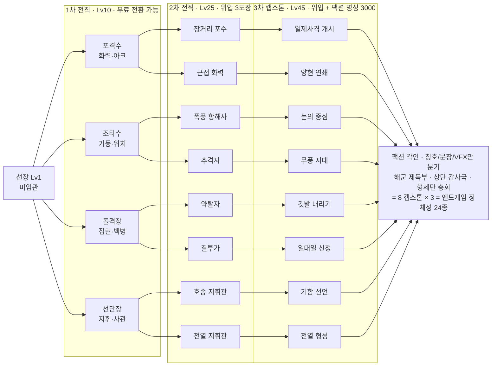

## 설계 계약 — 이 시스템이 반드시 지키는 것

이 섹션의 모든 수치는 아래 5개 계약을 위반하지 않도록 튜닝됐다. 구현 중 밸런싱 판단이 갈리면 이 계약이 우선한다.

| 계약 | 구체적 규칙 | 근거 |
|---|---|---|
| **동료는 물리 객체가 아니다** | 사관/선원은 순수 데이터 레코드 + UI. 갑판 위 시각적 NPC는 함선 모델에 웰드된 `Massless=true, CanCollide=false` 장식이며 물리 시뮬레이션에 참여하지 않는다. | Arcane Odyssey 선원이 다크시 파도에 휩쓸려 사라지고, 배로 복귀하지 못하고, 무작위로 소멸하는 버그 클래스를 **구조적으로 불가능**하게 만든다. AO 커뮤니티 평가는 "ship crews are useless" |
| **동료는 딜하지 않는다** | 모든 공격 입력은 플레이어. 사관 기여는 재장전/수리/사기/전리품 등 루프 지표에만. 예외는 선단장 호위선 1개(플레이어 DPS 6% 상한) | Grow a Garden의 유틸리티 패시브 패턴 검증 / 서먼 빌드가 "보스가 화면 밖에서 즉사"하는 실패 패턴 회피 |
| **동료 총 기여 ≤ 15%** | 사관 6명 최적 배치의 표준 교전 TTK 단축률 상한 15%. 서버가 클램프한다 | Anime Adventures 커뮤니티가 "재굴림이 파워크립의 1/3"이라 지목한 축을 애초에 안 만든다 |
| **숫자는 무료, 정체성은 획득** | 기량 포인트·사관 배치·장비는 항구에서 무료·무제한 재배분. 전직 계열 변경은 **획득 전용 증표**. 로벅스로 전직·사관·전투 수치를 팔지 않는다 | AO의 2,000 로벅스 마법 변경 → "Hecate Essence Rework" 스레드. Blox Fruits 2,500 로벅스 영구 과일 |
| **손실에 바닥이 있다** | 사관은 영구 사망하지 않는다. 승급 진행도는 사망으로 초기화되지 않는다 (도장 최대 1개 소실) | Type Soul Bankai 2단계 "죽으면 처음부터"가 이탈 원인으로 지목됨 |

---

## 1. 선장(플레이어) 성장 축

### 1-1. 세 개의 축을 분리한다

이 게임에는 성장 축이 **세 개**고, 각자 다른 질문에 답한다. 이걸 섞으면 "함선 티어가 곧 실력"이 되어 Fisch/Blox Fruits의 탈것-사다리가 되고, 반대로 다 통합하면 Arcane Odyssey처럼 "12~18시간 후 잡무"가 된다.

| 축 | 답하는 질문 | 화폐/자원 | 상한 | 리셋 가능? |
|---|---|---|---|---|
| **함선 (Ship)** | *얼마나 세게 때리고 얼마나 버티나* | 두캇 + 재료(목재/철/천) + **설계도**(탐험 전용) | 선체 4티어 × 10계통 × 4단계 | 아니오(자산) |
| **선장 (Captain Rank)** | *언제, 어떻게 그것을 쓰나* | 항해 경험치(XP) → 기량 포인트 | Lv 60, 기량P 60 | 배분은 무료 무제한 |
| **명성/오명 (Renown/Infamy)** | *누구로서 싸우나* | 계약, 접현 선택, 배달 | 팩션별 10,000 / 현상금 5성 | 감쇠(오명), 누적(명성) |

**핵심 관계:** 함선 업그레이드는 **기본 수치**를 올리고, 선장 기량은 **그 수치가 발동되는 조건과 타이밍**을 바꾼다. 예: 함선 「현측포 3단계」는 원탄 피해 45 → 62로 올린다. 선장 기량 「이중장전」은 피해를 1도 올리지 않고, *한 번의 아크 통과에서 두 번 쏘게* 만든다. 그래서 저티어 함선의 고레벨 선장은 "적은 피해를 정확한 순간에 두 번" 넣고, 고티어 함선의 저레벨 선장은 "큰 피해를 한 번, 자주 놓친다".

명성은 **전투 수치를 절대 주지 않는다.** 명성이 주는 것: 전직 분기 개방, 항구 입항 권한, 계약 게시판 티어, 칭호/문장, 패시브 선단 항로 지역, 합의 PvP 브래킷.

### 1-2. 실효 전투력 배분 (밸런스 감사 기준)

표준 더미 함대(스쿠너 3척) TTK 벤치마크 기준 최대 배율:

```
함선 티어+업그레이드   ×1.00 → ×2.20
선장 전직/기량 트리    ×1.00 → ×1.35
사관 6명 최적 배치     ×1.00 → ×1.15   ← 하드 캡
플레이어 숙련          ×1.00 → ×1.80   (브레이스 퍼펙트 / 아크 규율 / 약점 명중)
                                총 스팬 ≈ 6.1×
```

**플레이어 숙련이 단일 최대 축이다.** 이 배분이 유지되는지는 자동화 벤치로 검증한다(6-2 참조).

### 1-3. 레벨 곡선

XP 획득: 3~5분 항해 1회당 120~400 XP (교전 수/등급/접현 여부). 시간당 약 3,500~4,500 XP.

| 구간 | 레벨당 필요 XP | 누적 XP | 목표 도달 시간 |
|---|---|---|---|
| Lv 1→10 | `150 + 60×(L−1)` | 3,510 | **~50분** |
| Lv 10→25 | `700 + 120×(L−10)` | 26,610 | ~6.5시간 |
| Lv 25→45 | `2,600 + 200×(L−25)` | 116,610 | ~26시간 |
| Lv 45→60 | `7,000 + 400×(L−45)` | 263,610 | ~58시간 |

Blox Fruits의 Lv 1509 / King Legacy의 Lv 3000 게이트는 **복사하지 않는다.** 그건 이미 200시간 플레이어가 존재하는 게임에서만 성립한다.

### 1-4. 레벨별 개방 표

| Lv | 개방 |
|---|---|
| 1 | 시작 함선(슬루프), 사관 슬롯 1칸(스토리 목수 「하퍼」 지급) |
| 5 | **관측경(Spyglass)** — 적함 등급 색 판정 + 적재 명세 사전 공개 |
| 8 | 사관 슬롯 2 |
| **10** | **1차 전직 — 4계열 / 기량P 사용 개시** |
| 12 | 기량 랙 2단 노드 |
| 16 | 사관 슬롯 3 |
| 20 | 계약 게시판 티어2, 훈련소 개방 |
| **25** | **2차 전직 — 8분기** |
| 26 | 사관 슬롯 4 |
| 30 | 패시브 선단(정박지 2칸) |
| 35 | 훈련소 Lv2, 사관 장비 슬롯 2번째 |
| 38 | 사관 슬롯 5 |
| 40 | 요새 공략 |
| **45** | **3차 전직 — 캡스톤 8종 × 팩션 칭호 3종** |
| 50 | 사관 슬롯 6 (최대) |
| 55 | 전설선 도전 |
| 60 | 만렙 → **명예 항해(Prestige)** 시즌 랭크 개방 |

**만렙 이후는 수평이다.** 명예 항해는 반복 가능한 시즌 랭크로, 보상은 칭호/문장/사관 초상 프레임/함미 등불 색뿐 — 전투 수치 0. AO가 "만렙 후 전부 잡무"가 된 지점을 여기서 코스메틱 사다리로 대체한다.

---

## 2. 전직 트리 (Job Advancement)

### 2-1. 구조와 규칙

- **1차 (Lv10, 4계열):** 자유 선택. **Lv25 이전에는 언제든 무료로 전환** — 리서치가 지목한 "어린 플레이어가 빌드 사전조사 없이 막다른 길에 도달해 이탈"을 원천 차단.
- **2차 (Lv25, 계열당 2분기 = 8):** 레벨 + **위업(Deeds)** 조건.
- **3차 (Lv45, 분기당 캡스톤 1개 = 8):** 레벨 + 위업 + 팩션 명성 3,000.
- **팩션 플레이버:** 3차 캡스톤은 **해군 / 상단 / 해적** 세 버전으로 명명된다. 다른 것은 칭호·VFX 색·돛 문장·수정치 1개뿐이고 **능력 자체는 같다.** → 능력 8개 구현 비용으로 엔드게임 정체성 24종을 만든다. 이게 솔로 개발에서 Arcane Lineage의 3분기 패턴을 흉내내는 유일하게 정직한 방법이다.
- **기량 포인트 경제:** Lv당 +1, 만렙 60P. 한 계열의 전체 랙 총비용은 **92P**. 즉 자기 계열도 65%만 취득 가능 → 특화가 강제된다. 재배분은 항구 드라이독에서 **무료·무제한·즉시**.

### 2-2. 위업(Deeds) — 승급 조건

**단일 PvP 승수 게이트는 절대 만들지 않는다** (Type Soul: 랭크 1v1 26승 요구 → "감정적으로 소모적"). 대신 **5개 중 3개 달성(OR)** 방식, 각 항목은 도장 1개.

포격수 → 2차 승급 예시:
- 현측 일제사격으로 적함 40척 **무력화**
- 선회포로 약점 200회 명중
- 단일 교전에서 퍼펙트 브레이스 5회 (12회 달성)
- 요새 포탑 12개 파괴
- 화물 호송 계약 8회 완수

**사망 시 도장은 최대 1개만 소실**되고 즉시 재획득 가능. 전면 초기화 없음.

### 2-3. 전투 기준 상수 (능력 수치가 참조하는 베이스)

| 무기 | 아크 | 탄약 | 재장전 | 피해 | 사거리/특성 |
|---|---|---|---|---|---|
| 현측 원탄 | 좌/우현 | 무한 | 6.0s | 45 | 700 studs, 탄속 300/s, 수동 탄도 조준 |
| 중탄 | 좌/우현 | 8 | 9.0s | 200 | ≤220 studs, **무조준** |
| 박격포 | 전방향 | 5 | 12.0s | 130 | 착탄 반경 30 studs, 비행 3.0s, 지면 원형 텔레그래프 |
| 선회포 | 전방향 | 무한 | 2.5s | 90 + 출혈 | **약점 전용**, 차징 1.2s |
| 화약통 | 후방 | 3 | 20s | 250 | 지역 거부 |
| 충각 | 선수 | — | — | 60~320 (속도 비례) | **만장(full sail) 필요** |
| 브레이스 | — | — | — | 피해 −55% | 적 포문 발광 1.0s 텔레그래프. 발광 후 0.25s 창 = 퍼펙트 −80% |

선체 HP: **3 세그먼트 × 400 = 1,200.** 전투 이탈 8초 후 현재 세그먼트 상한까지 40 HP/s 자동수리. 0 HP = **무력화**(침몰 타이머 25s, 접현 가능).

### 2-4. 계열 상세

#### 포격수 (Cannoneer) — Lv10
> "한 번의 현측 일제사격으로 승부를 끝낸다."

1차 랙 (총 8P):
| 노드 | 종류 | 비용 | 효과 |
|---|---|---|---|
| 일제사격 준비 | 패시브 | 2P | 정지 또는 반장(half sail)에서 현측 재장전 −12% |
| 이중장전 | 액티브 CD 30s | 3P | 다음 일제사격이 0.4s 간격 2연발(2번째 피해 60%) |
| 조준선 | 패시브 | 1P | 원탄 탄도 예측선 +150 studs, 낙하 지점 마커 표시 |
| 화약 절약 | 패시브 | 2P | 중탄 최대 탄약 8 → 10 |

2차 분기:
- **장거리 포수** — 원탄 사거리 700→900, 탄속 300→360, 원탄 명중 시 약점 생성 확률 12%→20%. 시그니처 **「관통탄」** CD 45s: 다음 일제사격이 돛 전용 판정 — 적 최고속도 −35% 12s (선체 피해는 40%). *플레이스타일: 도망치는 배를 절대 놓치지 않는 저격형. 반장 상태로 궤도를 유지하며 아크를 계속 유지.*
- **근접 화력** — ≤220 studs에서 중탄 피해 200→260, 중탄 재장전 9.0→6.5s. 시그니처 **「양현 동시발사」** CD 60s: 좌우현 동시 발사(각 70%) — *두 배 사이를 통과하는 플레이에 보상. 만장으로 돌진 → 브레이스 → 통과 중 양현.*

3차 캡스톤:
- 장거리 포수 → **「일제사격 개시(Full Salvo)」** CD 90s: 3s 충전 후 전 현측포를 단일 타격으로 발사. 피해 = 원탄 피해 × 포문 수 × 0.55. **충전 중 브레이스 불가**(리스크). 서버에서 충전 완료/각도 검증 필수.
- 근접 화력 → **「양현 연쇄(Twin Thunder)」** CD 30s(60→30 단축), 명중 시 적에게 약점 1개 강제 생성.

**함선 변화:** 포격수는 포문 발사 시 VFX가 2단 화염으로 바뀌고, 3차에서 현측 포문 수가 시각적으로 +2 표시된다(수치 아님, 연출).

#### 조타수 (Helmsman) — Lv10
> "바람과 각도로 이긴다. 맞을 곳에 있지 않는다."

1차 랙 (8P): 급선회(액티브 CD 20s, 2P — 1.5s 선회속도 +80%, 사일 상태 무관) / 바람 읽기(패시브 1P — 풍향 화살표에 30초 후 예측 고스트 표시) / 돛 조작 숙련(패시브 2P — 사일 전환 1.2s → 0.7s) / 항적 이용(패시브 2P — 타 함선 항적 내 속도 +10%)

2차 분기:
- **폭풍 항해사** — 폭풍 내부 조종 불가 페널티 무시, 폭풍 시야 감소는 적 NPC에게만 적용(탐지 −40%). 시그니처 **「역풍 돌파」** CD 40s: 6s 동안 역풍 배율 0.8→1.0 + 파도 피해 면역.
- **추격자** — 선수 추격포 재장전 −30%, 만장 최고속도 +8%, 충각 피해 +25%. 시그니처 **「접근 각」** CD 35s: 3s 동안 선수 가속 +120%, 충각 성공 시 CD 즉시 초기화.

3차 캡스톤:
- 폭풍 항해사 → **「눈의 중심(Eye of the Storm)」** CD 150s: 20s 동안 반경 200 studs에 국지 폭풍 생성 — 적에게만 조종 페널티/시야 감소 적용.
- 추격자 → **「무풍 지대(Dead Calm)」** CD 120s: 8s 동안 반경 500 studs 내 **적** 함선 속도 상한 −40%. 자신은 무영향.

**함선 변화:** 사일 전환 애니메이션이 짧아지고 선원이 돛에 더 빨리 붙는다. 3차에서 항적이 발광한다.

#### 돌격장 (Boarder) — Lv10
> "배는 다리다. 진짜 싸움은 갑판에서."

1차 랙 (7P): 갈고리 숙련(패시브 1P — 접현 가능 거리 90→140 studs) / 선봉(패시브 2P — 접현 중 선장 근접 피해 +20%, 이동속도 +15%) / 연막 투척(액티브 CD 45s, 2P — 3s 동안 적 사수 조준 불가) / 약탈 손버릇(패시브 2P — 접현 성공 시 재료 굴림 +1)

2차 분기:
- **약탈자** — 접현 보상 선택지 4개→5개, 재료 수량 +25%, 접현 주 목표 처치 수 −20%(프리깃 15→12). 시그니처 **「강제 승선」** CD 90s: 적이 **무력화되지 않아도** 마지막 세그먼트에서 접현 개시 가능.
- **결투가** — 접현 중 선장 HP +40%, 적 함장 처치 시 2s 무적 + 즉시 25% 회복. 시그니처 **「함장 지목」** 접현당 1회: 적 함장 즉시 하이라이트, 처치 시 잔여 목표 무시하고 접현 즉시 성공.

3차 캡스톤:
- 약탈자 → **「깃발 내리기」** CD 180s: 접현 성공 후 3s 내 사용 — 나포선이 30s간 아군 호위선으로 전투 참가(피해 상한 = 플레이어 DPS의 6%, 실질 역할은 어그로/차폐).
- 결투가 → **「일대일 신청(Single Combat)」** CD 접현당 1회: 접현 시작 시 적 함장과 1v1. 승리 = 접현 즉시 완료 + 보상 선택지 +1, 패배 = 접현 실패(진짜 리스크).

#### 선단장 (Flotilla Commander) — Lv10
> "혼자 싸우지 않는다. 명령이 무기다."

**이 계열이 사관 시스템과 직결된 유일한 계열이다.** 사관 파워를 캐릭터 빌드로 흡수하는 통로.

1차 랙 (7P): 신호기(액티브 CD 25s, 2P — 지정 스테이션 효과 ×1.5, 8s) / 사기 고취(패시브 2P — 사기 감소 −30%) / 명령 체계(패시브 1P — 사관 슬롯 개방 레벨 −4, 상한 6은 불변) / 배치 감각(패시브 2P — 비적성 배치 페널티 절반: ×0.6 → ×0.8)

2차 분기:
- **호송 지휘관** — 파티/함대 내 타 플레이어 함선에 자신의 사관 효과 30% 공유, 광역 수리 속도 +25%. 시그니처 **「집결 신호」** CD 90s: 반경 400 studs 아군 브레이스 감소율 −55% → −70%, 8s.
- **전열 지휘관** — 호위선 소집(NPC 소형선 1척, 30s, CD 120s. 피해 상한 6%). 시그니처 **「십자포화」** CD 60s: 호위선–자신 직선상 적에게 원탄 피해 +25%.

3차 캡스톤:
- 호송 지휘관 → **「기함 선언」** CD 300s: 20s 동안 **서버 전체에 자기 위치가 공개되고**(리스크), 반경 600 studs 아군 플레이어 전원 재장전 −20% / 수리 +50% / 사기 최대. 리스크·리워드 + 소셜 스펙터클.
- 전열 지휘관 → **「전열 형성」** CD 180s: 30s 동안 호위선 2척, 자신과 호위선이 일직선일 때 전원 재장전 −25%.

> **검증 필요 — 호위선 NPC 함선.** 리서치 하드 제약: 다중 어셈블리 탈것 10척 이상에서 리플리케이션 러버밴딩, 그리고 클라이언트 소유 선체 간 충돌은 엔진이 제대로 처리하지 못한다. **구현 방침:** 호위선은 완전 서버 소유 앵커드 키네마틱 프록시(물리 미참여, 충돌은 자체 반경 판정만)로 만든다. **검증 테스트:** 24인 샤드에서 플레이어 함선 12척 + 호위선 8척 동시 상황의 수신 대역폭과 프레임 타임을 측정. 실패하면 호위선을 삭제하고 「전열 형성」을 *스테이션 효과 광역 공유 + 연막 방벽* 로 대체한다(능력 슬롯 유지, NPC 제거).

### 2-4. 리스펙 정책 (명시적 결정)

| 층 | 변경 가능? | 비용 | 위치 |
|---|---|---|---|
| 기량 포인트 배분 | **무료, 무제한, 즉시** | 0 | 항구 드라이독 |
| 사관 배치 / 장비 | **무료, 무제한, 즉시** | 0 | 승선 명부 UI (항구 및 항해 중 정지 상태) |
| 1차 계열 (Lv<25) | **무료, 무제한** | 0 | 임관소 |
| 2차/3차 승급 직후 | **1회 무료 재선택** | 0 | 임명식 직후 24시간 |
| 그 이후 전직 계열 변경 | 가능 | **「임명장(Commission Warrant)」 1장** | 임관소 |

**임명장은 획득 전용이다.** 드랍처: 전설선 격파(확정 1장), 요새 함락(확정 1장), 폭풍 항해 10회 누적(1장), 시즌 명예 항해 랭크 5 보상(1장). **로벅스로는 팔지 않는다.** 이건 AO가 Hecate Essence를 2,000 로벅스로도 팔아서 리워크 스레드를 만들어낸 지점이다.

Deepwoken 「질서의 신전」에서 두 가지를 가져온다: (1) 재배분 시 **요건 미달이 된 노드는 삭제하지 않고 자동 비활성(회색) 표시** — 요건을 다시 채우면 그대로 복구, (2) 리스펙 장소는 **물리적 목적지**(드라이독 섬) — 즉시 이동은 로벅스로 팔 수 있는 편의성이지만 리스펙 자체는 항구에 배를 대면 항상 무료.

### 2-5. 전직 트리 다이어그램



---

## 3. 전직 순간의 연출 (임명식)

전직은 메뉴 클릭이 아니라 **항구에서 벌어지는 의식**이다. Sol's RNG가 서버 전체 브로드캐스트 하나로 게임 하나를 만들었다는 걸 기억하면, 이건 개발 시간당 가장 수익성 높은 항목이다.

### 3-1. 브로드캐스트 예산 (엄격 상한)

브로드캐스트는 희귀할 때만 특별하다. **이 게임의 서버 전체 브로드캐스트는 총 5종뿐이고, 추가는 금지한다.**

| 이벤트 | 연출 등급 |
|---|---|
| 1차 전직 | **브로드캐스트 없음.** 로컬 임명식만 (너무 흔함) |
| 2차 전직 | 채팅 1줄: `[임명] {플레이어}가 「{분기명}」으로 승급했습니다.` |
| **3차 전직** | 전체 화면 배너 + 컷신 + 전용 음악 + 고유 문구 |
| 전설선 최초 격파 / 요새 함락 | 배너 |
| 시즌 서버 최초 만렙 | 배너 |

3차 고유 문구(팩션별):
- 해군: `[제독부] 모든 배는 길을 비켜라 — {플레이어}, 「{캡스톤 칭호}」.`
- 해적: `[형제단] 오늘부터 이 바다에 새 이름이 붙는다 — {플레이어}, 「{캡스톤 칭호}」.`
- 상단: `[감사국] 항로 등록 완료. {플레이어}, 「{캡스톤 칭호}」.`

### 3-2. 시퀀스 (총 14초, 2회차부터 4초 축약 스킵 가능)

| 시각 | 연출 |
|---|---|
| 0.0s | 입력 잠금. 카메라가 선장 등 뒤에서 정면으로 돌아나오며 FOV 70 → 55. 항구 소음 페이드아웃, 북 하나만 남음 |
| 1.5s | **사관 6명이 부두에 정렬.** 각자 자기 고유 임명식 대사 1줄을 순차 출력 (예: 목수 하퍼 — "이번엔 배가 안 부서지길 빌겠습니다, 선장") ← **애착 장치의 핵심.** 사관 카드가 여기서 사람이 된다 |
| 4.0s | 팩션 인물이 임명장 수여. 팩션별 장소: 해군=제독 관사 계단 / 상단=상관 회의실 / 해적=선장 총회 술집 |
| 6.5s | **아바타 변화** — 코트/모자/견장이 실제 액세서리로 부착. 3티어 시각 계단: 가죽 조끼 → 장교 코트 → 금몰 코트 |
| 8.0s | **돛 문장 전개** — 돛 텍스처 2초 디졸브. 계열별 문장(포격수=교차 포신, 조타수=나침도, 돌격장=갈고리, 선단장=신호기 3면) |
| 9.0s | 이름 위 **칭호 슬롯 페이드인** + 네임플레이트 색 변경 + 함미 등불 색 변경 |
| 10.0s | 예포 3발. 화면 흔들림(**흔들림/스웨이 토글 반드시 존중** — Resynced가 기본 비활성화한 이유) |
| 11.0s | 브로드캐스트 발화 (등급별) |
| 12.0s | **승급 버전 뱃노래 8초** 재생. 원곡 커미션 필수 — Roblox 오디오 프라이버시 정책상 6초 초과 업로드 오디오는 소유 경험에서만 쓸 수 있음 |

### 3-3. 영구적으로 남는 것 (다른 플레이어 화면에 보이는 것)

플렉스는 **타인의 화면에 강제로 보여야** 의미가 있다. 이 게임에서 전직은 다음을 영구 변경한다:

1. 이름 위 **칭호** + 네임플레이트 색
2. **아바타 코트/모자/견장** (3티어)
3. **돛 문장** (수평선에서 보인다 — 배는 Roblox 최고의 코스메틱 캔버스다)
4. **함미 등불 색** (야간에 원거리 식별)
5. **사관 제복 트림 색** (승선 명부 UI + 갑판 NPC)
6. 예포/일제사격 **VFX 색**
7. 승선 명부 상단의 **선단 인장**

3차 캡스톤 발동 시에는 Blox Fruits Race V4 패턴을 차용한다: 발동 애니메이션 1.2초 동안 **무적**(전투 도구로 실제 쓸 수 있어야 강해 보인다), 반경 300 studs 내 적 플레이어 화면에 **채도 감소 셰이드** 적용 — 플렉스가 상대 쪽에서 비자발적으로 일어난다.

---

## 4. 동료(선원/사관) 시스템

### 4-1. 두 개의 층

| 층 | 무엇 | 개체성 | 역할 |
|---|---|---|---|
| **일반 선원 (Crew)** | 숫자 자원. 함선 티어별 정원 12 / 20 / 32 / 48 | 없음 | 재장전·수리·접현 병력의 **바닥값** |
| **사관 (Officers)** | 개체 카드. 이름·초상·특성·숙련 레벨 | 있음 | 6개 직책 스테이션. **수집 루프** |

일반 선원 공식 (손실 깊이 상한 25%):
```
r = 현재 선원 / 정원
재장전 시간 = 기본 × (1.25 − 0.25 r)     -- r=1 → ×1.00, r=0 → ×1.25 (상한)
수리 속도   = 기본 × (0.6 + 0.4 r)
접현 아군 병력 = floor(선원 × 0.4)
```
선원 부상: 폭풍 통과 시 0~3명, 접현 시 1~5명. 부상 선원은 정원에서 제외되고 **항구 정박 30초로 무료 전원 회복.** 즉 마찰만 있고 손실은 없다.

### 4-2. 사관 획득 — 유료 랜덤 없음

**모든 사관 획득은 플레이 획득 전용이다.** 2026년 Roblox 유료 랜덤 아이템 정책(한국법 기반, 전 세계 적용)의 확률 공개 의무 대상은 "로벅스 또는 로벅스로 구매한 게임 내 화폐로 얻는 랜덤 결과"인데, 우리는 그 경로를 아예 만들지 않아 **규제 대상에서 벗어난다.** 그리고 2026년에 이것 자체가 마케팅 문구가 된다.

| 경로 | 방식 | 랜덤성 |
|---|---|---|
| **접현 후 포로 영입** | 접현 보상 선택 패널의 4~5개 선택지 중 하나. 나포선 등급에 따라 후보 **1~3명 제시, 플레이어가 골라서 선택** | 후보 풀만 랜덤 (등급 확률 공개) |
| **항구 술집 고용** | 항구별 후보 3명 상시 진열, 12시간(실시간) 로테이션. 두캇 지불. 명성 티어가 후보 등급 상한을 올림 | **없음 — 보이는 사람을 산다** |
| **표류자 구조** | 항해 중 이벤트. 구조 시 확정 영입 | 등급 랜덤 (확률 공개 + 피티) |
| **고유 사관 12명** | 계약/스토리 완료 보상. 이름·초상·전용 퀘스트·전용 함선 능력 1개 | **없음 — 100% 확정** |
| **로벅스** | 사관 제복/초상 프레임 코스메틱, **사관 슬롯 확장(무료 획득 경로 병존)**, 드라이독 즉시 이동, 훈련 즉시 완료 | 해당 없음 |

**자발적 확률 공개 + 화면 피티 게이지** (법적 의무가 없어도 한다 — 이게 우리 브랜드다):

| 표류자 구조 등급 | 확률 | 피티 |
|---|---|---|
| 평민 (Common) | 60% | — |
| 숙련 (Seasoned) | 28% | — |
| 노련 (Veteran) | 9% | **20회 내 확정** |
| 전설 (Legendary) | 3% | **80회 하드 피티** |

UI: 구조 이벤트 패널 우상단에 `노련+ 확정까지 7회` / `전설 확정까지 41회` 상시 표시. 피티 카운터는 서버 권위 저장.

### 4-3. 사관 6개 직책 — 기계적 효과

수치는 **노련(Veteran) 등급, 적성 배치(×1.2 적용 전 기준값)**.

| 직책 | 주 효과 | 부 효과 | 하드 캡 |
|---|---|---|---|
| **항해장** (Sailing Master) | 사일 전환 시간 −20%, 선회속도 +8% | 풍향 예측 게이지 +10초 | 선회 +12% |
| **포술장** (Master Gunner) | 현측 재장전 −10%, 원탄 명중 시 약점 생성 확률 +4%p | 중탄 최대 탄약 +2 | 재장전 −15% |
| **갑판장** (Boatswain) | 접현 주 목표 수 −1, 선원 부상률 −25% | 화약통/선회포 재장전 −15% | 부상률 −35% |
| **목수** (Carpenter) | **전투 중** 수리 12 HP/s (현 세그먼트 상한까지), 침수 정지 −30% | 세그먼트 상실 시 전투당 1회 40% 응급수리 | 수리 18 HP/s |
| **요리사** (Cook) | 출항 시 사기 +20, 항해 중 사기 감소 −40% | 정박 시 8분 요리 버프(3종 중 선택) | 사기 상한 +25 |
| **군의관** (Surgeon) | 부상 사관 회복 −50%, 접현 중 선장 회복 2 HP/s | **부상 → 사망 전환 확률을 0으로 고정** | — |

**적성/비적성 배치:** 각 사관은 선호 직책 1개를 갖는다. 적성 배치 = 효과 **×1.2**, 비적성 = **×0.6** (Sea of Conquest의 +20% 패턴). 비적성 배치는 합법이지만 약하다 → 크루 관리가 **운 체크가 아니라 로드아웃 퍼즐(실력)** 이 된다.

### 4-4. 등급 — 전설은 배율이 아니라 사이드그레이드

이게 파워크립 방어의 핵심 설계다.

| 등급 | 스테이션 효과 배율 | 특성 슬롯 | 최대 숙련 Lv |
|---|---|---|---|
| 평민 | ×0.8 | 1 | 5 |
| 숙련 | ×0.9 | 2 | 10 |
| 노련 | ×1.0 | 3 | 15 |
| **전설/고유** | **×1.0** + 고유 능력 1개 | 3 + 고유 특성 | 20 |

**전설 사관의 수치 효과는 노련과 동일하다. 차이는 "무엇을 할 수 있게 되는가"다.** 예:
- 고유 목수 「하퍼」 — 수리 수치는 노련과 같음. 고유 능력: **세그먼트를 되돌린다** (정박 없이 상실 세그먼트 1칸 복구, 항해당 1회). 새로운 *행동*을 개방하는 것.
- 고유 항해장 「베가」 — 선회 수치 동일. 고유 능력: **폭풍 진로를 미니맵에 30초 선행 표시.** 정보 개방.
- 고유 포술장 「모라 부인」 — 재장전 동일. 고유 능력: **약점이 4초 더 오래 유지.** 창을 늘리는 것.

전설을 배율로 만들면 6개월 후 신규 전설이 기존 전설을 무효화하는 Toilet Tower Defense / PS99 경로에 들어간다. 인에이블러로 만들면 신규 전설은 **새 플레이 방식**이 되고 기존 전설은 계속 유효하다.

### 4-5. 사관 성장 — 유료 재굴림 없음

1. **숙련 레벨** — 배치된 스테이션이 실제로 사용될 때만 경험 획득. Lv당 스테이션 효과 **+0.8%** (Lv20 = +16%, 하드 캡 내부에 머무름).
2. **항구 훈련** — 훈련소에서 두캇 + 실시간 10~60분(오프라인 진행) → 경험 벌크. **즉시 완료를 로벅스로 판매 가능**(순수 편의성). 단, 훈련은 숙련 레벨만 올리고 등급/특성은 못 바꾼다.
3. **장비 슬롯 2개** (도구 / 부적) — 접현 전리품·계약 보상에서만. 예: 「황동 육분의」(항해장 전용, 풍향 예측 +5초), 「젖은 화약포」(포술장, 화재 확률 −6%p, 재장전 +0.3s ← 양면).
4. **특성 진화 — 재굴림 상점을 아예 만들지 않는다.** 영입 시 결정된 특성은 굴려서 바꿀 수 없고, **행동으로 진화**한다. 예: 「뱃멀미」 사관과 함께 폭풍을 10회 통과하면 「폭풍에 익숙함」으로 변화. 이건 Anime Adventures가 "재굴림이 파워크립의 1/3"이라는 커뮤니티 진단을 받은 축을 애초에 제거하고, 그 자리를 *플레이 이력이 사관에 새겨진다*는 애착 장치로 대체한다.

### 4-6. 특성 — 대부분 양면, 총 24종

특성 총 기여 상한: **사관 기여도의 20% 이내 = 전체 전투력의 3% 이내.**

| 특성 | 효과 |
|---|---|
| 불꽃 애호가 | 포술 스테이션 효과 +10%, 피격 시 화재 확률 +8%p |
| 뱃멀미 | 폭풍 중 스테이션 효과 −30%, 정박 중 훈련 속도 +50% |
| 전 해군 | 해군 명성 획득 +10%, 해적 명성 획득 −10% |
| 고참 | 부상 회복 −40%, 숙련 경험 획득 −20% |
| 도박꾼 | 접현 재료 굴림 +1, 두캇 보상 −10% |
| 의리 | 사기 감소 −25%, 다른 사관 해고 시 사기 −15 |
| 수다쟁이 | **기계적 효과 0.** 잡담·뱃노래 대사 2배 |
| 미신쟁이 | 만장 상태에서 사기 −1/30s, 무력화 적 처치 시 사기 +8 |

「수다쟁이」처럼 **순수 플레이버 특성을 의도적으로 넣는다.** 이게 커뮤니티에서 가장 사랑받을 특성일 가능성이 높고, 파워 인플레이션에 기여가 0이다.

### 4-7. 애착 설계

- **이름 생성기**: 성 240개 × 이름 180개 × 지역 풀 6개. 항구 지역에 따라 이름 분포가 달라짐.
- **초상**: 레이어드 파츠 조합(얼굴형 12 × 헤어 16 × 흉터/문신 10 × 모자 8 × 수염 6) = 조합 92,160개. 아트 비용은 파츠 52개.
- **대사(Barks)**: 직책별 8~12줄 + 상황별(출항/폭풍 진입/약점 명중/세그먼트 상실/접현 개시/승급/부상/사기 저하) 총 ~200줄. **음성 없음, 텍스트 말풍선 + 0.4초 감탄 SFX** — 모바일 대역폭·비용 모두 절약.
- **승선 명부(Ledger)**: 6칸 그리드. 각 칸에 초상, 이름, 직책, 숙련 Lv, 특성 아이콘, 상태(정상/경상/중상/요양). 함께한 항해 수, 함께 격파한 함선 수, 최초 만난 항구가 카드 뒷면에 기록된다.

### 4-8. 영구 사망 정책 — 명시적 결정: **사관은 죽지 않는다**

| 상태 | 효과 | 회복 |
|---|---|---|
| 정상 | — | — |
| **경상** | 스테이션 효과 ×0.6 | 실시간 5분 자동(오프라인 포함) |
| **중상** | 스테이션 비활성, 임시 선원이 대체(효과 ×0.5) | 실시간 20분 요양. **군의관 있으면 10분** |
| **하선** (충성 0) | 명부에서 항구 명부로 이동 | 항구에서 재고용 가능(비용 2배) |

**방어 논거 3개:**
1. 리서치의 최우선 원칙: *손실은 절도처럼 느껴져선 안 된다.* 이름과 초상과 200줄 대사를 붙여 애착을 만들어 놓고 영구 삭제하는 건 애착을 무기로 쓰는 것이다.
2. Type Soul의 Bankai 2단계(죽으면 전면 초기화)는 이탈 원인으로 명시적으로 지목됐다. Roblox 대중 관객에게 영구 손실은 팔리지 않는다.
3. **구조적 근거:** 사관은 물리 인스턴스가 아니므로 *물리로 잃는 것이 불가능하다.* AO의 "선원이 다크시 파도에 휩쓸려 사라짐"은 우리 아키텍처에서 발생할 수 없는 버그다. 이걸 설계 자랑거리로 마케팅한다.

**대신 진짜 손실 축은 사기와 충성이다 — 둘 다 회복 가능.**
```
사기(Morale) 0~100
  출항 시        요리사 있으면 +20
  항해 중        −1 / 30s (요리사 있으면 −0.6 / 30s)
  세그먼트 상실  −10
  접현 성공      +15
  항구 정박      +40
  사기 < 30      스테이션 효과 ×0.7 + 불만 대사
  사기 = 0       스테이션 효과 ×0.4   ← 0이 아니다. 완전 무력화는 응징처럼 느껴진다

충성(Loyalty) 0~100
  급여는 항해 수익에서 자동 원천징수 5% (UI에 상시 표시, 수동 잡무 없음)
  장기 사기 저하, 해고 남발, 급여 미달 시 감소
  충성 ≤ 20     2단계 경고 대사 + 명부 카드에 붉은 테두리
  충성 = 0      다음 정박에서 하선 (영구 상실 아님)
```

해고(Dismiss)는 가능하지만 **항구 명부에 기록되고 재고용 가능.** 영구 삭제 버튼은 존재하지 않는다 — 실수로 애착 대상을 지우는 사고를 원천 차단.

### 4-9. 파워크립 방어 — 6개 장치

1. **하드 캡 (서버 클램프)** — 4-3 표의 캡을 어떤 조합으로도 초과 불가. 클램프는 서버에서.
2. **중첩 감소(DR)** — 같은 종류 효과 중첩 시 1번째 100%, 2번째 60%, 3번째 38.3% (PS99 인챈트 패턴). 포술장을 2명 배치해 재장전을 두 배로 줄이는 시도는 무의미하다. **넓은 크루가 스택보다 강하다.**
3. **전설 = 사이드그레이드** (4-4). 수치는 노련과 동일, 고유 능력만 추가.
4. **적성 ×1.2 / 비적성 ×0.6** — 실력(배치 판단)이 운(등급)을 상당 부분 대체.
5. **베테랑 개장(Veteran Retrofit) — 런치에 포함 선언.** 신규 사관이 출시되면 기존 사관도 「개장 도면」으로 동일 상한까지 도달 가능. 월 1회 무료 도면 지급. Anime Vanguards의 memorias를 *사후 수습이 아니라 사전 약속으로* 낸다. 예측 가능한 최대 불만을 런치에 선제 차단.
6. **매치업 레이어** — 원탄 vs 목재 선체 ×1.0 / 장갑 선체 ×0.6, 관통탄=돛 전용, 중탄 vs 장갑 ×1.2. 적 아키타입 4~5종이 각각 무기 하나를 무효화한다. 로스터 폭이 스택보다 유리해진다.

---

## 5. AI 사관과 실제 플레이어 크루의 공존

리서치의 하드 제약: *모든 크루 롤은 원터치·솔로 가능해야 한다.* Roblox의 실제 소셜 현실(랜덤 매칭, 짧은 세션, 모바일, 보이스 없음)에서 "조율된 인간 4명"을 가정한 배는 죽는다. 그러나 "친구와 하면 확실히 더 좋다"도 필요하다. 이 두 개를 동시에 만족시키는 규칙은 하나뿐이다.

### 5-1. 인수(Take Over) 규칙

> **실제 플레이어가 스테이션에 착석하면, 그 스테이션의 AI 사관은 「보좌(Assist)」 상태로 전환된다. 사관의 패시브 수치 효과는 100% 그대로 유지되고, 플레이어는 그 스테이션의 액티브 조작권을 얻는다.**

이 규칙의 결과:
- **AI를 쓰는 쪽이 손해가 아니다.** 솔로 플레이어는 6개 스테이션 전부의 패시브 효과를 받는다.
- **사람이 오는 쪽도 손해가 아니다.** 착석해도 사관 보너스가 사라지지 않는다. (사관 보너스가 꺼지는 설계면 아무도 친구를 태우지 않는다.)
- **사람의 이득은 수치가 아니라 「동시성」이다.** AI 포술장은 재장전만 도와주고 발사 타이밍은 선장 것이다. 사람 포술수는 **선장이 조타하는 동안 독립적으로 조준·발사**한다. 실효 DPS가 오르지만, 그건 스탯 버프 때문이 아니라 *동시에 일어나는 행동이 하나 늘어서*다.

### 5-2. 명시적 금지

- **파티 인원수에 따른 스탯 버프 없음.** "4인 이상 시 피해 +15%" 같은 것을 넣지 않는다. 이런 버프는 사람 모으기를 강제하고, 사람을 못 모으는 다수를 2등 시민으로 만든다.
- **사기/충성 시스템은 실플레이어에게 적용하지 않는다.** 사람에게 페널티 게이지를 붙이지 않는다.
- **모든 콘텐츠는 AI 사관 배치만으로 클리어 가능하도록 튜닝한다.** 난이도 기준선은 항상 솔로.

### 5-3. 사람이 낫다고 느끼게 하는 것 — 전부 소셜/코스메틱

| 장치 | 내용 |
|---|---|
| 승선 명부 각인 | 실플레이어가 앉았던 스테이션에 그 플레이어 이름과 아바타 헤드샷이 **항해 로그에 영구 기록**. "3번째 항해, 포술: {친구}" |
| 함대 리버리 | 같은 배에 3회 이상 승선한 그룹에게 **공동 코스메틱 세트**(선체 도색 + 깃발 + 사관 제복 트림) 개방. 그룹 단위 구매/착용 |
| 전리품 분배 옵션 | 접현 보상 패널에 "전리품 분배" 선택지 추가 (선택하면 참여자 전원 보상 +15%, 선장 지분 −10%) — 관대함이 선택 가능한 행동이 된다 |
| 기함 선언 | 선단장 3차 캡스톤이 실플레이어 아군에게만 의미 있는 광역 효과 (호송 지휘관의 존재 이유) |
| 항해 후 스탬프 카드 | 함께 항해한 사람과 상호 「함께 탔음」 도장. 도장 수가 코스메틱 언락 |

### 5-4. 정원과 보상 권위

- **승선 정원 6명** = 선장 1 + 스테이션 5. (선장은 기본적으로 항해장 스테이션을 점유하며 조타 = 주 조작.)
- 서버 샤드 **10~24명 / 함선 6~12척** (리서치: 다중 어셈블리 탈것 10척 이상에서 리플리케이션 붕괴. 규모는 NPC 함대로 위조).
- **전리품은 개인 인스턴스**다. 공유 풀을 만들지 않는다 → 도둑질/분쟁/신뢰 거래가 구조적으로 불가능. 선장은 추가로 「나포 지분」을 받는다.
- 모든 보상 판정, 접현 성공 판정, 사관 효과 적용, 피티 카운터는 **서버 권위**. 사관 효과는 클라이언트가 표시만 하고 계산하지 않는다.

### 5-5. 승선 명부 UI (모바일 우선)

```
┌─ 승선 명부 ──────────────────────── 사기 78 ─ 충성 92 ─┐
│  [초상] 항해장  베가 ★★★☆   Lv12   적성 ✓  정상       │
│  [초상] 포술장  칼로우 ★★☆☆  Lv 8   적성 ✓  경상 4:12  │
│  [헤드]  포술수  {친구 이름}  ← 인수 중 (사관 보좌)     │
│  [초상] 갑판장  마르셀 ★★☆☆  Lv 6   비적성 ✗ 정상      │
│  [초상] 목수    하퍼 ★★★★   Lv15   적성 ✓  정상  [고유]│
│  [초상] 요리사  ─ 비어 있음 ─         [고용하러 가기]    │
│  [초상] 군의관  ─ 비어 있음 ─         [고용하러 가기]    │
├────────────────────────────────────────────────────────┤
│  현측 재장전 −11.6%  │ 선회 +9.6% │ 수리 12.0 HP/s      │
│  총 기여도 ████████░░ 9.4% / 15.0% (상한)               │
└────────────────────────────────────────────────────────┘
```

**총 기여도 게이지를 플레이어에게 그대로 보여준다.** 상한이 공개되어 있으면 "더 좋은 사관을 뽑아야 이긴다"는 불안이 사라지고, 대신 "9.4%를 어떻게 채울까"라는 퍼즐이 된다. 이게 리서치가 말한 '기대 = 도파민'을 뽑기가 아닌 곳에서 만드는 방법이다.

---

## 6. 구현 노트 & 검증 필요 목록

### 6-1. 아키텍처 제약

- **사관 데이터는 어트리뷰트에 넣지 않는다.** Server Authority(2026년 7월 정식) 하에서 커스텀 상태는 인스턴스당 앞쪽 64개 어트리뷰트, 이름 ≤50자, 문자열 값 ≤50자로 제한된다. 사관 레코드는 서버 모듈 상태 + DataStore에 두고, 클라이언트에는 RemoteEvent로 표시용 스냅샷만 보낸다.
- **갑판 위 사관 시각 NPC**: 함선 모델 자식, `Massless = true`, `CanCollide = false`, 애니메이션만. 사일 상태 enum과 전투 상태에 반응해 애니메이션 프리셋을 바꾼다(연구: 크루 존재감이 juice 대비 효과 1위). 물리에 참여하지 않으므로 부력·핸들링에 영향 없음.
- **함선은 ModelStreamingMode = Atomic**, 척당 인스턴스 150~400. 사관 NPC는 이 예산에 포함(척당 6명 × ~12 인스턴스 = 72). 필요하면 원거리에서 NPC를 완전히 숨긴다.
- **브레이스 피해 감소, 약점 배율, 사관 스테이션 효과, 캡스톤 발동 조건은 전부 서버에서 계산·클램프.** 클라이언트는 표시만.
- **전직 승급, 임명장 소모, 피티 카운터, 사관 영입은 서버 권위 트랜잭션.** 실패 시 롤백.

### 6-2. 검증 필요 (테스트 명시)

| 항목 | 불확실성 | 이걸로 결판난다 |
|---|---|---|
| **사관 총 기여 ≤15%** | 캡 6개 + DR 조합이 실제로 15% 안에 머무는지 계산으로만 확인됨 | 표준 더미 함대(스쿠너 3척) 대상 자동화 TTK 벤치. 사관 0명 vs 노련 6명 최적 배치, 각 30회. 15% 초과 시 목수 수리량부터 하향 |
| **Lv10 도달 50분** | XP/시 3,500~4,500 가정이 실제 플레이 패턴 추정치 | 신규 계정 20명 플레이테스트, Lv10 도달 시간 중위값. 40~65분 밖이면 1구간 계수 조정 |
| **선단장 호위선 NPC 함선** | 리서치가 다중 탈것 리플리케이션 붕괴를 경고. 서버 소유 키네마틱 프록시로 회피 설계했으나 미검증 | 24인 샤드 / 플레이어 함선 12척 + 호위선 8척에서 수신 대역폭·프레임 타임 측정. 실패 시 호위선 삭제 → 「전열 형성」을 광역 스테이션 공유 + 연막 방벽으로 대체 |
| **표류자 랜덤이 유료 랜덤 정책 면제인지** | 리서치는 "로벅스 미개입 랜덤은 확률 공개 의무 면제"라 명시하지만 정책 문구 재확인 필요 | create.roblox.com/docs/production/monetization/paid-random-items 원문 + PolicyService 동작 재확인. 어느 쪽이든 우리는 자발 공개하므로 리스크는 문구 표기 방식뿐 |
| **3차 캡스톤 8개가 런치 범위인지** | 능력 8개 + 팩션 변종 24개 명명은 솔로 개발에 과할 수 있음 | 캡스톤 1개(「일제사격 개시」)를 먼저 완성해 실제 소요 시간 측정. 개당 2주 초과 시 **런치는 2차(8분기)까지, 3차는 시즌2로 이관** — 이 경우 Lv 상한을 45로 낮춰 출시하고 45~60 구간을 시즌1 라이브옵스로 개방 |
| **부상 회복 실시간 타이머가 짜증인지** | 5분/20분이 짧은 세션(중위 33분)에서 체감상 긴 벌칙일 수 있음 | 요양 중 임시 선원 효과 ×0.5가 실제로 "플레이 가능"한지 A/B. 이탈이 보이면 중상 20분 → 8분, 군의관 → 4분 |

### 6-3. 절대 하지 않는 것 (재확인)

- 전직 티어, 사관, 사관 재굴림, 전투 수치, 화물 용량, 브레이스 성능, 수리 속도를 **로벅스로 판매하지 않는다.**
- **사관 재굴림 상점을 만들지 않는다** (무료로도 만들지 않는다 — 축 자체를 없애는 것이 설계 의도).
- 클랜/함대 가입이 PvP를 강제 활성화하지 않는다 (AO의 최대 이탈 원인).
- 경쟁 세계 상태 정보(희귀 스폰 위치, 보물 운반자)를 판매하지 않는다. 자기 자산 정보(수리 완료, 훈련 완료, 사관 요양 종료)는 판매 가능.
- 브로드캐스트를 5종 이상으로 늘리지 않는다.