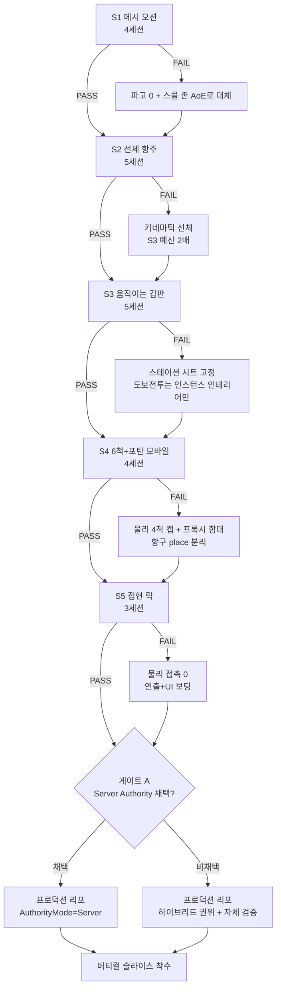
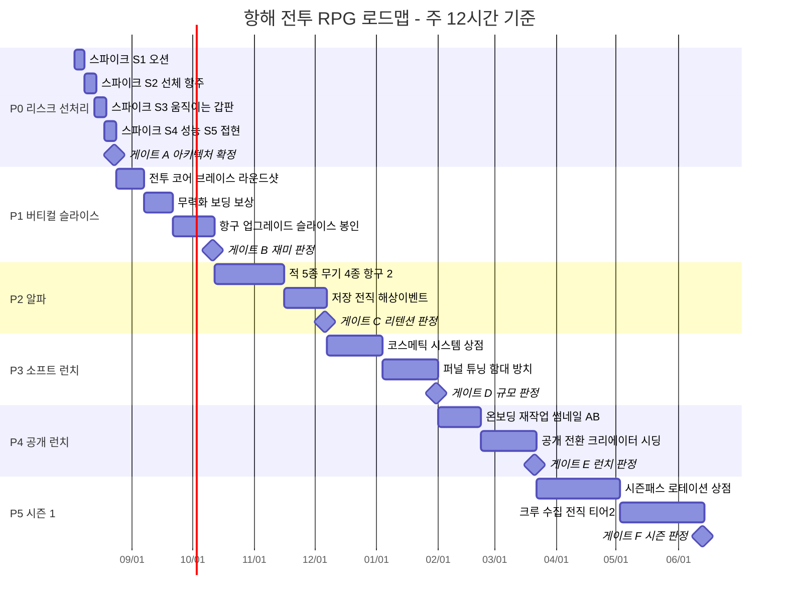

## 개발 계획 (로드맵)

### 0. 먼저 인정할 것 — 이건 뽁뽁이의 10~50배다

직전 프로젝트(+1 Pop! 뽁뽁이 탈출)는 14일 / 약 30세션에 v0.1이 나왔다. 이 게임은 그 공식이 통하지 않는다. 정직한 비교:

| 항목 | +1 Pop (하이퍼캐주얼) | 항해 전투 RPG (본 프로젝트) | 배수 |
|---|---|---|---|
| 코어 시스템 수 | 4 (탭·업그레이드·저장·상점) | 18+ (오션·부력·항주·세일상태·아크별 무기·브레이스·세그먼트HP·스파이글라스·무력화·보딩·보상선택·항구·업그레이드·크루·전직·시즌·코스메틱·서버권위) | 4.5x |
| 미검증 엔진 리스크 | 0 (전부 검증된 패턴) | 5 (커스텀 오션, 단일어셈블리 항주, 움직이는 갑판, N척 모바일 성능, 접현 락) | ∞ |
| 3D 에셋 | 프리미티브 + 데칼 | 선체 3종 + 항구 키트 12피스 + 크루 + VFX 세트 | 20~50x |
| 클라이언트 성능 여유 | 넉넉 | 모바일 한계선에서 상시 싸움 | — |
| 예상 총 세션(공개 런치까지) | 30 | 190~230 | 7x |

**결론: DDD를 버리는 게 아니라 스케일에 맞게 재정의한다.** 원칙 1(모든 세션은 보이는 것으로 끝난다)과 원칙 4(숫자를 보이게)는 그대로 유지, 원칙 3(7일 퍼블리시)과 원칙 6(2주 룰)만 아래처럼 치환한다.

| DDD 원칙 | 하이퍼캐주얼 버전 | 이 프로젝트 버전 |
|---|---|---|
| 1. 세션 = 보이는 변화 | 그대로 | **그대로. 타협 없음.** 스파이크 주차조차 매 세션 클립이 나온다(파도 타는 구슬, 폰에서 배 몰기) |
| 3. 7일차 퍼블리시 | 7일 비공개 출시 | **W1 종료 시 "실기기 데모"를 비공개 place로 퍼블리시** — 친구 3명 + 저가 안드로이드에서 실제 실행. 이후 매 4주 비공개 빌드 갱신 |
| 4. 숫자 가시화 | Creator Hub 리텐션 | **W0 세션 1에 자체 PerfHUD부터 만든다** (FPS / instance / draw call / ping / 오션 ms). 지표가 게임보다 먼저 존재해야 함 |
| 5. 주말 크기 스코프 | 기능 1개 = 1주말 | 기능 1개 = **1~3세션**. 3세션 넘어가면 무조건 쪼갠다(예: "보딩"이 아니라 "그래플 락"→"인테리어 전환"→"목표 1종"→"보상 패널") |
| 6. 2주 룰(피벗) | 2주 재미없으면 폐기 | **게이트 룰로 치환**: 게이트 A(W2 아키텍처), 게이트 B(W9 재미), 게이트 C(W17 리텐션), 게이트 D(W25 규모). 각 게이트에 정량 킬 기준 |
| 7. 과정 클립 공유 | 틱톡 | 그대로 + **W3부터 디스코드 개발 로그 고정 채널** (알파 테스터 풀을 미리 적립) |

**세션 정의:** 1세션 = 90~120분. 기준 케이던스는 **주 6세션(약 12시간/주)**. 아래 모든 주차 계산은 이 값 기준이며, 실제 가동률이 다르면 기간에 배수를 적용한다.

| 주당 실제 시간 | 기간 배수 | 공개 런치 예상 |
|---|---|---|
| 6시간 | ×2.0 | 약 64주 |
| 12시간 (기준) | ×1.0 | **약 32주** |
| 20시간 | ×0.65 | 약 21주 |

---

### 1. 기술 리스크 선처리 — Week 0~2 프로토타입 스파이크

이 섹션이 로드맵 전체에서 가장 중요하다. 엔진 리서치가 명시한 5개의 미해결 문제는 **콘텐츠 한 줄 쓰기 전에** 숫자로 판정한다. 스파이크는 "될까?"를 묻는 게 아니라 **"안 되면 어떤 설계로 도망칠지"를 미리 확정하는 작업**이다.

#### 스파이크 운영 규칙 5개

1. **타임박스 초과 = 자동 FAIL.** 스파이크별 상한 세션(아래 표)을 넘기면 성공 가능성과 무관하게 폴백 설계를 채택한다. 이 규칙이 프로젝트를 살린다.
2. **측정 없는 PASS 없음.** 눈으로 "괜찮네"는 FAIL로 기록. 모든 PASS는 PerfHUD 로그 또는 자체 검증 하네스의 수치 스크린샷으로 남긴다.
3. **실기기 필수.** 저가 안드로이드 1대 + 3세대 이상 지난 아이폰 1대 + 태블릿 1대. Studio 프레임레이트는 증거로 인정하지 않는다.
4. **스파이크 코드는 버린다.** 단 3개 모듈만 프로덕션으로 승격: `Ocean.GetHeight()`, `HullMover`, `PerfHUD`. 나머지는 W2 종료 시 삭제하고 프로덕션 리포를 새로 깐다.
5. **스파이크는 하루 단위로 보이는 것을 만든다.** 파도 타는 디버그 구슬, 폰으로 몰아보는 박스 배 — 리스크 처리 주차에도 도파민 체크포인트는 유지된다.

#### S1. 결정론적 메시 오션 (상한 4세션)

- **만드는 것:** Gerstner 4파 합성 `GetHeight(x, z, t)` 순수 함수 모듈 + `workspace:GetServerTimeNow()` 기준 클럭 + SkinnedMesh/EditableMesh 평면 1장 + LOD 3링 + 카메라 리센터링. 검증 하네스: 서버/클라 각각 1,000개 랜덤 (x,z,t) 샘플의 높이 차이를 로그로 출력.
- **PASS 기준:**
  - 서버-클라 높이 최대 오차 **< 0.05 stud** (0 replication 바이트)
  - 오션 프레임 비용 **< 1.5ms** (저가 안드로이드, 참고 상용 구현 0.05ms/9평면보다 30배 보수적으로 잡음)
  - 오션만 켠 상태 실기기 **>= 50 FPS**
  - Terrain Water 미사용 (voxel 0개) — 갑판 하부가 마른 상태로 유지되는지 확인
- **FAIL 시 폴백:** 파고를 0으로 고정한 평면 오션 + 스크롤 노멀맵/시각적 파도만. **설계 변경 명시: 로그 웨이브(파도 정면 돌파) 메커니즘을 삭제하고, "스콜 존"이라는 원형 AoE 볼륨(감속 + 조타 흔들림 + 텔레그래프된 낙뢰)으로 대체한다.** 하드 제약(Terrain 파도는 렌더 전용, GetWaveHeight API 없음)을 우회하는 게 아니라 게임플레이를 파고에 의존하지 않게 다시 짜는 것이다.

#### S2. 단일 어셈블리 선체 항주 안정성 (상한 5세션)

- **만드는 것:** 루트 파트 1개(높은 RootPriority)에 전부 용접한 어셈블리, 부력 = 6개 샘플 포인트 VectorForce(각 포인트 침수 깊이 비례), 서지 = XZ 평면으로 제한한 LinearVelocity, 요 = AngularVelocity, 3단 세일 상태(정박 0 / 반돛 55 / 전돛 105 studs/s, 선회 20 / 12 / 5 deg/s). **AlignPosition 금지, BodyVelocity 계열 금지.**
- **PASS 기준:**
  - 5분 연속 항주 + 급선회 20회에서 **전복 0회**, 침수 0회
  - 오너 클라이언트 대비 서버 위치 오차 **< 8 stud @ 인위적 200ms 지연** (선체 길이 150 stud의 5%)
  - 프레임 간 지터 **< 0.3 stud**
  - 승객 6명 승선 시 handling 변화 **< 2%** (모든 캐릭터 파트 `Massless = true`)
- **FAIL 시 폴백:** 완전 키네마틱 선체(서버 `BindToSimulation`에서 CFrame 직접 구동, 물리 무버 0개). **비용을 정직하게 적는다: 이 경우 갑판 이동·히트 판정·속도 상속 전부 자체 구현이 되고 S3 예산이 2배가 된다.** 그래서 S2가 애매하면 PASS가 아니라 FAIL로 처리하고 폴백을 택하는 편이 낫다 — 6개월 뒤에 갈아타는 게 최악이다.

#### S3. 움직이는 갑판 위 이동 (상한 5세션 · 최고 난이도)

- **만드는 것:** Character Controller Library(ControllerManager + GroundController) 기반 커스텀 컨트롤러. 접지 중이면 매 프레임 선체 속도를 캐릭터에 가산하고 점프 궤적 동안 유지. 선체와 승선 캐릭터의 **네트워크 오너 동일화**. 갑판 콜리전은 메시가 아니라 인비저블 박스 6개(갑판면·현측벽 2·계단 램프·해치 블로커).
- **PASS 기준:**
  - 8명 승선, 전돛 항주 4분간 **낙수 0회**
  - 걷기/점프/계단에서 선미 방향 표류 **< 0.5 stud/s**
  - 선체 메시 CollisionFidelity = Box/Hull (PreciseConvexDecomposition 금지) 상태로 갑판이 평탄하게 걷히는지
  - 두 캐릭터가 겹쳐도 미끄러져 떨어지지 않음
- **FAIL 시 폴백 (2단계):**
  - 1단계: 자유 이동 구간을 갑판 중앙 데크로 축소, 이동은 **스테이션 시트 간 1탭 전환**으로 처리(모바일 UX상 오히려 나은 선택일 수도 있음).
  - 2단계: 갑판 자유 이동 전면 폐기. 함선은 "탑승형 차량", 도보 전투는 **정적 인스턴스 인테리어**(보딩 시 고정 좌표에 렌더된 방으로 전환)에서만 발생. 리서치가 지적한 대로 실제 상용 게임들이 하는 방식이다. **캐릭터 용접은 어떤 경우에도 금지**(선체 끌림·질량 추가로 침몰·언웰드 시 승천·리스폰 재용접 사망 전부 문서화된 버그).

#### S4. N척 + 포탄 모바일 성능 (상한 4세션)

- **만드는 것:** 프리미티브 선체 6척(각 250 instance 목표)을 AI 항주 상태로 상시 운항 + FastCast 방식 스텝 레이캐스트 포탄(초속 300 studs/s, 프레임당 4스텝) 동시 60발 + PartCache 120풀 VFX + 항구 블록아웃 1개.
- **PASS 기준 (전부 저가 안드로이드 실기기):**
  - 전투 피크에서 **median 30 FPS 이상, 1% low 22 FPS 이상**
  - 씬 전체 instance **< 5,000**, draw call **< 1,000**, tri **< 1,000,000**
  - 러버밴딩/텔레포트 발생 0회 (문서화된 임계치가 "다중 어셈블리 차량 10척 이상"이므로 6척은 마진 안쪽)
  - 서버 메모리 예산 초과 없음, 물리 스텝 시간 프레임 예산의 30% 이내
- **FAIL 시 폴백:** 물리 시뮬 선박을 **4척으로 하드 캡**(플레이어 3 + NPC 1), 나머지 함대는 **프록시 실루엣**(단일 메시 + 항적 + 위치 업데이트만 받는 비물리 오브젝트)으로 규모를 위조. 항구는 별도 place로 분리하고 TeleportService로 연결. 서버 최대 인원 14 → 10으로 축소.

#### S5. 접현(보딩) 락 (상한 3세션)

- **만드는 것:** 그래플 → 두 선체를 **고정 상대 CFrame으로 스냅**, 한쪽을 물리 리더로 지정하고 다른 쪽을 종속(용접/얼라인)시켜 단일 어셈블리처럼 취급. 락 중 양 선체 무버 정지 + 무적 플래그(서버). 이어서 인스턴스 인테리어로 전환.
- **PASS 기준:**
  - 그래플 입력 → 락 완료 **0.5s 이내**, 락 진입 시 튀어오름/관통 0회
  - 락 유지 15초간 desync 0, 승선 인원 8명 중 fling 0명
  - 인테리어 전환 로드 **< 1.5s**
  - 연속 보딩 레이트 리밋 동작 확인(체인 보딩 무적 익스플로잇 차단 — 쿨다운 20s + 동일 대상 재보딩 금지)
- **FAIL 시 폴백:** 물리 접촉 없는 보딩. 근접 + 무력화 상태에서 프롬프트 → 카메라 연출 + UI 미니게임(20~45초)으로 전부 처리. 두 선체는 서로 충돌하지 않는 별도 콜리전 그룹으로 두고 시각적으로만 붙인다. **하드 제약: 서로 다른 네트워크 오너의 선체 간 충돌·충각·마찰을 창발 물리로 설계하는 것은 금지.** 충각(램) 역시 "접촉 판정 = 서버 거리 체크 + 상대속도 계산"으로 스크립트 판정한다.

#### 결정 게이트 D0 — Server Authority 채택 여부 (S2/S3 결과와 함께 W2에 확정)

`Workspace.AuthorityMode = Server`는 StreamingEnabled·UseFixedSimulation·Deferred 시그널·Input Action System을 강제하고, `BindToSimulation` 내부 yield 금지, 커스텀 상태를 인스턴스당 앞쪽 64개 attribute(이름/문자열 50자 이내)로 제한한다. **6개월 뒤 마이그레이션은 불가능하므로 W2에 결정한다.**

- **채택 조건:** S2/S3가 Server Authority 모드에서 PASS했고, 예측/롤백이 커스텀 캐릭터 컨트롤러와 충돌하지 않을 때 → 채택. 얻는 것: 전 경쟁작이 못 가진 치트 저항 함선 이동 + 자체 안티치트 불필요.
- **비채택 시:** 기본 복제 모드 + **하이브리드 권위**로 간다. 함선 운동학은 조타수 클라이언트 예측(체감), 데미지·침몰·전리품·점수·보상은 100% 서버(공정성). 클라 소유 선체가 문서화된 익스플로잇 표면(무한/NaN 속도, 텔레포트, 가짜 Touched)임을 전제로 서버 측 위치 델타 검증(프레임당 최대 이동거리 상한)과 명중 주장 검증(롤링 CFrame 히스토리 300ms 되감기 + 관대 허용치)을 처음부터 넣는다.
- **검증 필요:** 2026년 오픈 버그 리포트(물리 캐릭터 컨트롤러와 예측 궁합 불량, 저인원 서버에서 서버 소유 어셈블리 초당 1회 스냅)가 우리 구성에서 재현되는지. 이걸 재현 테스트하는 것이 S2 세션 4~5의 실질 목표다.

**게이트 A 킬 기준:** S2와 S3가 **둘 다 폴백**으로 떨어지고 S4까지 폴백이면, 이 팀 규모로 "여러 명이 갑판을 뛰어다니는 함선"은 불가능하다는 뜻이다. 그때는 프로젝트를 중단하지 말고 **컨셉을 축소 확정한다**: 1인 1함선 아케이드 해전(승선 개념 없음, 보딩은 전부 연출) → 스코프가 절반이 되고 리서치가 지목한 최대 공백(제대로 작동하는 함대 전투)은 그대로 노린다.

---

### 2. 버티컬 슬라이스 정의 (게이트 B)

**목표 한 문장: 진행 시스템을 전부 끄고도 교전 1회가 재미있는지 증명한다.**

#### 슬라이스에 들어가는 것 (이게 전부다)

| 카테고리 | v1 슬라이스 내용물 | 수치/규격 |
|---|---|---|
| 플레이어 함선 | 선체 1종 "슬루프" | 250 instance, 길이 150 stud, HP 3세그먼트 × 1,000 |
| 세일 상태 | 3단 (정박/반돛/전돛) | 0 / 55 / 105 studs/s · 선회 20 / 12 / 5 deg/s · 상태당 카메라 FOV·거리·셰이크·물보라·바람 SFX·크루 애니메 6채널 동시 전환 |
| 무기 | 현측 라운드샷(무한·수동 조준) + 헤비샷(근접·무조준·탄약 6발) | 초속 300 studs/s, 실효 사거리 320~800 stud (1024 stud 스트리밍 반경 안쪽) |
| 방어 | 브레이스 (적 포문 발광 텔레그래프 0.9s → 홀드) | 피해 -65%, 퍼펙트 창 0.25s에서 -85% |
| 적 | 아키타입 1종 "순찰 브릭" | 레벨 표기, 브레이스 텔레그래프 보유, 무력화 가능 |
| 정보 | 스파이글라스 스캔 | 레벨 + 색 판정(백/적) + **화물 매니페스트 사전 공개** |
| 결말 | HP 0 = 침몰 아님 = **무력화** → 보딩/침몰 선택 + 침몰 카운트다운 25s | 보딩 = 매니페스트 100%, 침몰 = 35% |
| 보딩 | 그래플 락 → 인스턴스 인테리어 → 목표 1종(승무원 N명 제압) → 보상 선택 패널 4옵션 | 20~45초, 보상: 수리 / 탄약 / 화물 / 크루 |
| 항구 | 1개 (수리 + 업그레이드 1종: 선체 장갑 T1) | 키트 12피스로 조립 |
| 크루 | 갑판 위 NPC 4명 (세일 상태·전투 반응 애니메만, 전투 기여 0) | 결정론적 스탯 버프는 슬라이스 제외 |
| 서버 권위 | 데미지·명중·보상·무력화 판정 전부 서버 | 클라 주장 검증 하네스 포함 |

**슬라이스에 없는 것:** 전직, 크루 수집, 시즌, 코스메틱 상점, 함대 방치 수익, 요새, PvP, 두 번째 항구, 세 번째 무기, 날씨. 전부 게이트 B 통과 후.

#### "재미있는가?" 테스트 프로토콜

1. 테스터 5~8명(친구 + 디스코드 초기 멤버), **진행/보상 저장 전부 OFF**. 업그레이드 버튼도 비활성.
2. 아무 설명 없이 스폰 → 관찰만. 화면 녹화 + 사후 5분 인터뷰.
3. 자동 계측: TTFC(스폰→첫 발사), 교전 지속시간, 브레이스 시도/성공, 보딩 선택률, 세션 길이, 자발적 2회차 교전 여부.

| 판정 항목 | PASS 기준 | 근거 |
|---|---|---|
| TTFC (첫 포탄까지) | median **< 30s** | 원작이 "항상 이미 탑승·이미 무장" 상태인 것이 5분 재미의 핵심 |
| 교전 1회 길이 | median **90~180s** 안에 완결 | 로블록스 짧은 세션 구조 |
| 무보상 자발 플레이 | median **>= 8분** | 진행 없이도 루프가 도는지 |
| 자발 2회차 진입 | **5명 중 4명 이상**이 지시 없이 재교전 | "한 번 더"가 나오는지 |
| 브레이스 학습 | 3교전 내 성공률 **>= 60%** | 텔레그래프가 읽히는지 |
| 보딩 선택률 | 무력화 시 **>= 70%**가 보딩 선택 | 매니페스트 사전 공개가 욕심을 만드는지 |
| 낙수/버그 이탈 | 세션당 **< 1회** | S3 품질 확인 |

#### 정직한 킬 기준

- **위 7개 중 4개 이상 FAIL** → 코어 전투 재설계 1회, 예산 **3주 고정**(무기 조준감·브레이스 창·속도·사거리·카메라만 만진다. 새 기능 추가 금지).
- **재설계 후에도 4개 이상 FAIL** → **프로젝트 중단.** 자산 회수 경로를 미리 정해둔다: 오션 모듈 + 선체 무버 + 포탄 시스템을 묶어 "5분 아케이드 해전 라운드" 게임으로 재포장(스코프 1/5), 또는 Creator Store에 오션/함선 킷으로 판매.
- **"자발 2회차 진입"이 단독 FAIL이면 그건 전투가 아니라 결말의 문제다** — 무력화→보상 패널 구간만 다시 만든다(1주).

---

### 3. 단계별 로드맵

| 페이즈 | 주차 | 목표 | 핵심 산출물 | 도파민 체크포인트 (외부에 보여줄 것) | 출구 게이트 |
|---|---|---|---|---|---|
| **P0 리스크 선처리** | W0~W2 (3주) | 5개 엔진 리스크를 숫자로 판정, 아키텍처 확정 | 스파이크 5종, PerfHUD, 폴백 결정서, 프로덕션 리포 재설정 | **W1 종료: 친구 3명이 실기기로 파도 위 배를 몬다** (비공개 place) | **게이트 A** — 5개 스파이크 전부 PASS/폴백 문서화 + Server Authority 결정 확정. 미결 항목 0개 |
| **P1 버티컬 슬라이스** | W3~W9 (7주) | 진행 없이 재미있는 교전 1회 완성 | 위 슬라이스 표 전부 | **W5: 첫 무력화 클립 / W7: 첫 보딩 클립 / W9: 8인 라이브 플레이테스트 스트림** | **게이트 B** — 재미 테스트 7항목 중 5개 이상 PASS |
| **P2 루프 클로저 + 클로즈드 알파** | W10~W17 (8주) | "내일 또 켤 이유"를 붙인다 | 적 아키타입 5종(단일 행동트리 + 데이터 테이블), 무기 4종 완성(모르타르·스위벨/약점), 세일 상태·바람 리드아웃, 항구 2개, 업그레이드 10계열 × 4티어 + 블루프린트 게이트, 전직 티어1, 해상 이벤트 테이블 6종, 데이터 저장, 초대 알파 50~150명 | **W12: 서버 전체 방송(전직/레어) 첫 발동 / W15: 알파 초대 코드 배포 / W17: 알파 리텐션 그래프** | **게이트 C** — D1 >= 22%, 세션 median >= 12분, 첫 교전 완주 70%, 첫 보딩 완주 55% |
| **P3 소프트 런치** | W18~W25 (8주) | 공개 상태로 지표를 튜닝, 상점 가동 | 공개 place(광고 0, 서버 14인), 코스메틱 모듈 시스템 + SKU 12종, 가격 사다리(3/49/99/199~499/1,499~2,999 R$), 함대 방치 레이어, 튜토리얼 퍼널, 지역별 가격, 신고/모더레이션, 8주 케이던스 리허설 1회 | **W20: 첫 Robux 결제 알림 / W23: 처음 보는 사람이 우리 배 코스메틱을 입고 있는 스크린샷** | **게이트 D** — 8주 median CCU >= 300, D1 >= 28%, D7 >= 8%, 결제 전환 >= 0.8% |
| **P4 공개 런치** | W26~W32 (7주) | 알고리즘 노출을 받아낼 상태로 다듬고 나간다 | 썸네일/아이콘 A/B 3세트, 15초 클립 10개, 온보딩 90초 재작업, 서버 스케일 테스트, 크리에이터 시딩(중소 유튜버 10~20명), 코스메틱 SKU 24종, 프레스티지 번들 1종 | **W26: 공개 전환 + 동시접속 그래프 실시간 관측 / W29: 첫 1,000 CCU 스크린샷** | **게이트 E** — 런치 후 4주 median CCU >= 1,000, 좋아요율 >= 85%, D1 >= 30% |
| **P5 시즌 1** | W33~W44 (12주) | 8주 시즌 리듬을 실제로 한 바퀴 돌린다 | 시즌 패스(코스메틱 전용 30~50 보상), 주간 로테이션 상점(신규 2 + 볼트 복귀 3), 크루 수집 티어1, 전직 티어2, 이벤트 함선 1종, 제목 접미사 업데이트("| 폭풍의 계절") | **매주 금요일 로테이션 갱신 = 개발자 루틴이자 유저 FOMO / 시즌 종료 시 리텐션 곡선 상승 그래프** | **게이트 F** — 시즌 패스 구매율 >= 3%, D30 >= 4%, 시즌 중 CCU 우상향 |

---

### 4. 주차별 상세 (첫 6주)

세션 = 90~120분. 마지막 열은 **그 세션이 끝났을 때 반드시 찍을 수 있는 화면**이다. 못 찍으면 다음으로 넘어가지 말고 그 세션을 반으로 쪼갠다. 매 세션 종료 = git 커밋 1개 + 클립 1개.

#### W0 — 오션과 선체 (S1, S2)

| # | 만드는 것 | 세션 끝에 보이는 것 |
|---|---|---|
| 0-1 | Rojo + git 프로젝트 골격, place 파일 커밋, 실기기 3대 페어링, **PerfHUD 자체 제작**(FPS/1% low/instance/draw call/ping/모듈별 ms) | 폰 화면 좌상단에 내 성능 숫자가 실시간으로 흐른다 |
| 0-2 | `Ocean.GetHeight(x,z,t)` Gerstner 4파 순수 함수 + 디버그 구슬 100개 부착 | 아무것도 없는 검은 화면에서 구슬 100개가 눈에 보이지 않는 파도를 탄다 |
| 0-3 | SkinnedMesh/EditableMesh 오션 평면 + LOD 3링 + 카메라 리센터링 | 수평선까지 파도가 치고, 폰 FPS 숫자가 HUD에 기록된다 |
| 0-4 | 서버/클라 높이 일치 검증 하네스(1,000 샘플 diff), 클럭 동기 확인 | "최대 오차 0.0x stud, 복제 0바이트" 로그 스크린샷 (**S1 판정**) |
| 0-5 | 6점 부력 VectorForce + 박스 선체 어셈블리(루트 1개 용접) | 박스 배가 파도 위에서 롤·피치하며 자연스럽게 뜬다 |
| 0-6 | LinearVelocity(XZ) + AngularVelocity + 3단 세일 상태 + 모바일 조타 UI | **폰 터치로 배를 몰아 항주 파도를 뚫는다** — 첫 진짜 클립 |

#### W1 — 갑판과 성능 (S3, S4) + 첫 비공개 퍼블리시

| # | 만드는 것 | 세션 끝에 보이는 것 |
|---|---|---|
| 1-1 | 커스텀 캐릭터 컨트롤러: 접지 시 선체 속도 가산, Massless 처리 | 항주 중인 배 갑판에서 걸어도 뒤로 밀리지 않는다 |
| 1-2 | 점프 궤적 속도 유지, 계단 램프, 인비저블 박스 콜리전 6개 규격화 | 전돛으로 달리는 배에서 점프해도 제자리에 착지한다 |
| 1-3 | 8인 승선 스트레스(봇 캐릭터), 표류 계측 로그 | "4분 8명 낙수 0회, 표류 0.2 stud/s" 로그 (**S3 판정**) |
| 1-4 | AI 항주 봇 선박 6척 + 프록시 실루엣 LOD 프로토 | 수평선에 여섯 척이 각자 항해하는 그림 |
| 1-5 | FastCast 스텝 레이캐스트 포탄 + PartCache VFX 120풀, 동시 60발 | 폰에서 포문 60개가 동시에 불을 뿜고 FPS 숫자가 버틴다 (**S4 판정**) |
| 1-6 | **비공개 place 퍼블리시 + 친구 3명 실기기 초대** | 진짜 사람 셋이 내 바다에서 배를 몬다 (DDD 원칙 3 대체 이행) |

#### W2 — 접현 락과 아키텍처 확정 (S5, D0)

| # | 만드는 것 | 세션 끝에 보이는 것 |
|---|---|---|
| 2-1 | 그래플 → 상대 CFrame 스냅 락, 리더/종속 지정 | 두 배가 튀지 않고 딱 붙어 하나처럼 움직인다 |
| 2-2 | 락 중 무버 정지 + 무적 플래그(서버) + 레이트 리밋(쿨다운 20s) | 8명이 붙은 두 배 사이를 오가도 아무도 튕기지 않는다 (**S5 판정**) |
| 2-3 | 인스턴스 인테리어 전환(고정 좌표 방 + 페이드), 로드 시간 계측 | 갑판에서 "탑승" 누르면 1초 안에 적선 하부 갑판이다 |
| 2-4 | `AuthorityMode = Server` 실험 브랜치에 S2/S3 이식, 예측/롤백 관찰 | 두 브랜치 나란히 놓고 지터·입력 지연 비교 영상 |
| 2-5 | **게이트 A 판정 문서 작성**: 스파이크 5종 결과, 폴백 채택 목록, 권위 모델 결정 | 결정서 1페이지 커밋 — 앞으로 6개월간 번복 금지 |
| 2-6 | 프로덕션 리포 재설정(스파이크 코드 폐기, 3모듈만 승격), lint/CI/유닛테스트 골격 | 깨끗한 리포에서 승격 모듈 3개가 CI 통과 |

#### W3 — 전투의 심장 (브레이스 + 라운드샷)

| # | 만드는 것 | 세션 끝에 보이는 것 |
|---|---|---|
| 3-1 | 슬루프 선체 실메시 1종 교체(8k tri) + 갑판 콜리전 박스 이식 | 박스가 아니라 실제 배가 파도를 탄다 |
| 3-2 | 현측 아크 정의(좌/우/함수/함미 4아크) + 아크 기반 컨텍스트 버튼 1개 | 배를 돌리면 같은 버튼이 다른 무기로 바뀐다(모바일 입력 해법) |
| 3-3 | 라운드샷 수동 조준 궤적 + 서버 명중 검증(300ms 되감기, 관대 허용치) | 조준선을 당겨 적선에 첫 명중, 나무 파편이 튄다 |
| 3-4 | 3세그먼트 HP + 세그먼트 상한 자동수리(전투 이탈 6s 후 40 HP/s) | 화면 상단에 3칸 게이지, 한 칸이 깨지는 순간의 상실감 |
| 3-5 | **브레이스**: 적 포문 발광 0.9s 텔레그래프 + 홀드 완화(-65%) + 서버 플래그 | 적 포문이 주황으로 달아오르고, 버티면 피해가 절반 이하 |
| 3-6 | 세일 상태 ↔ 카메라/셰이크/물보라/바람SFX/크루 애니메 6채널 동시 전환 + 접근성 토글 | 전돛으로 올리는 순간 게임이 다른 게임처럼 보인다 |

#### W4 — 무력화 → 보딩 → 보상

| # | 만드는 것 | 세션 끝에 보이는 것 |
|---|---|---|
| 4-1 | 헤비샷(근접·무조준·6발) + 탄약 UI | 붙어서 한 방에 세그먼트 하나를 날린다 |
| 4-2 | 스파이글라스 스캔: 레벨 + 백/적 색 판정 + **화물 매니페스트 사전 공개** | 싸우기 전에 "저 배에 뭐가 있는지" 화면에 뜬다 |
| 4-3 | HP 0 = 무력화 상태 + 그래플 아이콘 + **침몰 카운트다운 25s** | 적선이 기울며 연기를 뿜고, 시계가 돌아간다(욕심 타이머) |
| 4-4 | 보딩 시퀀스 v1: 락 → 인테리어 → 목표 "승무원 N명 제압"(5/10/15/20 클래스 스케일) | 첫 보딩 완주 클립 |
| 4-5 | **보상 선택 패널 4옵션**(수리 / 탄약 / 화물 / 크루) — 자동 지급 금지 | 승리 순간에 내가 고른다는 감각 |
| 4-6 | 적 아키타입 1종 "순찰 브릭" 행동트리 + 데이터 테이블 골격 | 적이 먼저 다가와 브레이스 텔레그래프를 쏜다 |

#### W5 — 항구, 업그레이드, 슬라이스 봉인

| # | 만드는 것 | 세션 끝에 보이는 것 |
|---|---|---|
| 5-1 | 항구 키트 12피스 제작(부두/램프/창고A·B/크레인/노점/등/통/로프/배너/코너) | 12개 조각으로 부두 하나가 조립된다 |
| 5-2 | 항구 1개 배치 + 정박 판정 + 완전 수리 | 배를 대면 3칸 게이지가 전부 회복된다 |
| 5-3 | 업그레이드 1종(선체 장갑 T1) + 재화 2종(소프트 통화 + 보딩 재료) | 상점에서 처음으로 내 배가 강해진다 |
| 5-4 | 계측 텔레메트리: TTFC/교전길이/브레이스/보딩 선택률 이벤트 로깅 | 내 플레이가 숫자로 기록된 대시보드 |
| 5-5 | 슬라이스 폴리시 세션(사운드 6종, 히트 피드백, 침몰 연출) | 소리를 끄고 켜보며 "게임 같다"고 느끼는 순간 |
| 5-6 | 진행 시스템 OFF 스위치 + **테스터 8명 라이브 세션 예약** | 다음 주 게이트 B 판정 준비 완료 |

> W6~W9는 게이트 B 결과에 따라 배분한다. 계획: W6 튜닝·버그, W7 두 번째 무기(모르타르, 지면 텔레그래프 원), W8 재미 테스트 1차 + 수정, W9 재미 테스트 2차 + **게이트 B 판정**.

---

### 5. 지표 게이트

측정은 Creator Hub Analytics(방문/리텐션/세션/퍼널) + `AnalyticsService` 퍼널 이벤트 + 자체 PerfHUD 로그 3중으로 한다. **퍼널 스텝은 W5에 먼저 심는다** — 지표 없이 알파를 열면 아무것도 배우지 못한다.

| 게이트 | 시점 | 지표 | 목표 | 최소 통과선 | 미달 시 액션 |
|---|---|---|---|---|---|
| A | W2 | 스파이크 판정 완료 수 | 5/5 문서화 | 5/5 | 미결 시 다음 페이즈 착수 금지, 폴백 강제 채택 |
| B | W9 | TTFC median | 20s | **< 30s** | 스폰 위치를 적 근처로, 튜토리얼 제거 |
| B | W9 | 교전 완결 시간 median | 120s | 90~180s | HP/DPS 재조정(수치만, 기능 추가 금지) |
| B | W9 | 무보상 자발 플레이 median | 12분 | **>= 8분** | 5분 미만이면 코어 전투 재설계 1회(3주) |
| B | W9 | 자발 2회차 진입 | 5/5 | **>= 4/5** | 무력화→보상 구간만 재작업(1주) |
| C | W17 | D1 리텐션 | 30% | **>= 22%** | 첫 90초 재작업, 첫 교전을 스폰 직후로 |
| C | W17 | 세션 길이 median | 18분 | **>= 12분** | 해상 이벤트 밀도 상향(20~40초당 1회 결정) |
| C | W17 | 첫 교전 완주율 | 80% | **>= 70%** | 스파이글라스 온보딩 강화 |
| C | W17 | **첫 보딩 완주율** | 70% | **>= 55%** | 보딩 목표 단순화, 인테리어 로드 단축 |
| C | W17 | 낙수/desync 이탈 | 0 | 세션당 < 0.5회 | S3 폴백 2단계로 강등 |
| D | W25 | median CCU (8주) | 800 | **>= 300** | 노출 문제로 진단, 썸네일·제목·클립 A/B |
| D | W25 | D7 / 결제 전환 | 12% / 1.5% | **>= 8% / >= 0.8%** | 상점 가격 사다리 점검(3 R$ 진입 SKU 존재 확인) |
| E | W32+4 | median CCU | 3,000 | **>= 1,000** | 시즌 진입 연기, 리텐션 보강에 8주 재투자 |
| E | W32+4 | 좋아요율 | 90% | **>= 85%** | 부정 리뷰 클러스터링 후 상위 3개 원인 처리 |
| F | W44 | 시즌 패스 구매율 / D30 | 6% / 6% | **>= 3% / >= 4%** | 패스 보상 가시성 상향(선체 스킨을 무료 트랙 상단으로) |

#### 손익 기준선 (사전 공표 — 저조한 매출을 오진하지 않기 위해)

| CCU | 예상 DAU (mid-core k=8~12) | 개발자 순수익/월 (약 $1.0~1.5/CCU) |
|---|---|---|
| 300 | 2.4k~3.6k | $300~450 |
| 1,000 | 8k~12k | $1,000~1,500 |
| 5,000 | 40k~60k | $4,800~7,200 (**1인 손익분기**) |
| 10,000 | 80k~120k | $9,600~14,400 (3인 손익분기) |

**규칙: 게이트 D/E에서 매출이 실망스러우면 진단은 항상 "플레이어가 부족하다"이며, 절대 "파워를 팔자"가 아니다.** 이 문장을 로드맵에 박아두는 것이 가장 값싼 리스크 관리다. (검증 필요: 위 ARPDAU·DAU/CCU 계수와 2026-06-08 페이아웃 인상은 미검증 — 게이트 D 전에 create.roblox.com/docs에서 DevEx 환율·수익 배분·구독 분배를 30분 재확인)

**최종 중단 기준:** 공개 런치 후 12주간 median CCU < 250 이고 D1 < 20% 이면 콘텐츠 추가를 중단하고 둘 중 하나를 택한다 — (a) 5분 아케이드 해전 모드로 리패키징(스코프 1/5, 오션·전투 자산 100% 재사용), (b) 프로젝트 종료 + Creator Store에 오션/함선 킷 판매로 자산 회수.

---

### 6. 콘텐츠 파이프라인

핵심 원칙: **드로우콜은 유니크 메시 단위로 붙는다. 그래서 같은 선체를 재사용한 함대는 렌더링상 거의 무료다.** 파이프라인 전체를 이 사실 위에 세운다.

#### 함선: 베이스 3종 × 리깅 변형

| 베이스 선체 메시 | tri 예산 | 파생 변형 (리깅/삭구/데칼만 교체) | 결과 |
|---|---|---|---|
| 슬루프(소형) | 6k | 상선형 / 순찰형 / 해적형 / 이벤트형 | 4종 |
| 브릭(중형) | 9k | 순찰 / 호송 / 사략 / 이벤트 | 4종 |
| 프리깃(대형) | 12k | 해군 / 요새함 / 보스 / 이벤트 | 4종 |

- 함선 1척 규격: **instance 150~400(목표 250)**, 유니크 메시 8~12개, CollisionFidelity = Box/Hull, 콜리전은 인비저블 박스 6개 템플릿.
- 스트리밍: 함선은 전부 `ModelStreamingMode = Atomic`, 승선 플레이어의 `ReplicationFocus`를 선체 루트로 지정. 추가 포커스 부여 금지(플레이어 1명에 9개 포커스 = 서버 10명분 비용).

#### 코스메틱 모듈 슬롯 (W18 이전에 시스템부터 만든다)

| 슬롯 | 어태치먼트 | 제작 시간/개 | 가격대 | 가시성 |
|---|---|---|---|---|
| 선체 도장(재질+데칼) | `HullSkin` | 1~2h | 3~19 R$ | 최상 |
| 세일 세트 | `SailSet` | 2~3h | 49~99 R$ | 최상 |
| 깃발/페넌트 | `Flag` | 0.5h | 25~49 R$ | 상 |
| 함수상 | `Figurehead` | 3~4h | 99~199 R$ | 상 |
| 포격 VFX | `CannonVFX` | 2h | 99~299 R$ | 상 |
| 크루 제복 | `CrewLivery` | 3h | 149~399 R$ | 중 |
| 선명 명판(프리셋) | `Nameplate` | 0.5h | 49~99 R$ | 중 |
| 기함 번들 | 위 전부 세트 | 12h | 1,499~2,999 R$ | 최상 |

생산 목표: **월 4~8 SKU.** 8주 시즌 = 신규 10~16개 + 볼트 복귀분으로 주간 로테이션(신규 2 + 복귀 3~4)을 채운다. 볼트-복귀 정책은 라이브옵스 생존 수단이면서 동시에 안티-FOMO 약속이다.

#### 항구: 파라메트릭 키트배싱

12피스 키트(직선 부두/코너/램프/창고 A·B/크레인/노점/등/통 묶음/로프/배너/방파제)로 **항구 4개를 조립**한다. 각 항구의 차별화는 건물이 아니라 (a) 색상 팔레트, (b) 지형 실루엣, (c) 조명/시간대, (d) NPC 배치로 만든다. 항구 1개 제작 예산 = **6세션**.

#### 절대 손으로 만들지 않는 것

| 금지 | 대신 |
|---|---|
| 지형·물결·파고 | 절차적 오션 모듈 1개 (Terrain Water는 항구 얕은 물 정도만 선택적) |
| 벽돌 조립 함선 디테일 | 메시 8~12개 + 데칼 |
| 항구별 유니크 건물 | 12피스 키트 재조합 |
| 적 개별 AI 스크립트 | **행동트리 1개 + `EnemyDefs.lua` 데이터 테이블** (아키타입 5종은 파라미터 차이) |
| 배/무기/보상 수치 하드코딩 | `ShipDefs / WeaponDefs / RewardTables` 모듈 + 밸런스 시뮬 스크립트(Lune로 헤드리스 실행) |
| UI 화면 개별 제작 | 컴포넌트 라이브러리(패널/게이지/리스트/토스트) 10종 |
| 걸어다니는 선박 내부 | 정적 인스턴스 인테리어 3개 프리셋 |

#### 에셋/오디오 정책

- Creator Store 에셋은 **라이선스 확인 후에만** 사용, 유료 메시도 재배포 조건 확인. 임시 프로토타입 에셋은 파일명에 `TEMP_` 접두사를 붙여 런치 전 전수 교체.
- **AC 계열 자산·명칭·선박명·음악 전면 금지.**
- 셔티는 **오리지널 커미션 5~8곡**(로블록스 오디오 프라이버시 규정상 6초 초과 업로드는 소유 경험에 한정 → 저작권 완전 소유 필수). 예산: 곡당 $80~200, P3에서 집행.
- AI 활용: 데칼·문양·UI 텍스처·썸네일 초안 생성 → 직접 정리. 3D는 AI 초안 후 리토폴로지 필수(tri 예산 준수).

---

### 7. 범위 방어선 — v1에 넣지 않는 것

**운영 규칙: 기능 요청은 전부 `backlog.md`에 append-only로 적고, 로드맵에 넣으려면 같은 크기의 기능을 빼야 한다(1-in-1-out).** 예외 없음.

| v1 제외 기능 | 왜 유혹적인가 | 제외 근거 | 나중에 추가할 정량 조건 |
|---|---|---|---|
| 걸어다니는 선박 내부(하부 갑판 전체) | 몰입의 정점 | 움직이는 플랫폼 물리가 미해결, S3 폴백 리스크 직결 | 게이트 E 통과 + S3가 1단계 PASS + 전용 4주 예산 |
| 오픈월드 육상 플레이 | "블랙 플래그처럼" | 콘텐츠량이 3배가 되고 해전 정체성이 희석 | CCU 5,000 4주 유지 + 인력 +1 |
| 기지/항구 건설 | 소유감 | 저장·복제·성능 전부 새 시스템 | 시즌 3 이후, D30 >= 6% |
| 길드전 / 네이벌 워즈 | 엔드게임 | 비합의 PvP는 이 오디언스의 최대 이탈 요인, 서버 6~12척 물리 한계 | 합의형 브래킷 PvP가 소프트런치에서 참여율 >= 15% 검증된 뒤 |
| 자유 조선(블록 빌드) | 최대 수익화 표면(검증됨) | 언앵커 파트 수 = 성능 천장, 파트 예산·베이킹·콜리전 단순화 전부 신규 | 게이트 F 통과 + 파트 예산 시스템 선행 스파이크 PASS |
| 프로시저럴 오픈 오션(다크시형) | 무한 콘텐츠 | 장르 최대 실패 사례(반복 상자 파밍·빈 섬·RNG 징벌) | 영구 제외. 대신 핸드크래프트 항로 + 보상 하한 보장 |
| 요새 공략(20분 세트피스) | 스펙터클 | 로블록스 세션 길이와 불일치 | 3~5분 축약판으로만, 시즌 2 |
| 크루 멀티 스테이션 강제 협동 | 판타지 완성 | 모바일·랜덤 매칭 현실에서 붕괴 | NPC 크루 + 1탭 인수 폴백이 항상 병행될 때만 |
| 거래/마켓 | 경제 깊이 | 스캠·중복 경제·모더레이션 비용 | 에스크로 설계 완료 + 전담 모더레이션 인력 |
| 잠수/수중 탐험 | 블루프린트 수집 원작 | 신규 캐릭터 컨트롤러 1식 | 영구 제외(블루프린트는 해상 이벤트로 배치) |
| 유료 랜덤 아이템(가챠) | 최고 ARPPU | 2026 확률 공시 규제 + 브랜드 정체성 | 채택하지 않는다. 무작위는 무료/획득 트랙에만 |
| 날씨 5종 | 다양성 | 개발비 대비 체감 낮음 | v1은 폭풍 1종 + 파도/스콜 1종으로 충분 |
| 선실 인테리어 꾸미기 | 테마상 매력적 | 본인만 보는 코스메틱은 판매가 저조 | 다른 플레이어가 들어올 이유(기함 퍼레이드/주간 기함 보드)가 생긴 뒤 |

---

### 8. 팀 / 도구 / 테스트

#### 실제로 필요한 역할

| 역할 | 필요 시점 | 담당 | AI 보조 가능성 |
|---|---|---|---|
| 시스템 엔지니어(오션·물리·복제·권위) | W0 | 본인 (전담) | **중** — 보일러플레이트·리팩토링·데이터 테이블은 강함, 물리 튜닝 감각과 실기기 성능은 사람 |
| 3D/VFX | W3부터 파트타임 | 외주 또는 본인 + AI 초안 | **중** — 텍스처·데칼·초안 메시는 AI, 최적화/tri 예산은 사람 |
| UI/UX | W3부터 | 본인 + 컴포넌트 라이브러리 | **상** — 레이아웃 코드·상태 관리는 AI로 대량 생산 |
| 사운드 | P3 | 커미션(셔티 5~8곡 + SFX 팩) | **하** — 소유권 요구 때문에 오리지널 필수 |
| 커뮤니티 | W15(알파) | 본인 → 시즌 1부터 모더레이터 1명 | **하** |
| QA | W1부터 상시 | 친구 테스터 5~8명 + 실기기 3대 | **중** — 회귀 체크리스트/로그 파싱 자동화 |

라이브옵스는 P5부터 **영구적으로 1~1.75 FTE 상당**을 먹는다. 1인 체제라면 8주 시즌 케이던스가 개발 역량의 절반을 잡아먹는다는 뜻이므로, **모듈 코스메틱 시스템을 P3(W18~21)에 반드시 완성**해야 한다. 이걸 미루면 시즌이 팀을 먹고 게임플레이 개발이 멈춘다.

#### 도구

| 용도 | 선택 |
|---|---|
| 소스 관리 | **Rojo + git (이 레포)** — `src/` 아래 Luau 파일, place는 바이너리로 별도 관리. 매 세션 1커밋, 페이즈별 브랜치 + 태그(`vs-slice`, `alpha`, `soft`) |
| 코드 품질 | Selene(린트) + StyLua(포맷) + GitHub Actions CI |
| 유닛 테스트 | **순수 함수만** 대상: `Ocean.GetHeight`, 데미지·브레이스 감산, 보상 테이블, 피티 카운터, 세그먼트 회복. Lune로 헤드리스 실행 → CI에서 5초 내 |
| 성능 계측 | MicroProfiler + 자체 PerfHUD(W0 세션 1) + 실기기 3대(저가 안드로이드/구형 아이폰/태블릿) |
| 부하 테스트 | 봇 함선 6척 상시 항주 + 봇 캐릭터 8인 승선 스크립트(W1 산출물 재사용) |
| 지표 | Creator Hub Analytics + `AnalyticsService` 퍼널(스텝: 스폰 → 스캔 → 첫 발사 → 무력화 → 보딩 완주 → 항구 정박 → 업그레이드 구매) |
| 커뮤니티/테스터 | 디스코드(개발 로그 채널 W3 개설, 알파 초대 채널 W15) |
| 홍보 | 틱톡/쇼츠 15초 클립 — 소재는 매 세션 체크포인트 클립에서 그대로 나온다 |

#### 3단 테스트 접근

1. **매 커밋(자동):** 린트 + 순수 함수 유닛 테스트. 5초 내 실패 통보.
2. **매 세션 종료(수동 5분):** 실기기 스모크 체크리스트 10항목 — 스폰 정상 / 배 조타 / 파도 렌더 / 8인 승선 낙수 없음 / 포격 명중 / 브레이스 텔레그래프 / 무력화 판정 / 보딩 락 / 항구 정박 / FPS >= 30. 하나라도 깨지면 그 세션에 고치고 커밋한다.
3. **주 1회 고정(금요일 저녁 90분):** 테스터 8명 라이브 세션. 화면 녹화 + 자동 계측 + 5분 인터뷰. **이 슬롯을 W1부터 캘린더에 고정**하는 것이 리텐션 감각을 잃지 않는 유일한 방법이다.

#### AI가 잘하는 것 / 못하는 것 (일감 배분 기준)

- **잘함:** Luau 시스템 보일러플레이트, 데이터 테이블/정의 파일, UI 코드, 리팩토링, 밸런스 시뮬 스크립트, 행동트리 노드, 문서·패치노트, 텍스처/데칼/썸네일 초안, 테스트 하네스.
- **못함(사람이 해야 함):** 물리 파라미터의 "손맛" 튜닝, 카메라·피드백 곡선, 실기기 성능 판정, 모더레이션·연령 적합성 판단, 오디오 오리지널리티, 그리고 **게이트에서 프로젝트를 죽이는 결정**.