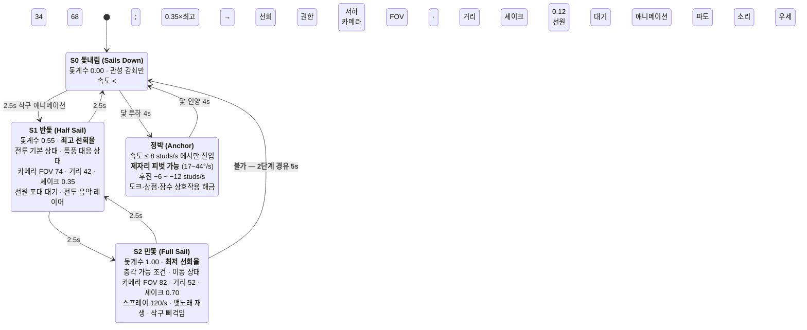
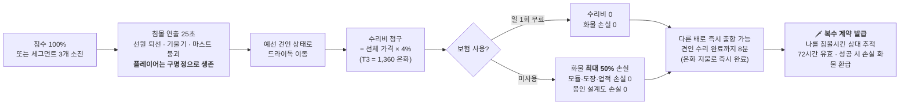

## 배(선박) 시스템 — 디자인과 성장

### 0. 이 섹션의 설계 전제

| 전제 | 근거 | 이 섹션에서의 결과 |
|---|---|---|
| 배는 **절대 소멸하지 않는다** | Blox Fruits의 소모품 보트는 애착을 만들지 못한다 / "손실은 절도처럼 느껴지면 안 된다" | 침몰 = 파괴가 아니라 **예선(曳船) 견인** 상태 |
| 성능은 **획득 전용**, 표현은 **판매 가능** | AC4의 리스크/리워드 엔진은 업그레이드가 플레이로 얻어진다는 전제에 의존 | 도장·엠블럼·VFX만 Robux, 장갑·포·속력·화물은 100% 플레이 |
| 상위 등급은 "더 강한" 게 아니라 **"더 무거운"** 것 | 15시간 벽 대신 수평 엔드게임 | T2가 최고속, T5는 3종 사이드그레이드 |
| 배 물리는 **엔진에 맡기지 않는다** | 네트워크 오너십은 어셈블리당 1클라이언트, 10척 이상 러버밴딩 문서화, AlignPosition 지터, 크로스오너 충돌 파손 | 운동학 자체 적분 + 서버 권위 재조정 (§5) |
| 모바일이 다수 플랫폼 | 세션 ~33분, 터치 입력 | 상시 버튼 5개, 아크 컨텍스트 발사, 씬 전체 5,000 인스턴스 이하 |

---

## 1. 선체 등급 (Hull Tiers)

### 1.1 등급 철학

T1→T4는 **수직 사다리**(장갑·화력 단조 증가, 기동 단조 감소), T5는 **동급 3종 사이드그레이드**. T2 스쿠너를 게임 내 최고속으로 두는 것이 핵심 장치다 — 2번째 배에서 이미 "위로 가는 게 항상 이득은 아니다"를 몸으로 배우게 해서, T5의 수평 선택이 갑작스럽지 않게 만든다.

### 1.2 스탯 표

| 항목 | **T1 슬루프**<br/>Sloop | **T2 스쿠너**<br/>Schooner | **T3 브리간틴**<br/>Brigantine | **T4 프리깃**<br/>Frigate | **T5-A 갈레온**<br/>Galleon | **T5-B 레이지**<br/>Razee | **T5-C 전열함**<br/>Ship of the Line |
|---|---|---|---|---|---|---|---|
| 실루엣 | 단일 마스트, 낮은 건현, 삼각 메인세일 1장. 실루엣이 **가장 얇고 낮다** | 마스트 2개, 날카로운 선수, 사각+삼각 혼합. 마스트가 **뒤로 눕혀진 실루엣** | 마스트 2개(전방 사각/후방 종범), 뚜렷한 선미루. 첫 "군함처럼 보이는" 배 | 마스트 3개, 2단 포열, 규칙적인 포문 줄. 실루엣이 **직사각형에 가까워짐** | 마스트 3개 + 거대한 선미루, 넓은 선체폭. **가장 두꺼운** 실루엣 | 프리깃의 상단 갑판을 깎아낸 형태. 마스트 3개인데 **낮다** | 마스트 3개, 3단 포열, 각진 성벽 같은 선체. **가장 높고 큰** 실루엣 |
| 전장 (스터드) | 62 | 88 | 118 | 152 | 186 | 158 | 205 |
| 파트 예산 (인스턴스) | 110 | 155 | 210 | 285 | 360 | 320 | 395 |
| 승조원 스테이션 | 2 | 3 | 4 | 5 | 6 | 5 | 6 |
| 플레이어 정원 | 1–2 | 2–3 | 2–4 | 3–5 | 4–6 | 3–5 | 4–6 |
| 세그먼트 체력 | 3 × 420 (1,260) | 3 × 640 (1,920) | 3 × 900 (2,700) | 3 × 1,320 (3,960) | 3 × 1,700 (5,100) | 3 × 1,380 (4,140) | 3 × 2,050 (6,150) |
| 만돛 최고속력 (studs/s) | 92 | **106** ← 최고 | 98 | 88 | 78 | 96 | 70 |
| 만돛 선회 (°/s) | 21 | 18 | 14 | 11 | 8.5 | 12 | 7 |
| 반돛 선회 (°/s) | **32** | 28 | 22 | 17 | 13 | 19 | 11 |
| 정박 피벗 (°/s) | 44 | 40 | 33 | 26 | 20 | 29 | 17 |
| 가속 시상수 τ (s) | 3.4 | 4.2 | 5.6 | 7.2 | 9.4 | 6.8 | 11.0 |
| 타성(감속) τ (s) | 5.5 | 6.8 | 8.5 | 10.5 | 13.0 | 9.5 | 15.0 |
| 흘수 (스터드) | 5 | 7 | 9 | 12 | 15 | 12 | 17 |
| 현측포 (편측) | 3 | 4 | 6 | 8 | 11 | 8 | **13** |
| 선수포 | — | 1 | 2 | 2 | 2 | 3 | 2 |
| 선회포 | 1 | 1 | 1 | 2 | 2 | 2 | 2 |
| 박격포 | — | — | 1 | 2 | 3 | 1 | 3 |
| 화선통 (후미) | — | ✔ | ✔ | ✔ | ✔ | ✔ | ✔ |
| 충각 | — | — | ✔ | ✔ | ✔ | ✔ (계수 +30%) | ✔ |
| 화물 슬롯 | 10 | 16 | 22 | 30 | **46** | 26 | 34 |
| 파도 감쇠계수 | 1.00 | 0.86 | 0.72 | 0.58 | 0.46 | 0.52 | 0.42 |
| 모듈 티어 상한 | T1 | T2 | T3 | T4 | T4 | T4 | T4 |

> **파도 감쇠계수**는 롤/피치 진폭 배수다. 큰 배가 파도를 덜 느끼는 것 자체가 등급 상승의 감각적 보상이 된다 — 수치를 늘리는 게 아니라 **화면이 조용해지는 것**으로 승급을 체감시킨다.

> **선회포는 T1부터 지급한다.** 약점(weak point) → 정밀 무기 루프가 이 게임의 스킬 표현 축이므로, 첫 30분에 반드시 가르쳐야 한다.

### 1.3 세그먼트 체력과 자동 수리

- 체력 바는 **3분할**. 각 세그먼트는 독립적으로 소진된다.
- 전투 이탈 후 **20초** 경과 시 승조원 자동 수리 시작: 초당 `현재 세그먼트 최대치 × 3.5%` 회복, 단 **현재 세그먼트 상단까지만**.
- 세그먼트 전체 복구는 (a) 항구 드라이독, (b) **보딩 성공** 두 가지뿐.
- 세그먼트 상실 시: 침수 게이지 +25%, 최고속력 계수 −10%p(1개 상실 0.90 / 2개 상실 0.78), 해당 구역 시각 파손(파편·연기·기울기).
- 침수 100% = 침몰 → 견인(§7.3). 침수는 격벽&펌프 모듈과 목수 승조원이 되돌린다.

### 1.4 각 등급이 생존하는 콘텐츠

| 등급 | 생존 콘텐츠 | 죽는 콘텐츠 |
|---|---|---|
| T1 슬루프 | 연안 해역, 소형 밀수선/전마선 1–2척, 표류 화물 회수, 초급 계약 | 폭풍 해역(측면 삼각파 1발에 세그먼트 1개), NPC 편성 함대 |
| T2 스쿠너 | 해상 이벤트 참여(암초 사이렌·난파 습격), 소형 호송선단, 도주 기반 플레이 | 요새 포대 1발, T3급 정면 교전 |
| T3 브리간틴 | **첫 큰 관문** — 폭풍 해역 통과, 4척 편성 함대, 요새 외곽 포대. 박격포 해금 = 요새 콘텐츠 입장권 | 요새 본진, 전설선 |
| T4 프리깃 | 요새 공략, 대형 호송선단 기함 보딩, PvP 상위 브래킷, 전설선 1–2척 | 심해 항로 장기 항해(화물 부족), 전설선 3척 이상 연전 |
| T5 3종 | 전설선 전체, 클랜 선단전, 심해 항로 | — (엔드게임은 조합 문제로 전환) |

### 1.5 선체 획득 — 이중 게이트

선체는 **은화 + 재료 + 업적(Deeds)** 로만 얻는다. Robux 경로는 존재하지 않는다.

| 선체 | 은화 | 재료 | 업적 게이트 |
|---|---|---|---|
| T1 슬루프 | 0 (시작 지급) | — | — |
| T2 스쿠너 | 8,000 | 목재 60 | 아래 4개 중 **2개**: 교전 승리 15 / 보딩 성공 8 / 화물 인도 10 / 해상 이벤트 참여 6 |
| T3 브리간틴 | 34,000 | 목재 150, 철재 80 | 5개 중 **3개**: 폭풍 통과 5 / T2급+ 보딩 20 / 섬 발견 12 / 계약 15 / 난파선 잠수 6 |
| T4 프리깃 | 120,000 | 철재 300, 범포 180 | 4개 중 **3개**: 요새 외곽 포대 무력화 4 / T3급 호송 기함 보딩 6 / 봉인 설계도 5개 보유 / 심해 항로 완주 3 |
| T5 (각 1종) | 320,000 | 철재 700, 범포 400 | **기함 인가장** = 전설선 1척 격파 + 조선소 등급 4 + 함대 교역 누적 은화 200,000 |

**규칙:** 단일 PvP 승수 게이트는 절대 만들지 않는다(Type Soul Bankai 반례). 침몰·사망으로 업적 진행도를 **전체 리셋하지 않는다** — 최대 소프트 세트백 1스탬프.

### 1.6 유효등급(EL)과 망원경 색 판정

```
EL = 선체등급 × 10 + (장착 모듈 티어 합 / 2)     -- 모듈 14종, 티어 1~4
```
망원경으로 대상을 보면 **흰색**(적 EL ≤ 내 EL + 4) / **노란색**(+5 ~ +12) / **빨간색**(+13 이상) 판정과 **화물 명세**가 뜬다. 레벨 락 시스템을 만들지 않고 정보로 대체한다 — 지는 싸움은 플레이어가 스스로 고른 것이 된다.

---

## 2. 구조 모듈 (Modules)

### 2.1 구조 다이어그램

```mermaid
graph TD
    HULL["🚢 <b>선체 T1~T5</b><br/>모듈 티어 상한 결정<br/>포 슬롯 수 · 화물 기본치 · 흘수"]

    HULL --> DEF["🛡 방어 계열"]
    HULL --> FIRE["💥 화력 계열"]
    HULL --> MOB["⛵ 기동 계열"]
    HULL --> OPS["📦 운용 계열"]
    HULL --> SKIN["🎨 표현 계열<br/><i>성능 영향 0</i>"]

    DEF --> D1["선체 장갑판<br/>T1-T4"]
    DEF --> D2["격벽 &amp; 펌프<br/>T1-T4"]

    FIRE --> F1["현측 포대<br/>T1-T4"]
    FIRE --> F2["원형탄<br/>T1-T4"]
    FIRE --> F3["중포탄<br/>T1-T4"]
    FIRE --> F4["탄약고<br/>T1-T4"]
    FIRE --> F5["선회포<br/>T1-T4"]
    FIRE --> F6["박격포<br/>T1-T4"]
    FIRE --> F7["박격포 탄약대<br/>T1-T4"]
    FIRE --> F8["선수포<br/>T1-T4"]
    FIRE --> F9["충각<br/>T1-T4"]

    MOB --> M1["삭구 &amp; 돛<br/>T1-T4"]

    OPS --> O1["화물칸<br/>T1-T4"]
    OPS --> O2["선수상 소켓<br/>트레잇 슬롯 0-2"]

    SKIN --> S1["도장 · 돛 엠블럼 · 깃발<br/>선수상 외형 · 랜턴<br/>항적/포연 VFX · 선명판<br/>갑판 장식 · 승조원 제복"]

    GATE1["🏗 <b>조선소 등급 1~4</b><br/>티어 배치 해금<br/>(은화 + 재료)"]
    GATE2["📜 <b>봉인 설계도 ×14</b><br/>난파선 잠수 7 · 보물지도 7<br/><i>구매 불가 · 탐험 전용</i>"]

    GATE1 -->|"T1~T3 해금"| DEF
    GATE1 --> FIRE
    GATE1 --> MOB
    GATE1 --> OPS
    GATE2 -->|"T4 최종 티어만"| FIRE
    GATE2 --> DEF
    GATE2 --> MOB

    ACC["👤 <b>계정 단위 해금</b><br/>한 번 사면 모든 선체에 적용"] -.-> GATE1
    FIT["🔧 선체별 장착비<br/>재료 25% · 은화 0"] -.-> HULL

    style SKIN fill:#2d2d3f,stroke:#8a7cff
    style GATE2 fill:#3f2d2d,stroke:#ff8a7c
    style ACC fill:#2d3f2d,stroke:#7cff8a
```



### 2.2 모듈 스펙 (14종 × 4티어 = 56 구매 단계)

| # | 모듈 | 계열 | T1 | T2 | T3 | T4 | 메커닉 |
|---|---|---|---|---|---|---|---|
| 1 | 선체 장갑판 | 방어 | ×1.00 | ×1.18 | ×1.30 | ×1.45 | 세그먼트 체력 배수 |
| 2 | 격벽 & 펌프 | 방어 | −0% | −28% | −40% | −52% | 침수 속도 감소 / 자동수리 배수 ×1.15→1.75 |
| 3 | 현측 포대 | 화력 | +0문 | +1문 | +2문 | +3문 | 편측 포 수 추가, 재장전 −0/−8/−15/−22% |
| 4 | 원형탄 | 화력 | 34 | 42 | 52 | 66 | 발당 피해. **탄약 무제한 · 궤적 수동 조준** |
| 5 | 중포탄 | 화력 | ×2.2 | ×2.4 | ×2.6 | ×2.8 | 일제 배수, 유효사거리 110/120/130/140스터드, **조준 없음** |
| 6 | 탄약고 | 화력 | 중포탄 4 / 화선통 2 | 6 / 3 | 9 / 4 | 12 / 6 | 소모탄 보유량 |
| 7 | 선회포 | 화력 | ×1.6 | ×1.8 | ×2.0 | ×2.2 | 약점 명중 배수. **T4는 약점 자동 사격**(마스터리 → 편의로 전환) |
| 8 | 박격포 | 화력 | 210 | 265 | 320 | 380 | 발당 피해, 반경 11/12/13/14, 재장전 9/8/7/6초, 아크 무시 |
| 9 | 박격포 탄약대 | 화력 | 3발 | 5발 | 7발 | 10발 | 보유량 |
| 10 | 선수포 | 화력 | 26 | 34 | 44 | 56 | 발당 피해, 아크 ±18/±20/±22/±25° |
| 11 | 충각 | 화력 | ×1.0 | ×1.3 | ×1.6 | ×2.0 | 충각 계수. T4는 자기 피해 −50% |
| 12 | 삭구 & 돛 | 기동 | +0% | +3% | +6% | +9% | 최고속력. 돛 전환 시간 2.5/2.2/1.9/**1.6초**. 맞바람 페널티 0.80/0.84/0.88/**0.92** |
| 13 | 화물칸 | 운용 | +0 | +4 | +8 | +14 | 화물 슬롯. **Robux 판매 절대 금지** (화물칸 = 성능) |
| 14 | 선수상 소켓 | 운용 | 0슬롯 | 1슬롯 | 1슬롯 | 2슬롯 | 선체 트레잇 소켓. **트레잇은 획득 전용**, 소켓 외형은 별도 코스메틱 |

**피해 정합성 검산 (T3 대 T3):**
현측 6문 × 52 = 일제 312, 재장전 5.0초 → 이론 DPS 62. 아크 유지율 실측 가정 45% → 실효 DPS ≈ 28. 세그먼트 총합 2,700 ÷ 28 ≈ **96초**. 여기에 중포탄 일제(×2.6)와 약점(×2.0)을 얹으면 숙련자 60–75초, 초보 130–160초. 목표 교전 시간 **90–180초** 안에 정확히 들어온다.

### 2.3 통화와 비용

| 통화 | 획득 경로 | 용도 |
|---|---|---|
| **은화** (Silver) | 교전·계약·항해 완주·함대 교역 | 모듈 해금, 선체 구입, 수리 |
| **목재** (Timber) | 보딩 전리품, 난파 잔해 | T1–T2 모듈 |
| **철재** (Iron) | 보딩 전리품(군함급), 요새 | T2–T4 모듈 |
| **범포** (Canvas) | 보딩 전리품(상선급), 교역 | T3–T4 모듈 |
| **봉인 설계도** (Sealed Plans) ×14 | **난파선 잠수 7 + 보물지도 7. 구매 불가** | T4 티어의 유일한 열쇠 |

**모듈 티어별 해금 비용 (계정 단위, 1회):**

| 티어 | 은화 | 재료 | 추가 게이트 |
|---|---|---|---|
| T1 | 900 | 목재 12 | 조선소 등급 1 |
| T2 | 3,200 | 목재 30, 철재 18 | 조선소 등급 2 |
| T3 | 9,500 | 철재 65, 범포 40 | 조선소 등급 3 |
| T4 | 26,000 | 철재 150, 범포 90 | 조선소 등급 4 **＋ 봉인 설계도 1** |

**조선소 등급 승급:** 2등급 12,000 은화 / 3등급 45,000 / 4등급 140,000 + 설계도 2. (Black Flag의 항무관 3단계 게이트 대응)

### 2.4 계정 해금 vs 선체 캡 — 두 축 구조

- **모듈 티어는 계정 단위로 해금**된다. 한 번 T3 원형탄을 사면 내가 가진 모든 선체에 적용 가능.
- **선체별 장착비**는 해당 티어 재료의 **25%만**, 은화 0. 새 선체를 사도 처음부터 갈지 않는다.
- **선체 등급이 장착 가능 티어의 상한**이다(§1.2 마지막 행). T2 선체에는 T2 모듈까지만.

이 구조가 해결하는 것: (a) 배를 갈아탈 때의 진행도 상실감 제거 — Arcane Odyssey의 "세이브 파일 간 데이터 이전 불가"가 대체 캐릭터를 "거의 못 할 슬로그"로 만든 정확한 실패를 회피. (b) 그러면서도 승급이 여전히 의미 있다 — 상한이 올라가야 방금 산 T4 장갑판이 켜진다.

### 2.5 시간 예산

| 목표 | 은화 누적 | 예상 시간 |
|---|---|---|
| T1 선체 풀 킷 | ~12,600 | 1.5–2시간 |
| T2 선체 + 풀 킷 | ~65,000 | 5–7시간 |
| T3 선체 + 풀 킷 | ~230,000 | 14–18시간 |
| T4 선체 + 전 모듈 T4 | ~554,000 + 설계도 14 | **31–40시간** (설계도는 시간이 아니라 지역 진행에 묶임) |
| T5 1종 | +320,000 | 55–70시간 |

수입 기준: 교전 1회 은화 = 적 등급별 130 / 250 / 430 / 720 / 1,150, **보딩 성공 시 ×2 + 재료**. 항해 1회(8–14분, 교전 4–7회 + 도착 보상) = T3 구간 2,400–5,600 은화. 시간당 12,000–25,000.

> **검증 필요:** 56단계가 과한지. 첫 5시간 플레이테스트에서 구매 횟수를 카운트하고 **세션당 1–2회 구매**가 나오는지 확인한다. 미달이면 T1 비용을 30% 내리고, 초과면 티어를 3단으로 줄인다.

---

## 3. 배 커스터마이징 (표현)

### 3.1 수평선 브랜드 — 왜 배가 로블록스 최고의 코스메틱 캔버스인가

코스메틱 수익은 **사회적 가시성에 비례한다.** 아바타 액세서리는 10스터드에서 잠깐 보이고, 선체 도장은 800스터드 밖에서 세션 내내 보인다. 그리고 배 게임에는 다른 게임에 없는 것이 있다 — **수평선에서 읽히는 3요소**:

```
실루엣(선체 등급)  +  돛 엠블럼  +  깃발 색  =  "저건 누구 배다"
```

이걸 기술적으로 보장하는 규칙:

- **원거리 프록시에도 엠블럼이 실린다.** 1,024스터드(스트리밍 반경) 밖 선박은 클라이언트 프록시(단일 MeshPart 실루엣 + 항적 + 돛 판)로 대체되지만, **돛 엠블럼은 128×128 데칼로 프록시에 그대로 얹는다.** 엠블럼 텍스처는 등급별 실루엣 메시와 함께 상시 로드(엠블럼 아틀라스 1장, 1024×1024에 64칸).
- 엠블럼은 **단색 실루엣 + 2색 팔레트**로 제한한다. 원거리 축소·모바일 저해상도에서 형태가 무너지지 않게 하려는 것이고, 동시에 아트 제작 단가를 SKU당 시간 단위로 내린다.
- 야간에는 실루엣이 죽으므로 **선미등 색**이 식별자로 승격된다. 이게 3 R$ 엔트리 SKU를 야간 랜턴 염료로 두는 이유다 — 가장 싼 물건이 가장 자주 남에게 보인다.

### 3.2 코스메틱 슬롯 & 가격 (전량 표현 전용, 성능 영향 0)

| 슬롯 | 무료 획득 경로 | 유료 가격대 | 원거리 가시성 |
|---|---|---|---|
| 돛 염료 1색 (**엔트리 SKU**) | — | **3 R$** | ★★ |
| 선미등/랜턴 색 | 야간 항해 업적 | 3–19 R$ | ★★★ (야간 ★★★★★) |
| 깃발 & 페넌트 | 업적, 클랜 | 25–49 R$ | ★★★★ |
| 선체 기본 도장 | 항해 업적 | 49–99 R$ | ★★★★ |
| 선명판 (프리셋 문구) | 기본 지급 | 49–99 R$ | ★ |
| 선체 트림/패턴 | 시즌 패스 무료 트랙 | 99–199 R$ | ★★★ |
| 돛 재질 (낡음/새것/실크/기움) | 목재 소비 | 99–199 R$ | ★★★ |
| 돛 엠블럼 | 클랜·업적 | 99–299 R$ | **★★★★★** |
| 포연 & 예광 VFX | 전투 업적 | 99–299 R$ | ★★★★ |
| 항적 VFX | 시즌 패스 | 149–299 R$ | ★★★ |
| 갑판 장식 (앵커 3곳) | 이벤트 | 99–249 R$ | ★ |
| 승조원 제복 세트 | 평판 | 149–399 R$ | ★★ |
| 선수상 외형 | 보스 격파 | 199–399 R$ | ★★ |
| 선명판 (커스텀 텍스트) | — | 199 R$ | ★ |
| **함대 리버리** (보유 전 함대 일괄 적용) | — | 499–899 R$ | ★★★★ |
| **기함 통합 번들** (선체+돛+엠블럼+선수상+포연+제복) | — | **1,499–2,999 R$** | ★★★★★ |
| 정박 슬롯 7~10번째 | 6번까지 무료 경로 존재 | 199 R$ / 슬롯 | — |

**가격 사다리 근거:** 3 / 49 / 99 / 199–499 / 1,499–2,999 R$ + $4.99 서포터 구독. 순수익 $0.00245/R$ 기준 $1,000을 벌려면 99 R$ 4,122건 vs 2,999 R$ 137건. **프레스티지 티어를 안 만드는 건 공정함이 아니라 산술적 자살이다.**

**만들지 말 것 (초기에):** 선장실·선창 인테리어. 소유자만 보는 공간은 심하게 안 팔린다. 시즌 3 이후, "기함 퍼레이드"나 "이주의 기함" 공개 게시판으로 **사적 공간이 공적으로 바뀔 이유**를 만든 다음에 착수한다.

### 3.3 P2W 방화벽 — 코스메틱이 성능을 건드리는 6가지 경로를 명시적으로 차단

1. **모든 도장·스킨은 동일 실루엣 볼륨과 동일 콜리전 박스를 공유한다.** 히트박스 축소·위장 스킨은 존재하지 않는다.
2. **포문 발광(브레이스 텔레그래프) 영역은 도장 마스크에서 제외.** 포문 중심 반경 6스터드는 항상 기본 재질 + 발광 렌더 우선. 스킨으로 "내가 언제 쏠지" 숨길 수 없다.
3. **포연/항적 VFX는 색과 밀도만 변경.** 지속시간·불투명도 상한은 전 스킨 동일. 연막으로 시야를 가릴 수 없다.
4. **야간 랜턴은 밝기 고정, 색만 변경.** 어둡게 해서 은신 불가.
5. **이벤트 한정 선체는 동급 표준 선체와 스탯 ±0.** 실루엣·재질만 다르다 → Fisch식 수집 루프(라이브옵스 레버)를 P2W 없이 확보.
6. **정박 슬롯은 6번까지 무료 획득 경로가 존재해야 7번 이후를 판매한다.** (Deepwoken 3-free / PS99 6-free-3-paid 패턴)

**커스텀 선명판 주의:** TextService 필터링 필수 + 오탐 문의 서포트 부하 발생. 199 R$는 그 비용을 포함한 가격이다. 부담스러우면 프리셋 조합(형용사 12 × 명사 24 = 288조합)으로 출발하고 커스텀은 시즌 2로 미룬다.

---

## 4. 배 조작 & 항해 감각

### 4.1 컨트롤 스킴

**모바일 — 상시 버튼 5개 + 조타.** 7종 무기를 7버튼에 매핑하지 않는다. **아크가 버튼의 의미를 바꾼다** — 이게 AC4의 방향성 무장 설계가 터치에서 통하는 이유다.

| 입력 | 위치 | 기능 |
|---|---|---|
| 조타 반원 슬라이더 | 좌하단 | 가로 드래그로 타각 −35°~+35°. 손 떼면 25°/s로 중앙 복원 |
| 돛 ▲ / ▼ | 좌상단 세로 2버튼 | 인접 상태 1단 상승/하강. 전환 중 입력 큐잉 |
| **발사 (아크 컨텍스트)** | 우하단 대형 | 아이콘이 아크에 따라 변형: 측면 → 현측포 / 선수 ±25° → 선수포 / 후방 → 화선통 |
| 브레이스 (홀드) | 발사 왼쪽 | 누르는 동안 피해 감소. 포문 발광 감지 시 버튼 테두리 주황 펄스 |
| 선회포 (홀드→릴리스) | 우측 중단 — **약점 감지 시에만 페이드인** | 홀드 중 조준선이 표적으로 드리프트, 정렬 순간 릴리스 |
| 박격포 | 우상단 | 탭 → 월드 착탄 원 드래그 → 재탭 발사 |
| 보딩 | 화면 하단 중앙 — **무력화 감지 시에만** | 탭 |

**PC:** `A/D` 조타 · `W/S` 돛 단계 · `LMB` 발사 · `RMB` 원형탄 궤적 조준 · `Space` 브레이스(홀드) · `Q` 선회포 · `E` 박격포 · `R` 그래플/보딩 · `C` 화선통 · `F` 망원경 · `Shift` 자유 시점

**접근성 (출시일부터):** 카메라 셰이크 / 스웨이 / 모션블러 / 스프레이 각각 독립 토글. Ubisoft가 Resynced에서 기본값으로 스웨이를 끈 것과, 원작 시절 "Stable Camera" 모드가 인기였던 게 근거다.

### 4.2 3단 돛 상태 머신

돛 상태는 속도 설정이 아니라 **게임 전체의 상태 머신**이다. 1번 전환에 최소 6개 피드백 채널이 동시에 터진다.



- **인접 상태로만 전환**하고 전환에 **2.5초**(삭구&돛 T4에서 1.6초)가 걸린다. 만돛에서 급정지는 없다. 이 2.5초가 "선원이 삭구로 달려가는" 연출로 정당화되고, 동시에 전투에서 **돛 상태를 미리 결정해야 하는** 압박을 만든다.
- 충각은 **S2에서만** 성립한다(선수 ±20° + 상대속도 ≥ 45 studs/s). 이렇게 해야 만돛이 "이동용"으로 죽지 않고 전투 안에서 살아 있다.

### 4.3 속력 공식과 바람 곡선

```lua
유효속력 = 기본최고속력
         × 돛계수        -- 1.00 / 0.55 / 0.00
         × 바람계수      -- 아래
         × 손상계수      -- 세그먼트 상실 0/1/2개 → 1.00 / 0.90 / 0.78
         × 화물계수      -- 1 - 0.0035 × 적재슬롯   (46슬롯 만재 = 0.839)
         × (1 + 삭구모듈보너스)   -- 0 / 0.03 / 0.06 / 0.09
```

**바람계수 (θ = 선수 방향과 "바람이 불어오는 방향" 사이 각):**

```lua
바람계수 = 0.975 - 0.175 * math.cos(θ)     -- 삭구 T4는 맞바람 하한이 0.92로 완화
```

| θ | 상태 | 계수 | 미니맵 화살표 |
|---|---|---|---|
| 0–30° | 노고존(맞바람) — 돛이 펄럭임, 선체 진동 | **0.80** | 🔴 빨강 |
| 30–60° | 클로스홀드 | 0.85–0.89 | 🔴 빨강 |
| 60–120° | 횡풍(빔리치) | 0.93–1.02 | 🟡 노랑 |
| 120–150° | 브로드리치 | 1.06–1.12 | 🟢 초록 |
| 150–180° | 순풍(러닝) | **1.15** | 🟢 초록 |

**설계 의도:** 최대/최소 격차는 1.44배. **바람은 세금이 아니라 스킬 표현이다.** 바람을 무시하는 플레이어도 재미있어야 하고(최악 0.80배는 참을 수 있다), 읽는 플레이어는 추격전에서 30~40% 우위를 얻는다. AC4 원작의 바람이 실측상 거의 무의미했고 Resynced가 그걸 강화했다는 사실을 감안한 절충값이다.

**바람 방향은 복제하지 않는다.** `workspace:GetServerTimeNow()`의 결정론적 함수:

```lua
local function WindDir(t)   -- 도(°) 반환, 서버·전 클라이언트 동일
    return (BASE_DIR + 40*math.sin(t/14) + 25*math.sin(t/37)) % 360
end
```
→ 60–90초 주기로 ±40° 흔들리고 4–8분마다 큰 전환. **유리하게 시작한 추격이 도중에 불리해진다** — 이게 실제 포지셔닝 결정을 만든다. 지역 조류(Current)도 같은 방식: 상시 벡터 8–16 studs/s, 결정론적 필드, 지도에 화살표 표기.

**READOUT에 6개 채널을 투자한다** (물리 정밀도보다 여기에 돈을 쓴다):
① 미니맵 3색 화살표 ② 마스트 최상단 풍향기 ③ 깃발 나부끼는 방향 ④ 돛의 팽팽함/펄럭임 셰이프키 ⑤ 수면 잔물결 방향 ⑥ 노고존 진입 시 바람 소리 톤 변화 + 화면 가장자리 미세 비네트

### 4.4 조타와 관성

```lua
-- 타각: 입력은 각도가 아니라 각속도
타각 += 입력방향 * 40 * dt                      -- 최대 ±35°
if 입력 == 0 then 타각 → 0 (초당 25°) end

-- 선회: 속도가 있어야 돌아간다
ω = ω_max(등급, 돛상태)
  * (타각 / 35)
  * math.clamp(속력 / (0.35 * 최고속력), 0, 1)   -- 저속에서 조타 권한 붕괴

-- 정박 상태 예외: ω = ω_pivot (속도 무관, 17~44°/s)

-- 속력: 지수 추종
속력 += (목표속력 - 속력) * (1 - math.exp(-dt / τ))   -- τ는 가속/감속 구분
```

τ가 T1 3.4초 → T5 11.0초, 감속 τ는 5.5 → 15.0초. **만돛 전열함이 돛을 내리고 완전히 멈추려면 45초 이상 걸린다.** 이게 무게감의 뼈대다.

### 4.5 좌초 (Running Aground)

수심은 **256×256 8bit 깊이 텍스처**(1픽셀 = 31.25스터드, 8k 맵 커버)를 클라·서버가 동일하게 로드하고 이중선형 보간해서 읽는다. 지형 물리가 아니라 필드 조회다.

| 단계 | 조건 | 결과 |
|---|---|---|
| 경고 | 수심 < 흘수 + 8스터드 | 선체 긁힘 SFX, 화면 하단 노란 띠, 속도 ×0.6, 미니맵 얕은물 셰이딩 강조 |
| 좌초 | 수심 < 흘수 | 4초에 걸쳐 속도 0으로 감쇠, 조타 무효, **세그먼트 피해 없음**, 침수 +15% |
| 이탈 | 20초 자동 / 즉시 | S0 + 정박 → 후진 명령으로 즉시 이탈 (승조원 밀어내기 연출) |

**좌초로 배를 잃거나 세그먼트를 잃지 않는다.** 손실은 시간(최대 20초)과 침수 수리비뿐. "손실이 절도처럼 느껴지지 않게" 원칙이 여기서도 적용된다. 절벽·부두는 스크립트 반발(속도 반전 ×0.25 + 셰이크)로 처리하고 물리 충돌을 쓰지 않는다.

### 4.6 선박 간 충돌 — 물리로 하지 않는다

크로스 네트워크오너 충돌은 로블록스가 명시적으로 "가장 큰 문제 중 하나"로 꼽은 영역이다. 따라서 **전부 상태 기반**으로 만든다.

| 상황 | 구현 |
|---|---|
| **충각** | 서버 판정: 선수 ±20° 아크 + 상대속도 ≥ 45 studs/s + S2. 판정 성립 시 양쪽에 스크립트 임팩트(속도 감쇠 65%, 셰이크 1.4, 파편, 피해 = 상대속도 × 등급질량계수 × 충각모듈계수). **물리 충돌 없음** |
| **선체 겹침 방지** | 서버가 선체 OBB 교차를 20Hz로 검사하고, 겹치면 두 선박의 **목표 속도 벡터에 분리 성분을 더한다**(임펄스 아님). 결과적으로 밀려나지만 튕겨나가거나 파손되지 않음 |
| **보딩** | 그래플 성공 → 두 선체를 **고정 상대 CFrame으로 스냅**, 한쪽 리더 / 한쪽 팔로워(웰드). 상대 운동이 0이 되므로 갑판 이동 문제가 소멸한다. 보딩 중 양측 무적 + 물리 시뮬 정지 (연구가 지목한 "기술적 탈출구") |
| **보딩 남용 방지** | 보딩 성공 후 **45초 쿨다운**, 서버 검증. 연쇄 보딩으로 무적이 되는 익스플로잇 차단 |

### 4.7 무게감 체크리스트 — "배" vs "자동차"

배가 자동차처럼 느껴지는 원인은 대개 하나다: **입력 → 결과가 즉발이거나, 결과만 있고 즉발 피드백이 없거나.** 답은 둘을 분리하는 것이다.

| # | 채널 | 구현 | 값 |
|---|---|---|---|
| 1 | **즉발 피드백 / 지연 결과 분리** | 조타 입력 즉시 러더 파트 회전 + 선원 타륜 애니메이션 + 선미 물살 각도 변화. **실제 선회는 0.8초 뒤부터** 체감 | 지연 0.8s |
| 2 | 관성 | 지수 감쇠 τ 5.5–15.0초. 후진은 정박 상태에서만 | — |
| 3 | 파도 롤/피치 | 4점 샘플 → 크리티컬 댐핑 스프링(ζ=0.75, ω 1.2→0.6 rad/s) 추종. 등급별 감쇠계수 적용 | 평시 진폭 ±7° (T1) ~ ±3° (T5) |
| 4 | 선회 뱅킹 | `bank = -clamp(ω/ω_max) × maxBank` | 14° (T1) → 8° (T5) |
| 5 | 카메라 | FOV 68/74/82, 거리 34/42/52, 셰이크 0.12/0.35/0.70 — 돛 상태 enum에 바인딩 | 전환 블렌드 0.6s |
| 6 | 삭구 사운드 | 삐걱임 볼륨을 **각속도에 선형 연동**, 목재 스트레스는 롤 가속도에 연동 | — |
| 7 | 선원 존재감 | 갑판 NPC 4명(T1) → 14명(T5). 돛 상태 전환 시 삭구로 달림, 피격 시 엎드림 | LOD: >400스터드 4명 |
| 8 | 스프레이/포말 | 파티클 rate 0/40/120 (돛 상태), 선수 파단 포말은 속력 비례 | 모바일 LOD 3단 |
| 9 | **숫자 금지** | 데미지 숫자 없음. 파편·기울기(리스트)·연기·속도 저하로만 표현 | — |

**뱃노래:** 오리지널 커미션 5–8곡(로블록스 오디오 프라이버시 규칙상 6초 초과 오디오는 소유 경험에만 쓸 수 있으므로 **저작권 완전 소유 필수**). 만돛 + 평온 + 비전투 20초 유지 시 재생, 전투 진입 시 페이드아웃.

### 4.8 날씨 — 세 번째 교전자

날씨는 항해 시뮬을 만드는 것보다 압도적으로 싸고 이야기를 잘 만든다. 핵심은 **위험의 해법이 곧 코어 메커닉**이라는 점 — 날씨가 항해를 가르친다.

| 요소 | 스펙 | 해법 = 코어 메커닉 |
|---|---|---|
| 폭풍 볼륨 | 반경 900스터드, 이동 22 studs/s, 8–14분마다 1개. **결정론적 시드 경로 → 복제 0바이트** | 파도 진폭 ×2.6, 렌더/네임태그 거리 350스터드 → **추격 회피 수단으로도 쓰임** |
| 돌풍 | 폭풍 내에서 3초마다. S2면 강제 타각 ±15° 3초, S1이면 ±5°, S0면 없음 | **반돛으로 내려라** (= 돛 상태 시스템) |
| 삼각파 | 폭풍 내 20–35초마다. 텔레그래프: 수평선 흰 선 2.5초 | **선수를 정면으로 대라.** ±30° 안: 피해 0 + 속도 −35%. 측면: 세그먼트 피해 180 + 롤 32° + 갑판 인원 2초 넘어짐(**낙수 없음 — 승조원과 플레이어는 물리로 잃지 않는다**) |
| 번개 | 폭풍 내 25초마다. 착탄 원 텔레그래프 1.8초, 반경 18스터드 | **원에서 벗어나라.** 피해 150. 마스트 명중 시 돛 상태 강제 1단 하강 |

v1은 폭풍 1종 + 삼각파 1종만. 그것으로 충분하다.

---

## 5. 기술 구현 방침

### 5.1 결정: **운동학 자체 적분 (Kinematic Own-Integrator) + 서버 권위 재조정**

**채택 방식:**
- 선체 = **단일 웰드 어셈블리**. 루트 파트 1개만 `Anchored = true`, 나머지 전부 `WeldConstraint`. (전체 앵커는 어셈블리를 늘려서 오히려 느려진다 — 공식 문서)
- 물리 엔진은 선체 운동에 **일절 관여하지 않는다.** `LinearVelocity`, `AngularVelocity`, `AlignPosition`, `AlignOrientation`, `PlaneConstraint`, `VectorForce` **전부 미사용.**
- 우리 적분기가 매 프레임 `루트.CFrame` **하나만** 쓴다. 웰드된 나머지 파트는 공짜로 따라온다.
- `AuthorityMode`는 **Default 유지.** 재조정은 우리가 한다.

**왜 이것인가 (배제한 대안과 함께):**

| 대안 | 배제 이유 |
|---|---|
| 물리 기반 (VectorForce 부력 + LinearVelocity + AlignOrientation) | 문서화된 실패가 전부 여기 몰려 있다: 다중 어셈블리 차량 10대 이상에서 러버밴딩, ImprovedPhysicsReplication에서 **바로 이 컨스트레인트 스택**이 초당 1회 스냅되는 오픈 버그, AlignPosition 지터, 플레이어가 점프하면 피치/요가 흔들리는 부력, 크로스오너 충돌 파손, 클라 소유 시 Inf/NaN 속도 익스플로잇 |
| Roblox Server Authority (`AuthorityMode = Server`) | 전략적으로는 정답에 가깝지만 **현재 오픈 버그가 우리의 가장 어려운 부분과 정면 충돌**한다: "예측이 ControllerManager 기반 물리 캐릭터 컨트롤러와 잘 동작하지 않음". 게다가 `BindToSimulation` 내부 yield 금지, 커스텀 상태가 인스턴스당 앞쪽 64개 어트리뷰트(이름·문자열 각 50자)로 제한, StreamingEnabled/Deferred/InputActionSystem 강제 — 1주차 결정이어야 하는데 리스크가 검증되지 않았다. **§5.6의 스파이크 대상으로 남긴다.** |
| 완전 서버 물리 | 파이렛급 선체에서 컨스트레인트 스택이 서버 CPU를 잡아먹는다는 보고 다수 |

**운동학이 공짜로 해결하는 것들:**
- 러버밴딩 없음(물리 복제를 아예 안 쓴다) → `ImprovedPhysicsReplication` 롤아웃 리스크와 **무관**해진다
- 클라이언트가 선체를 소유하지 않으므로 텔레포트·Inf 속도·플링 익스플로잇 표면이 사라진다
- 두 선박이 서로 갈아 부수는 크로스오너 충돌이 원천적으로 불가능
- 파도 높이가 순수 함수이므로 **서버와 모든 클라이언트가 0바이트 복제로 동일한 부력을 계산**한다

**대가 (명시):** 갑판 이동 레이어를 100% 우리가 쓴다. 앵커된 파트는 `AssemblyLinearVelocity`를 보고하지 않아 캐릭터가 속도를 물려받지 않는다. **이건 지름길이 아니고, 이 프로젝트에서 가장 어려운 엔지니어링이다. 1주차부터 예산을 잡는다.**

### 5.2 선체 운동 파이프라인

```
[입력]  클라이언트: 타각 · 돛상태 요청 → 20Hz로 서버 전송 (타임스탬프 포함)
   │
[서버]  20Hz 적분기 = 진실. 입력 검증(타각 변화율 ≤ 40°/s, 돛 상태 인접 전환만,
        전환 쿨다운 ≥ 2.5s). 결과를 10Hz로 브로드캐스트.
        패킷: pos(XZ, 2×f32) + yaw(f16) + speed(f16) + rudder(i8) + sail(u8) + t(f32)
        ≈ 20~28바이트 / 선박 / 틱  →  8척 = 약 2.2 KB/s
   │
[클라] 60Hz 동일 적분기를 로컬 실행 (전 선박, 자기 배 포함).
        서버 패킷 수신 시 재조정:
          위치 오차 < 12스터드  → 0.15초 블렌드로 흡수 (플레이어는 못 느낌)
          12~45스터드          → 0.5초 블렌드
          > 45스터드           → 즉시 스냅 (텔레포트 연출 마스킹: 스프레이 버스트)
   │
[히트] 서버가 선박별 CFrame 히스토리 링버퍼 유지 (10Hz × 24 = 2.4초).
        포탄 히트 검증: 클라가 origin+dir+timestamp 전송 → 서버가 되감은 CFrame으로 재레이캐스트.
        허용오차 = 선체 전장 × 0.15 + 12스터드
        (100 studs/s 선박에 200ms 되감기 오차는 ~20스터드. 150스터드 표적에는 여전히 명중이다.)
        작은 표적(플레이어, 망대)에만 엄격 검증 적용.
```

**포탄:** 물리 파트 절대 금지(`Touched`가 100 studs/s 이상에서 신뢰 불가, CFrame 이동 시 아예 미발동, 클라 소유 가능). **FastCast식 스텝 레이캐스트 + PartCache 시각 파트.** 초속 300 studs/s, 중력 196.2 → 45° 사거리 ≈ 460스터드, 실효 대역 **320–800스터드** → 1,024 스트리밍 반경 안이므로 **전투가 스트리밍 경계를 넘지 않는다.** 발사 선박의 속도 벡터는 우리가 명시적으로 더한다(엔진에 기대지 않음 → 결정론적).

### 5.3 갑판 위 플레이어

```lua
-- 각 클라이언트, PreSimulation. 자기 캐릭터만.
-- 1) 배의 프레임 델타를 캐릭터에 더한다 (걷기는 여전히 컨트롤러가 담당)
local delta = shipRoot.CFrame * lastShipCFrame:Inverse()
hrp.CFrame = delta * hrp.CFrame

-- 2) 점프 시작 시 배 속도를 스냅샷 → 0.9초간 캐리
--    (문서화된 "점프하면 뒤로 밀리는" 버그 회피)
```

| 규칙 | 이유 |
|---|---|
| 캐릭터 **웰드 절대 금지** | 걷는 웰드 캐릭터가 배를 끌고 감 / 질량 추가로 침몰 / 언웰드 시 배가 날아감 / 리스폰 재웰드가 플레이어를 죽임 — 전부 문서화됨 |
| 캐릭터 전 파트 `Massless = true` | 승조원 수가 조종감에 영향을 주지 않게 (BABFT는 사람이 타면 배가 느려진다 — 우리는 그 문제를 아예 안 갖는다) |
| 갑판 콜리전은 **손수 만든 인비저블 박스 8–16개** | 갑판 평면, 현측 벽, 계단 램프, 해치 차단. 시각 선체 메시는 `CanCollide = false` + `CollisionFidelity = Box`. **PreciseConvexDecomposition 금지** |
| 계단·사다리는 **램프**로 | 계단·사다리에서 뒤로 밀리는 것이 알려진 실패 지점 |
| 선내(선창·포열갑판)는 **정적 인스턴스 인테리어** | 원점 근처 고정 좌표에 렌더. 이동 플랫폼 물리를 백병전에서 제거. 커스텀 메시 바다를 쓰므로 "잠수 여부"가 우리 술어라서 **선내는 그냥 물이 없다** — 지형 물을 쓰면 불가능한 기능 |
| Character Controller Library (2026-04-30 정식) | `GroundController` / `AirController`의 가속·감속·마찰·점프 운동량 보존 파라미터가 Luau로 노출된다. Humanoid 블랙박스와 싸우지 말고 여기에 갑판 상대 속도를 주입. 단 CCL 문서에 "움직이는 지면"에 대한 언급은 없으므로 **여전히 우리 코드다** |

### 5.4 바다

**클라이언트 사이드 스킨드메시/EditableMesh Gerstner 평면 9장 + LOD + 해석적 높이 조회.** 지형 물은 **항구 안쪽에만** 쓴다(정적 배경, 선내 없음, 이음새는 방파제 지오메트리 + 안개로 숨김).

```lua
-- 서버·클라 동일 코드. 복제 0바이트.
function Ocean.GetHeight(x, z, t)  -- t = workspace:GetServerTimeNow()
    -- 4파 Gerstner 합
end
```

| 파 | 파장(스터드) | 진폭 | 방향 | 위상속도 |
|---|---|---|---|---|
| 1 | 220 | 3.2 | 주풍향 | √(g·λ/2π) |
| 2 | 130 | 1.8 | 주풍향 +35° | 〃 |
| 3 | 74 | 0.9 | 주풍향 −58° | 〃 |
| 4 | 31 | 0.35 | 주풍향 +120° | 〃 |

평시 유효 파고 ≈ 6스터드 p-p, 폭풍 시 진폭 ×2.6 (최대 ≈ 16스터드).

선체 부력: **4점 샘플**(선수·선미·좌현중앙·우현중앙)에서 높이를 읽어 목표 Y / roll / pitch를 계산하고, 크리티컬 댐핑 스프링으로 추종. 힘이 아니라 목표값이다. **구획 피해 → 해당 샘플점 목표 Y 하강 → 배가 실제로 기울고 가라앉는다.** 코드 몇 줄로 얻는 체감 프로덕션 밸류가 가장 높은 항목.

> 지형 물을 쓸 수 없는 이유는 성능만이 아니다: 파도 물리가 아예 없고(`GetWaveHeight` API 부재, 2018년부터 미구현), 볼류메트릭 4×4×4 복셀이라 넓은 바다에서 메모리가 터지고(11억 복셀 20–40GB 사례), StreamingEnabled와 조합 시 잘못된 높이로 렌더되는 버그가 있고, 무엇보다 **선체 내부에서 Humanoid가 수영 상태가 되어 걸을 수 있는 포열갑판이 원천 불가**하다.

### 5.5 예산 표

| 항목 | 예산 | 근거 |
|---|---|---|
| 씬 전체 인스턴스 (플레이 중) | **< 5,000** | 중급 모바일 편안한 상한 |
| 선박당 인스턴스 | 110–395 | §1.2. 8척 × 평균 250 = 2,000 |
| 동시 시뮬 선박 | **6–8** (하드 상한 10) | 다중 어셈블리 차량 10대+ 러버밴딩 문서화 |
| 서버 정원 | 16 (권장 12) | 물리 해상 게임 관행 (AO는 12) |
| 드로콜 | < 1,000 | 저사양 모바일 기준 |
| 삼각형 | < 1,000,000 | 〃 |
| 고유 선체 메시 | **7종** (등급별 1) + 모듈 오버레이 9종 | 드로콜은 고유 메시 단위 → 동형 함대는 렌더가 거의 공짜 |
| 바다 프레임 비용 | ≤ 0.15ms | 참조 구현 0.05ms (평면 9장 × 530본) |
| 선체 상태 복제 | 10Hz × ~24B / 선박 | 8척 = 약 2.2 KB/s |
| 원거리 프록시 | 3Hz × 12B, >1,024스터드 | 실루엣 1메시 + 항적 + 엠블럼 데칼 |
| 플레이필드 | **±4,000스터드** (8k × 8k), 원점 중심 | float32 지터, 레이캐스트 15,000 한계. 절대 상한 16k |
| 프레임 예산 | 16.67ms @ 60fps / 33.3ms @ 30fps(모바일 목표) | — |

**스트리밍:** 모든 선박은 `ModelStreamingMode = Atomic` (전부-또는-전무. 웰드/좌석이 부분 스트림되어 유령 선박이 되는 버그 회피). 승조원의 `Player.ReplicationFocus = 자기 배 루트` → 스트리밍 버블이 배와 함께 항해한다. **추가 포커스는 절대 부여하지 않는다** (동적 포커스 9개 = 플레이어 10명 부하). 서버 로직이 선박 위치를 읽을 때는 반드시 서버 측에서 — 스트림아웃된 인스턴스의 `Position`은 임의로 낡은 값을 반환한다.

**침몰 잔해:** −180스터드에서 스크립트로 제거. 기본 `FallenPartsDestroyHeight`(−500)에 도달하게 두지 않는다.

**8k × 8k 크로싱 시간:** 90 studs/s로 대각 11,300스터드 = 125초. 직선 8,000스터드 = 89초. → **항해 1구간을 40–90초로 자르고 20–40초마다 이벤트를 배치**한다. 빈 물은 낭비된 시간으로 읽힌다(Dark Sea의 교훈).

### 5.6 폴백 & 검증 필요

| # | 항목 | 판정 테스트 | 폴백 |
|---|---|---|---|
| 1 | **운동학 갑판 컨트롤러가 모바일에서 성립하는가** (최대 리스크) | 8척 × 4인 승선, 만돛 최대 선회 중 갑판 종주 3분. **캐릭터-갑판 상대 위치 표준편차 < 0.5스터드**, 낙수 0회, 30fps 유지 | **스코프 컷 1순위 = 갑판 자유 이동.** 모든 스테이션을 고정 좌석 상호작용으로 전환하고, 백병전은 정적 인스턴스 아레나로 이전. **물리 기반(대안 B)으로는 후퇴하지 않는다** — 문서화된 버그가 더 많다 |
| 2 | Server Authority 채택 여부 | 1주 스파이크: `AuthorityMode = Server` + 커스텀 데크 컨트롤러. 오탐 롤백 빈도, 수신 대역폭 측정 | 현재 오픈 버그(ControllerManager 예측 충돌, 높은 수신 대역폭) 때문에 **기본 미채택.** 스파이크가 깨끗하면 1주차에 전환, 아니면 영구 미채택 |
| 3 | 파도 진폭 6스터드가 적절한가 | A/B: 진폭 3 / 6 / 9. 모바일 멀미 리포트 + 조준 성공률 | 조준 성공률이 15% 이상 떨어지면 4스터드로 낮추고 폭풍 배수를 ×3.2로 올려 대비를 유지 |
| 4 | 세그먼트 3개가 맞는가 | 첫 100인 테스트에서 "세그먼트 1개 상실 후 이탈" 발생률. 목표 25–40% | 너무 낮으면 4분할, 너무 높으면 자동수리 시작 지연을 20→12초로 |
| 5 | 모듈 56단계가 과한가 | 첫 5시간 구매 횟수. 목표 세션당 1–2회 | 초과 시 티어 3단으로 축소, 미달 시 T1 비용 −30% |
| 6 | 31시간 은화 추정 | 실측 항해 페이오프 로깅 | ±40% 안이면 유지 |
| 7 | 원거리 프록시 전환 거리 | 900 / 1,024 / 1,200스터드에서 팝인 체감 | 팝인이 보이면 850스터드 + 0.4초 크로스페이드 |

---

## 6. 함대 (Fleet)

### 6.1 소유 구조

플레이어는 **여러 선체를 영구 소유**한다. 현역 1척(기함) + 정박 함대.

| 슬롯 | 획득 |
|---|---|
| 1–3 | 시작 지급 |
| 4–6 | 조선소 등급 2 / 3 / 4 (**무료 경로**) |
| 7–10 | 199 R$ / 슬롯 |

6번까지 무료 경로가 존재하므로 7번 이후 판매가 정당하다 (PS99의 6-free-3-paid, Deepwoken의 3-free 패턴).

### 6.2 드라이독 UI

항구에서 진입하는 **3D 미니어처 카드 그리드.** 2D 아이콘이 아니라 실제 선체 메시의 축소본을 도크 배경 위에 놓고 드래그로 회전시킨다 — 방금 산 도장을 보는 것 자체가 보상이고, 스크린샷/클립 소재가 된다.

각 카드 표시 정보:
```
[회전 가능한 3D 미니어처 — 실제 도장·엠블럼·깃발 반영]
선명판 · 등급 배지 · 세그먼트 HP 3분할 게이지 · 침수 링
장착 모듈 요약 아이콘 4개 (방어 / 화력 / 기동 / 운용, 각각 평균 티어 색)
유효등급 EL 숫자
상태 태그: [현역] [정박] [🪢 견인 중 — 수리비 1,200 은화] [🚢 교역 항로 중 — 남은 시간 1:12:40]
```
하단 액션: `기함 지정` · `드라이독 수리` · `모듈 장착` · `도장 편집` · `교역 항로 파견` · `함대 리버리 일괄 적용`

### 6.3 침몰 = 견인 (배를 잃지 않는다)



**손실 깊이 상한:** 화물 50%, 모듈·선체·설계도·업적은 절대 손실 없음. 그리고 손실은 **복수 시스템으로 전환**된다 — 침몰이 이탈이 아니라 재접속 이유가 되게 만든다.

### 6.4 교역 항로 (패시브 층)

정박 중인 배를 실시간 타이머 항로에 보낸다. 로블록스의 짧은 세션 / 다시 와서 확인하는 행동 패턴에 가장 잘 맞는 레이어다.

| 항로 | 소요 | 은화 배수 | 재료 | 요구 |
|---|---|---|---|---|
| 연안 교역 | 20분 | ×1.0 | 목재 | T1+ |
| 원양 교역 | 2시간 | ×3.4 | 목재·철재 | T2+ |
| 심해 항로 | 8시간 | ×11.0 | 철재·범포 | T3+ |
| **순찰** | 4시간 | 수익 0 | — | T4+. **같은 해역 내 다른 내 배들의 위험도 −40%** |

```
수익 = 기본치 × 항로배수 × (1 + 장착모듈 티어합 / 60) × 선체등급계수 × 위험롤
```

**규칙:**
- **봉인 설계도는 절대 나오지 않는다.** 설계도는 탐험 전용 게이트로 유지 — 이게 업그레이드 트리가 상점이 아니라 세계를 통과하게 만드는 장치다.
- **항로 수익을 Robux로 부스트하는 상품은 존재하지 않는다** (하드 제약). 슬롯과 코스메틱만 판매.
- 위험 실패 시 **화물만 소실**, 배는 견인으로 귀환.
- 요새를 점령하면 **그 해역 항로 배수 +25%** 가 해금된다 — 전투 성과가 경제를 확장하는 AC4의 우아한 연결.

### 6.5 로드맵

| 버전 | 함대 기능 |
|---|---|
| **v1 (출시)** | 정박 슬롯 3 + 기함 교체 + 침몰 견인 + 보험 + 복수 계약 + 드라이독 3D 카드 UI |
| **v2 (+8주)** | 교역 항로 3종 + 순찰 + 슬롯 4–6 무료 해금 + 함대 리버리 |
| **v3 (+16주)** | 요새 → 해역 항로 배수 연결 + 클랜 함대(같은 서버에 여러 플레이어 선박이 선단으로 항해, **동시 시뮬 6–8척 예산 안에서만**) + 유료 슬롯 7–10 |

---

## 7. 구현 순서 (1인 개발 기준)

| 주차 | 산출물 | 세션 종료 시 찍을 수 있는 클립 |
|---|---|---|
| 1 | Gerstner 바다 `GetHeight(x,z,t)` + 평면 9장 LOD + 서버/클라 동일 검증 | 파도가 치는 바다에서 큐브 하나가 정확히 뜬다 |
| 2 | 운동학 적분기 + 3단 돛 상태 머신 + 조타 + 카메라 바인딩 (T1 슬루프 1척, 단독) | 만돛→반돛 전환에 카메라·FOV·스프레이·사운드가 동시에 바뀐다 |
| 3 | **갑판 컨트롤러** — 델타 CFrame 주입 + 점프 캐리 + 박스 콜리전. §5.6-1 테스트 통과가 게이트 | 선회 중인 배 갑판을 뛰어다녀도 안 미끄러진다 |
| 4 | 서버 권위 적분기 + 10Hz 복제 + 재조정 + 히스토리 링버퍼. 2인 승선 테스트 | 두 사람이 같은 배에 타고, 한 명이 조타한다 |
| 5 | 현측포 + 원형탄 궤적 조준 + FastCast + 되감기 히트 검증 + 세그먼트 HP + 파편/연기 | 실제로 배가 배를 부순다 |
| 6 | 브레이스(포문 발광 텔레그래프) + 중포탄 + 선회포/약점 + 아크 컨텍스트 모바일 버튼 | 모바일 한 손으로 교전 1회를 완주한다 |
| 7 | 무력화 → 보딩 스냅(고정 상대 CFrame, 리더/팔로워) + 보상 선택 패널 | 배를 나포한다 |
| 8 | T2 스쿠너 + 모듈 시스템(계정 해금 + 선체 캡) + 조선소 UI + 은화/재료 | 배를 갈아타고 업그레이드를 산다 |
| 9 | 폭풍 볼륨 + 삼각파 + 좌초 + 깊이 필드 + 바람 READOUT 6채널 | 폭풍에서 살아 나온다 |
| 10 | 코스메틱 모듈러 시스템(슬롯 스키마 + 원거리 프록시 엠블럼) + 상점 | 수평선에서 남의 엠블럼이 보인다 |
| 11 | 드라이독 3D 카드 UI + 침몰 견인 + 보험 + 복수 계약 | 침몰해도 배가 돌아온다 |
| 12 | T3 브리간틴 + 박격포(착탄 원 텔레그래프, 서버 판정) + 충각 + 화선통 | 무기 매트릭스 7칸이 전부 채워진다 |

**모듈러 코스메틱 시스템은 10주차 이전에 골격이 서 있어야 한다.** 하나의 선체 메시에 재질·데칼·돛 세트·선수상·VFX·제복 슬롯을 꽂는 구조가 없으면, 신규 SKU 하나가 며칠 걸리고 8주 시즌 사이클이 팀을 먹는다. 라이브옵스는 출시 작업이 아니라 **영구 1–1.75 FTE 약정**이다.