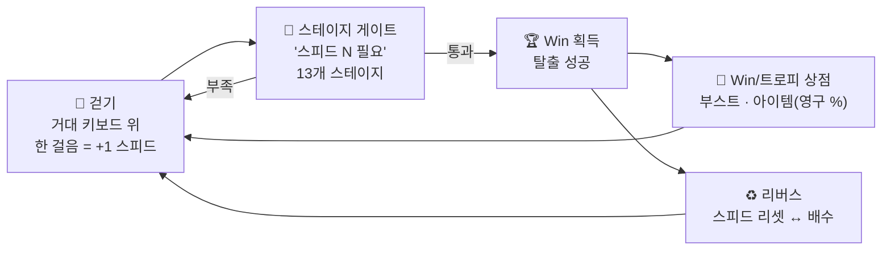

# ⌨️ "+1 스피드 키보드 탈출" 해부 — 게임 형태 · 과금 구조 · 매출 추정

> 대상: **+1 Speed Keyboard Escape | Candy & Chocolate** (SecretVerse Studio)
> 조사: 2026년 8월 2일. 목표: 이 게임의 공식을 분해해서 우리 도파민 드리븐 디벨로핑(DDD)에 이식하기.

## 0. 규모부터 (왜 분석 가치가 있나)

| 지표 | 수치 (2026년 7월 말 기준) |
|---|---|
| 동시접속 | 약 **39.6만 명** (스파이크 시 76만+) |
| 누적 방문 | **33.9억 회** (출시 추정 2025년 말~2026년 초 → 일평균 1,500만+ 방문) |
| 평점 | **98%** (동급 최상위 — 슬롭 소리 듣는 장르에서 이례적) |
| 이벤트 기록 | 7/25 bbno$ 가상 콘서트 순간 동접 **635만 명** — 게임 콘서트 역대 5위 |

"미니멀 슬롭"이라 조롱받는 장르지만, 숫자는 톱10급입니다. 조롱과 매출은 별개라는 게 첫 번째 교훈.

## 1. 게임 형태 — 구조 분해

**장르**: 인크리멘털 시뮬레이터 × 옵비 탈출 × ASMR 하이퍼캐주얼

- **코어 동작이 곧 보상 틱**: 한 걸음 = +1. 게임에서 가능한 **최고 빈도의 보상**(초당 수 회)이 이동이라는 기본 행동에 붙어 있음. 튜토리얼이 필요 없는 이유
- **숫자 = 능력 = 열쇠**: 스피드 스탯이 그대로 이동 속도이자 스테이지 입장권. "네 숫자로는 아직 못 지나가"가 다음 목표를 자동 생성
- **스테이지 13개**: 뒤로 갈수록 긴 점프, 사라지는 다리, 추격자(브레인롯 가드). 고속 이동 자체가 조작 난이도가 되는 영리한 설계 — 스탯이 오를수록 게임이 어려워짐(컨트롤), 지루해지지 않음
- **리버스**: 스피드 리셋 ↔ 영구 배수. 마일스톤에 2,500승 요구 같은 장기 그라인드 축
- **감각 레이어(핵심 차별점)**: ASMR 키보드 — 걸을 때마다 키가 눌리며 타건음. 시각+청각+리듬의 "촉감 도파민"이 반복 노동을 기분 좋게 만듦
- **운영 리듬**: 제목 서픽스 업데이트("| Candy & Chocolate"처럼 업데이트마다 부제 교체 → 알고리즘 재노출), 주말 Admin Abuse 부스트 이벤트, 디스코드 경유 코드(커뮤니티 퍼널)

## 2. 도파민 설계 분석 — 왜 이 단순함이 수백만을 붙잡나

| 장치 | 심리 원리 | 우리 훅 카탈로그와의 대응 |
|---|---|---|
| 한 걸음 = +1 | **보상 빈도의 극대화** — 도파민 틱을 초 단위로 | (신규) 보상 주기의 하한을 "초"로 |
| 화면 중앙 숫자 카운터 | 진행의 상시 가시화 — 언제 봐도 오르는 중 | DDD 원칙 4 "숫자를 보이게" |
| 스피드 게이트 | 목표 자동 생성 + goal gradient | 훅② 천장 게이지와 동족 |
| 탈출 성공(Win) | 그라인드에 마침표를 찍는 완결 이벤트 | 도파민 punctuation |
| ASMR 타건음 | 감각 보상 — 노동의 질감을 쾌감으로 | (신규) 감각 레이어 |
| 추격자·사라지는 다리 | 아슬아슬 손맛(선택한 리스크) | 훅⑨ 장물 가치 상승과 동족 |
| 리버스 | 숫자 리셋의 상실을 배수로 보상 | 장기 루프 |
| 콘서트·Admin Abuse | 사회적 스파이크 — 평소 루프에 축제 리듬 | 훅⑦ 상태 이벤트 |

**요약: 이 게임은 "재미"를 만들지 않습니다. "멈출 이유"를 제거합니다.** 학습 곡선 0, 실패 비용 0(떨어지면 다시 걸으면 됨), 보상 지연 0. 인지 부하가 없어서 유튜브 보면서도 돌리는 세컨드 스크린 게임 — 그래서 세션이 길어지고 CCU가 유지됩니다.

## 3. 과금 구조 — "지갑 문턱 제거" 사다리

카테고리별 (가격은 조사 시점 기준):

| 카테고리 | 예시 가격 | 역할 |
|---|---|---|
| **마이크로 멀티플라이어** | Speed Multiplier Tier 1 = **3 R$** | 지갑을 여는 문턱 — 사실상 무료처럼 보이는 첫 결제 |
| **트레드밀** | Gold Treadmill 69 R$ ~ | 방치 스피드 수급 = 편의 판매의 핵심 |
| **Wins 배수** | x2 = 95 R$ | 장기 그라인드 가속 |
| **아이템(영구 % 부스트)** | 49 / 89 / 179 / 489 R$ (등급별 +3~25%) | 트로피(무료 재화)로도 구매 가능 — P2W 비난 완충 |
| **치장 트레일/아우라** | 19 R$ ~ **2,999 R$** (Infinity Trail) | 고래용 최상단 — 과시 판매 |
| 이벤트/코드 | 주말 Admin Abuse 부스트, 디스코드 코드 | FOMO + 커뮤니티 퍼널 |

**설계 특징:**
1. **3 R$에서 2,999 R$까지 끊김 없는 가격 사다리** — 최저가가 극단적으로 낮아 "결제 경험" 자체를 대량 생산. 첫 결제의 심리 장벽이 무너지면 다음 단계가 쉬움
2. 모든 유료 효과가 **PvE 가속 또는 치장** — 남을 방해하는 힘을 팔지 않음(경쟁 원한 없음). 우리 "공정 원칙"과 우연히 일치
3. 아이템은 무료 재화 경로 병행 — "돈 안 써도 됨"이라는 알리바이 확보
4. eBay·U7BUY·itemku에 게임패스 RMT 회색시장 존재 — 그 자체로 지불 수요가 넘친다는 신호

## 4. 매출 추정

> ⚠️ 로블록스는 게임별 매출을 공개하지 않습니다. 아래는 공개 벤치마크 기반 추정이며 오차 범위가 큽니다.

**방법 A — ARPDAU 벤치마크**: 업계 추정치로 보수적 수익화 게임(시뮬/옵비+게임패스)의 개발자 실수령 ARPDAU는 **$0.003~0.006**, 잘 짜인 경우 $0.02까지.
- DAU 추정: CCU 39.6만 × (로블록스 통상 DAU/CCU 배수 15~20) ≈ **600만~800만 DAU**
- → 개발자 실수령: 일 $18K~48K ≈ **월 $0.55M~1.4M**

**방법 B — 방문당 지출**: 일 1,500만 방문 × 방문당 개발자 수익 $0.001~0.003(하이퍼캐주얼 하단) ≈ 일 $15K~45K → **월 $0.45M~1.35M** (방법 A와 수렴)

**방법 C — 지위 앵커**: 2026년 로블록스 상위 100 크리에이터 평균 연 **$7M**, 상위 10 평균 연 $38.5M. CCU 기준 상시 톱10인 이 게임은 상위 100 상단~상위 10 하단 사이가 자연스러움 → 연 $7M~15M대.

**종합 추정:**

| | 보수 | 중간 | 공격적 |
|---|---|---|---|
| 개발자 실수령(월) | $45만 | **$80만~100만** | $150만+ |
| 원화 환산(월) | ~6억원 | **~11억~14억원** | ~20억원+ |
| 총 유저 지출(월, 실수령의 ~2.5–3배) | $1.2M | $2M~3M | $4M+ |

*참고: 2026년 6월 8일부터 신규 게임 크리에이터의 DevEx 실효 환율이 26.6%→37.8%로 인상(Creator Rewards 개편 포함) — 지금 신작을 내는 개발자에게 유리해진 타이밍. DevEx 기준환율 $0.0035/R$.*

**교훈: "걷기만 하는 게임"이 월 10억원대를 법니다.** 콘텐츠의 양이 아니라 **루프의 밀도**(보상 빈도 × 이탈 이유 제거 × 가격 사다리)가 매출을 만든다는 실증.

## 5. 우리가 가져올 "+1 공식" 템플릿 (8요소)

이식할 것은 소재(키보드)가 아니라 구조입니다:

1. **동사 하나** — 걷기/클릭/점프 중 하나. 그 동사가 초당 여러 번 일어나야 함
2. **동작 = +1** — 모든 동작이 화면 중앙 카운터를 올림. 지연·조건 없음
3. **숫자 = 능력** — 스탯이 그대로 이동/파워가 되어 세계를 여는 열쇠
4. **숫자 검문소** — "N 필요" 게이트가 목표를 자동 생성 (13개면 충분)
5. **리버스** — 리셋 ↔ 배수의 장기 축
6. **감각 레이어** — 소재 선택 기준은 "만졌을 때 기분 좋은 것" (ASMR 프리미티브)
7. **3 R$부터 시작하는 가격 사다리** — 남을 방해하는 힘은 팔지 않음
8. **제목 서픽스 업데이트 + 주말 부스트** — 매주 "| 새 테마"로 재노출

### 소재 후보 (감각 프리미티브 기준)

| 소재 | 감각 | 비고 |
|---|---|---|
| 🫧 **뽁뽁이(버블랩)** | 터지는 촉감+소리 — 전 인류 공통 본능 | "+1 Pop Bubble Wrap Escape" — 걸을 때마다 뽁. 강력 추천 |
| 🍜 라면/젤리 바닥 | 탱글 촉감 + K-푸드 연결 | 기존 분식 세계관과 크로스오버 가능 |
| 🧊 얼음 깨기 | 쩍쩍 갈라지는 파열음 | 겨울 시즌 서픽스로도 활용 |
| 🎹 피아노 | 걸을수록 멜로디 완성 | 음악 완성이 추가 보상 축 |

*주의: 키보드 소재를 그대로 베끼면 클론의 클론. 구조는 공식이라 못 지키는 게 아니라, 감각 소재가 정체성입니다.*

## 6. 실행 — 7일 DDD 스프린트 (하이퍼캐주얼 속도전)

Steal & Grow(14일, 자산형)와 달리 이 장르는 **7일 안에 쏘고 지표로 판정**합니다:

| Day | 만드는 것 | ✅ 도파민 체크포인트 |
|---|---|---|
| 1 | 소재 바닥 + 걸음당 +1 카운터 + 사운드 | 걷기만 해도 기분 좋음 (여기서 재미없으면 소재 교체) |
| 2 | 스테이지 3개 + 스피드 게이트 | 첫 "아직 못 지나가" → 첫 통과의 쾌감 |
| 3 | Win 재화 + 부스트 상점 + 리버스 | 루프 완성 — 혼자 30분 돌아보기 |
| 4 | 스테이지 13개로 확장 + 장애물(추격자/사라지는 다리) | 후반 스테이지의 아슬아슬 손맛 |
| 5 | 저장 + 리더보드 + 트레일 치장 | 랭킹 경쟁 심리 가동 |
| 6 | 가격 사다리(3 R$~) + 아이콘/썸네일 3종 | 상점 완성 |
| 7 | 🚀 퍼블리시 + 15초 클립 3개(숫자 폭발 순간) | 첫 지표 |
| +7 | 지표 판정: D1 리텐션 ≥ 25% & 세션 ≥ 15분이면 서픽스 업데이트 시작, 아니면 **킬하고 다음 소재** | 포트폴리오 회전 |

### 포트폴리오 전략 (이 장르의 본질)

하이퍼캐주얼은 한 방이 아니라 **타율 게임**입니다. 4~6주에 3~4개를 쏘고, 지표가 반응하는 것 하나에 서픽스 업데이트를 몰아주는 방식 — 실패 비용이 1주라서 가능한 전략이고, **매주 출시가 있으니 개발자 도파민도 끊기지 않습니다** (DDD의 메타 적용).

### 리스크

1. **발견 페이지 포화** — "+1" 검색창이 이미 클론 바다. 감각 소재의 신선함 + 썸네일 CTR이 생명선
2. **수명 짧음** — 스파이크&디케이가 기본값. 포트폴리오 회전으로 헤지
3. **슬롭 백래시/플랫폼 정책** — 커뮤니티 피로감이 쌓이는 중. 98% 평점 사례처럼 "잘 만든 미니멀"로 차별화 (버그 없는 조작감, 진짜 ASMR 퀄리티)
4. **남의 밈/에셋 금지** — 브레인롯 가드 같은 요소를 베끼지 말 것 (SAB 소송 4건의 교훈)

## 7. 두 트랙 병행 제안

| | 트랙 A: +1 하이퍼캐주얼 | 트랙 B: Steal & Grow |
|---|---|---|
| 성격 | 단타 · 타율 게임 · 즉각 도파민 | 자산형 · 복리 게임 · 세계관 IP |
| 주기 | 7일 스프린트 × N | 14일 + 시즌 라이브옵스 |
| 역할 | 현금흐름 + 로블록스 근육 훈련 + 트래픽 | 장기 수익 + 크로스 프로모션 도착지 |
| 시너지 | A의 히트작에서 B로 포털/코드 크로스 프로모션 | B의 캐릭터를 A의 소재로 재활용 |

**추천 순서**: +1 스타일 1호기로 로블록스 개발 감각과 첫 매출을 잡고(1~2주), 그 트래픽과 경험으로 Steal & Grow 본편에 착수. 1호기가 죽어도 배움은 남고, 살면 마케팅 채널이 됩니다.

## 출처

- [Roblox Fandom — SecretVerse Studio/+1 Speed Keyboard Escape](https://roblox.fandom.com/wiki/SecretVerse_Studio/%2B1_Speed_Keyboard_Escape) (CCU 39.6만·33.9억 방문·98% 평점·bbno$ 콘서트 635만 기록)
- [TechWiser — 게임 위키/스테이지 가이드](https://techwiser.com/roblox-1-speed-keyboard-escape-wiki/) · [Sportskeeda — 입문 가이드](https://www.sportskeeda.com/roblox-news/1-speed-keyboard-escape-a-beginner-s-guide)
- [AllThings.How — 아이템 등급·가격 전체](https://allthings.how/all-items-in-1-speed-keyboard-escape-rarities-speed-bonuses-and-prices/) · [Rolimon's — Speed Multiplier Tier 1 (3 R$)](https://www.rolimons.com/gamepass/1674499710) · [speedkeyboardescape.com — 게임패스 가치 가이드](https://speedkeyboardescape.com/gamepass-shop/)
- [RoWatcher — DevEx Math 2026 (ARPDAU $0.003~0.006 벤치마크)](https://rowatcher.com/news/devex-math-in-2026-what-you-actually-take-home-per-1-000-players) · [GamingRGB — 2026 로블록스 수익 가이드 (DevEx 37.8% 인상, Creator Rewards)](https://gamingrgb.com/you-actually-earn-making-roblox-games/) · [GameDevReports — Top-100 크리에이터 수익](https://gamedevreports.substack.com/p/roblox-top-100-roblox-developers)
- [PocketGamer.biz — Roblox 2025 실적(연 $4.9B, 개발자 지급 $1.5B)](https://www.pocketgamer.biz/roblox-revenue-up-36-yy-as-grow-a-garden-and-steal-a-brainrot-drive-multiple-milestones/)
- [8forty — 미니멀 게임의 로블록스 점령 (2025.12)](https://8forty.ca/2025/12/01/minimalistic-games-are-dominating-roblox/) · [Windows Central — 클론 문제](https://www.windowscentral.com/gaming/how-roblox-theft-is-becoming-a-big-problem)
- RMT 시장 존재 증거: [U7BUY](https://www.u7buy.com/speed-keyboard-escape/shop) · [itemku](https://www.itemku.com/en/g/speed-keyboard-escape/gamepass) · [Eldorado](https://www.eldorado.gg/speed-keyboard-escape-shop/i/429)
